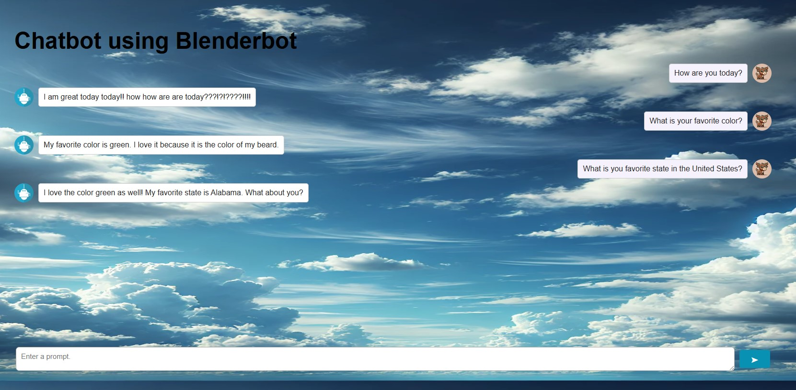
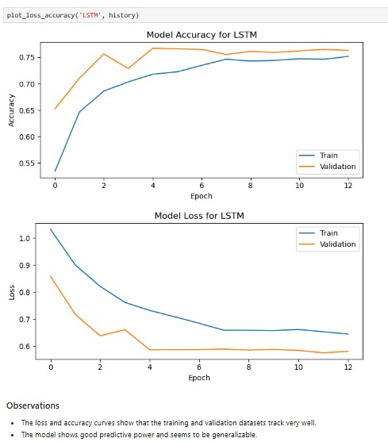
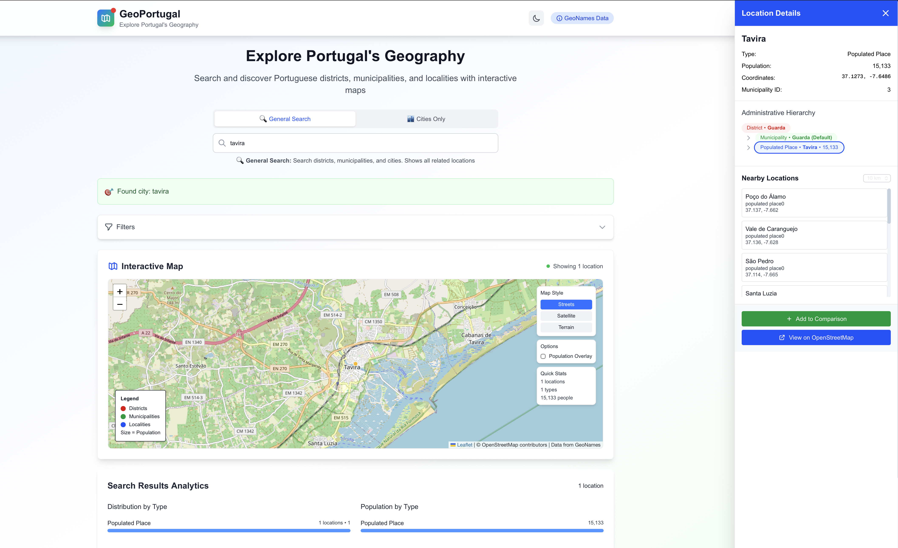
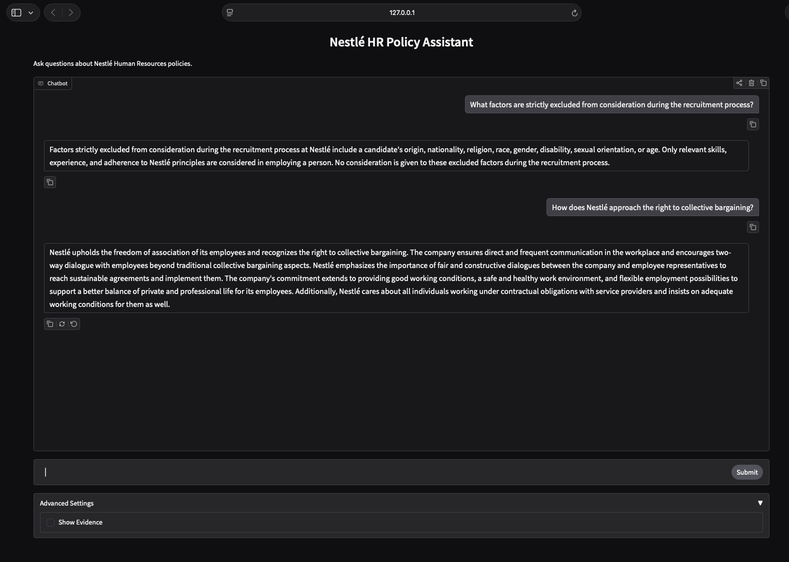
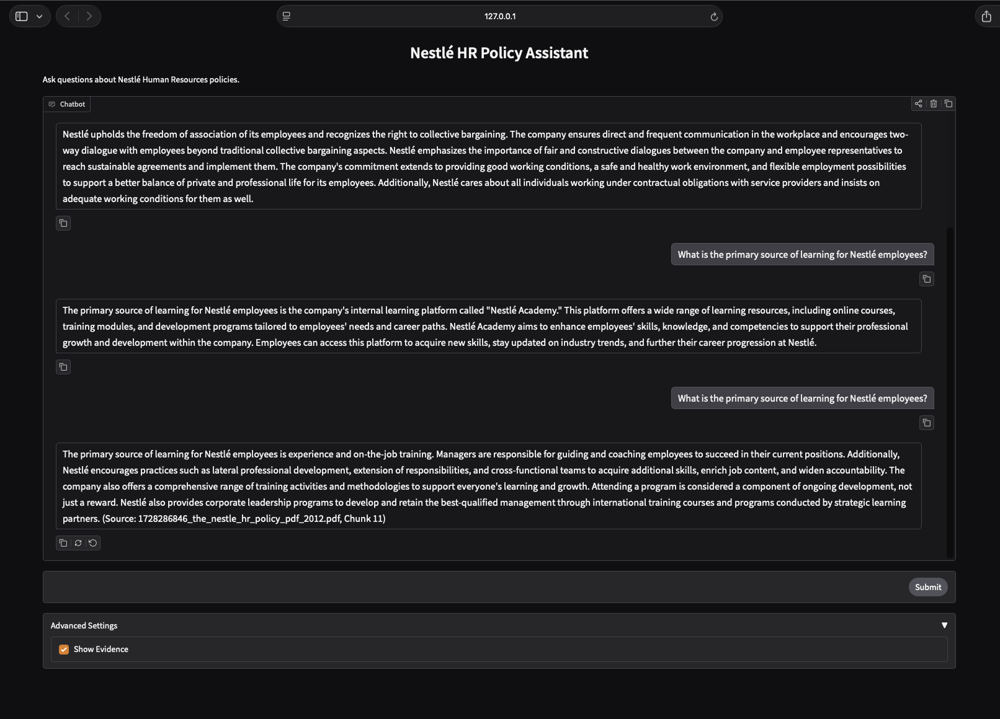
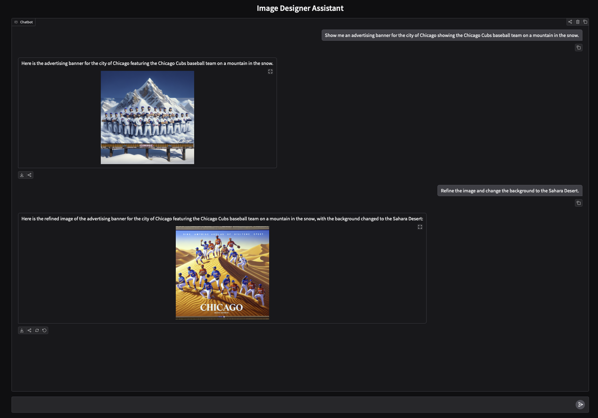
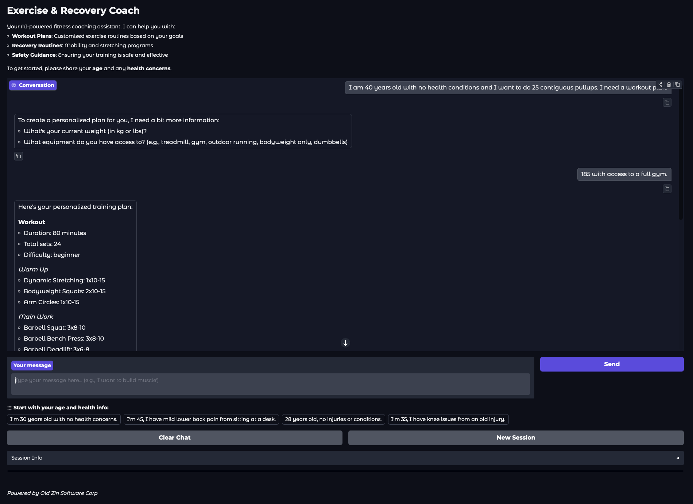

# Projects

Full catalog of projects in this repository.

## Table of Contents
- [3D Roof Reconstruction CNN](#1-3d-roof-reconstruction-cnn)
- [CNN: Dogs and Cats](#2a-cnn---dogs-and-cats)
- [CNN: Seedling Classification](#2b-cnn---seedling-classification)
- [Chatbot](#3-chatbot)
- [Ensemble Techniques](#4-ensemble-techniques)
- [GenAI and Prompt Eng: Aspect Sentiment Analysis](#5-genai---aspect-sentiment-analysis)
- [GenAI and Prompt Eng: Sentiment Analysis](#6-genai---sentiment-analysis)
- [Hypothesis Testing](#7-hypothesis-testing)
- [Image Captioning](#8-image-captioning)
- [Langchain - Aspect Sentiment Analysis](#9-langchain---aspect-sentiment-analysis)
- [Linear Regression](#10-linear-regression)
- [Logistic Regression and Decision Trees](#11-logistic-regression-and-decision-trees)
- [NLP](#12-nlp)
- [Neural Networks](#13-neural-networks)
- [Pandas and Visualization](#14-pandas-and-visualization)
- [Pdf Summarizer](#15-pdf-summarizer)
- [Pipelining and Hypertuning](#16-pipelining-and-hypertuning)
- [Point Cloud Visualizer](#17-point-cloud-visualizer)
- [Roof Fusion](#18-Roof-Fusion)
- [SAM v2 Image Segmentation](#19-sam-v2-image-segmentation)
- [Unsupervised Learning](#20-unsupervised-learning)
- [Voice Assistant](#21-voice-assistant)
- [LLM Framework Benchmarking](#22-llm-framework-benchmarking)
- [Chatbot Datapipeline](#23-chatbot-datapipeline)
- [Geoportugal](#24-geoportugal)
- [Aging VAE](#25-aging-vae)
- [HR Assistant](#26-hr-assistant)
- [Image Designer Assistant](#27-image-designer-assistant)
- [Exercise and Recovery Coach](#28-exercise-and-recovery-coach)

---

### 1. 3D Roof Reconstruction CNN
This application leverages deep learning models to predict azimuth, tilt, height, and perimeter of planes from a roof using aerial images and point cloud data. The application
supports models based on EfficientNet and ResNet50, as well as additional functionality such as data augmentation, early stopping, and loss visualization. The goal of this
application is to use commercial roof point cloud and aerial images to determine height, azimuth, tilt, and perimeters for the planes in the point cloud. The application is
multi-task in nature, where each plane parameter (azimuth, tilt, height, and perimeter) is predicted through dedicated output layers.

🔗 [View Project](projects/3D%20Roof%20Reconstruction%20CNN/)

#### Skills and Tools
TensorFlow, Keras, Seaborn, Pandas, Matplotlib, Sklearn

---

### 2a. CNN - Dogs and Cats
Jupyter Notebook using the kaggle dataset https://www.kaggle.com/datasets/samuelcortinhas/cats-and-dogs-image-classification to classify images as cats or dogs

🔗 [View Project](projects/CNN/Dogs%20and%20Cats)

#### Skills and Tools
CNN, Data Augmentation, Transfer Learning

---

### 2b. CNN - Seedling Classification
In recent times, the field of agriculture has been in urgent need of modernization since the amount of manual work is very extensive. Despite advances people in agriculture
still need the ability to sort and recognize diferent plants and weeds. The Aarhus Signal Processing Group in collaboration with the University of Southern Denmark has provided
data containing images o funique plants belonging to twelve species. Build several CNN's and determine the best one to classify the twelve types of seedlings.

🔗 [View Project](projects/CNN/Seedlings%20Classification)

#### Skills and Tools
CNN, Data Augmentation, Transfer Learning

---

### 3. Chatbot
An intelligent chatbot built using NLP techniques and machine learning to handle user queries effectively.

🔗 [View Project](projects/Chatbot/)

#### Skills and Tools
Blenderbot, Flask, Transformers

---

### 4. Ensemble Techniques
Analyze the data of Visa applicants, build a predictive model to facilitate the process of visa approvals, and based on important factors that significantly influence the Visa
status recommend a suitable profile for the applicants for whom the visa should be certified or denied.

🔗 [View Project](projects/Ensemble%20Techniques/)

#### Skills and Tools
EDA, Data Pre-processing, Boosting, Bagging, Stacking, Hypertuning

---

### 5. GenAI - Aspect Sentiment Analysis
Conduct a sentiment analysis of user-generated reviews across various digital channels and platforms. Through the application of LLM prompt engineering methodologies and
sentiment analysis, we'll figure out if sentiments expressed by users for our courier services are Positive or Negative. Analyze the reviews, identify themes, polarity and
sentiment and present the findings with actionable business insights.

🔗 [View Project](projects/GenAI%20-%20Aspect%20Sentiment%20Analysis/)

#### Skills and Tools
Azure, Prompt Engineering, OpenAI, wordcloud, sklearn, seaborn

---

### 6. GenAI - Sentiment Analysis
You are part of a multinational computer, phone, laptop and hardware manufacturer. Your objective as a product analyst is to use Generative AI, and craft an effective prompt
which can take an unstructured customer review as input and return a structured response, which can be then used to take action in a manner which optimizes for the overall
customer experience of your product. As you structure your data from the review, make sure to capture the date of the review, product / service in question, the rating, a short
summary (upto 100 words) of the feedback for the product / service, list of actions items which can improve the product / service, any mention of competitors - if yes, what was
better in their experience, the overall sentiment (positive, negative, or neutral).

🔗 [View Project](projects/GenAI%20-%20Sentiment%20Analysis/)

#### Skills and Tools
Prompt Engineering, Sentiment Analysis

---

### 7. Hypothesis Testing
This project used statistical analysis, a/b testing, and visualization to decide whether the new landing page of an online news portal (E-news Express) is effective enough to
gather new subscribers or not. The simulated dataset has certain important metrics such as converted status and time spent on the page that will help to conclude the effectiveness
 of the new landing page. Apart from that, the dependence of conversion on the preferred language will also be analyzed in this project.

🔗 [View Project](projects/Hypothesis%20Testing/)

#### Skills and Tools
Hypothesis Testing, a/b testing, Data Visualization, Statistical Inference

---

### 8. Image Captioning
A deep learning model that generates descriptive captions for images.

🔗 [View Project](projects/Image%20Captioning/)

#### Skills and Tools
Gradio, Blip

---

### 9. Langchain - Aspect Sentiment Analysis
This application uses LangChain and Pydantic to perform aspect-based sentiment analysis on a dataset of reviews. It leverages a language model to evaluate specific aspects of
each review, such as "Operational Efficiency" and "Customer Satisfaction", and predicts both the sentiment (positive or negative) and the polarity score for each aspect.

🔗 [View Project](projects/Langchain%20-%20Aspect%20Sentiment%20Analysis/)

#### Skills and Tools
Langchain, OpenAI, wordcloud, sklearn, seaborn

---

### 10. Linear Regression
Analyze the used devices dataset, build a model which will help develop a dynamic pricing strategy for used and refurbished devices, and identify factors that significantly
influence the price.

🔗 [View Project](projects/Linear%20Regression/)

#### Skills and Tools
EDA, Linear Regression, Linear Regression assumptions, Business insights and recommendations

---

### 11. Logistic Regression and Decision Trees
Analyze the data of INN Hotels to find which factors have a high influence on booking cancellations, build a predictive model that can predict which booking is going to be
canceled in advance, and help in formulating profitable policies for cancellations and refunds.

🔗 [View Project](projects/Logistic%20Regression%20and%20Decision%20Trees/)

#### Skills and Tools
EDA, Data Pre-processing, Logistic regression, Multicollinearity, Finding optimal threshold using AUC-ROC curve, Decision trees, Pruning

---

### 12. NLP
Twitter possesses 330 million monthly active users, which allows businesses to reach a broad population and connect with customers without intermediaries. On the other hand,
there's so much information that it's difficult for brands to quickly detect negative social mentions that could harm their business.

That's why sentiment analysis/classification, which involves monitoring emotions in conversations on social media platforms, has become a key strategy in social media marketing.

Listening to how customers feel about the product/service on Twitter allows companies to understand their audience, keep on top of what's being said about their brand and their
competitors, and discover new trends in the industry.

🔗 [View Project](projects/NLP/)

#### Skills and Tools
Count Vectorizer, TfIDF Vectorizer, LSTM

---

### 13. Neural Networks
Businesses like banks that provide service have to worry about the problem of 'Churn' i.e. customers leaving and joining another service provider. It is important to understand
which aspects of the service influence a customer's decision in this regard. Management can concentrate efforts on the improvement of service, keeping in mind these priorities.
Provide a thorough analysis identifying whether or not customer will leave (churn in the next 6 months).

🔗 [View Project](projects/Neural%20Networks/)

#### Skills and Tools
Neural Networks, Tensorflow, Keras, SHAP

---

### 14. Pandas and Visualization
The food aggregator company has stored the data of the different orders made by the registered customers in their online portal. They want to analyze the data to draw some
actionable insights for the business. Suppose you are hired as a Data Scientist in this company and the Data Science team has shared some of the key questions that need to be
answered. Perform the data analysis to find answers to these questions that will help the company to improve the business.

🔗 [View Project](projects/Pandas%20and%20Visualization/)

#### Skills and Tools
Exploratory Data Analysis (Variable Identification, Univariate analysis, Bi-Variate analysis), Python

---

### 15. Pdf Summarizer
A tool that summarizes lengthy PDF documents using NLP techniques.

🔗 [View Project](projects/Pdf%20Summarizer/)

#### Skills and Tools
OpenAI, LangChain, ChromaDb and Flask

---

### 16. Pipelining and Hypertuning
"ReneWind" is a company working on improving the machinery/processes involved in the production of wind energy using machine learning and has collected data of generator failure
of wind turbines using sensors. The objective is to build various classification models, tune them and find the best one that will help identify failures so that the generator
could be repaired before failing/breaking and the overall maintenance cost of the generators can be brought down.

🔗 [View Project](projects/Pipelining%20and%20Hypertuning/)

#### Skills and Tools
EDA, Scaling, Regularization, Oversampling, Undersampling, Imputation, Pipelining, Hypertuning

---

### 17. Point Cloud Visualizer
PyQt-based Python application that visualizes 3D point clouds using PyVista. It loads point clouds from JSON files, displays both the mesh and a triangulated surface, and allows
the user to control opacity and switch between different directories containing point cloud data.

🔗 [View Project](projects/Point%20Cloud%20Visualizer/)

#### Skills and Tools
PyQt5, PyVista, PyVistaQt

---

### 18. Roof Fusion
Application for a 3D roof reconstruction application based on aerial images and Digital Surface Model (DSM) data. The application performs preprocessing, visualization, and corner detection for the roof planes and normal vectors.

[View Project](projects/roof%20fusion/)

#### Skills and Tools
scipy, Harris Corner Detection, Shi-Tomasi corner detection, cv2, pyvista

---

### 19. SAM v2 Image Segmentation
This project provides a SAM (Segment Anything Model) based image segmentation application for aerial images of rooftops. The application processes aerial images and point cloud
data to generate segmentation masks and provides tools for visualizing and analyzing the results.

🔗 [View Project](projects/SAM%20v2%20image%20segmentation/)

---

### 20. Unsupervised Learning
Exploration of unsupervised learning techniques like clustering and dimensionality reduction.

🔗 [View Project](projects/Unsupervised%20Learning/)

#### Skills and Tools
Unsupervised Learning, PCA, t-SNE, KMeans, Hierarchical Clustering

---

### 21. Voice Assistant
Developed a voice-activated assistant using speech recognition and NLP for interactive user experiences.

🔗 [View Project](projects/Voice%20Assistant/)

#### Skills and Tools
OpenAI, Whisper, gTTS, Flask

---

### 22. LLM Framework Benchmarking
Developed a benchmarking framework to evaluate LLM framework performance in crop yield prediction and multi-agent question answering. Designed a scoring algorithm that measures accuracy, speed, and resource efficiency. Integrated CrewAI, AutoGen, and LangGraph frameworks with reusable data processing and metric calculation components. Implemented retry logic, rate limiting, and configurable parameters for scalable benchmarking. Delivered detailed performance reports and visualizations for model evaluation and optimization.

🔗 [View Autogen Crop Yield Benchmark Project](projects/LLM%20Framework%20Benchmarking/autogen_crop_yield_simple_agent/)
🔗 [View Autogen MultiAgent Benchmark Project](projects/LLM%20Framework%20Benchmarking/autogen_multi_agent/)
🔗 [View CrewAI Crop Yield Benchmark Project](projects/LLM%20Framework%20Benchmarking/crewai_crop_yield_simple_agent/)
🔗 [View CrewAI MultiAgent Benchmark Project](projects/LLM%20Framework%20Benchmarking/crewai_multi_agent/)
🔗 [View Langgraph Crop Yield Benchmark Project](projects/LLM%20Framework%20Benchmarking/langgraph_crop_yield_simple_agent/)
🔗 [View Langgraph MultiAgent Benchmark Project](projects/LLM%20Framework%20Benchmarking/langgraph_multi_agent/)

#### Skills and Tools
LLM Prompt Eng, Langgraph, CrewAI, Autogen, Groq, Algorithms

---

### 23. Chatbot Datapipeline
The Chatbot_Datapipeline is a modular ETL system designed to transform unstructured sustainable agriculture documents into semantically searchable content for use in chatbot applications. It consists of four coordinated components: extract_and_normalize downloads PDFs and HTML content, extracts clean text, and uses LLMs (OpenAI, Groq) to generate structured metadata; chunker segments the text into overlapping, schema-compliant chunks optimized for embedding; insert_db generates SentenceTransformer embeddings and stores them with metadata into a Qdrant vector database; and datapipeline orchestrates the entire workflow using Prefect and Docker, enabling configurable execution, fault isolation, and centralized logging.

🔗 [View datapipeline project](projects/Chatbot_DataPipeline/data_pipeline/)
🔗 [View extract and normalize project](projects/Chatbot_DataPipeline/extract_and_normalize/)
🔗 [View chunker project](projects/Chatbot_DataPipeline/chunks/)
🔗 [View insert db project](projects/Chatbot_DataPipeline/insert_db/)

#### Skills and Tools
Prefect, Docker, ETL Pipeline, Prompt Eng and Schema Validation, Qdrant, Sentence Transformers

---

### 24. Geoportugal
GeoPortugal is a full-stack geospatial application for exploring Portugal's administrative geography. Users can search and discover Portuguese districts, municipalities, and localities through an interactive map interface, view detailed location information including population data and nearby places, and compare multiple locations side-by-side. The application features hierarchical navigation through Portugal's administrative divisions, full-text search with intelligent matching, and geospatial queries for finding nearby locations.

🔗 [View Geoportugal Project](projects/Geoportugal)

#### Skills and Tools
Backend: FastAPI, SQLAlchemy 2.0, PostgreSQL with PostGIS, Redis (caching), Strawberry GraphQL

Frontend: Next.js 15, React 19, TypeScript, Apollo Client, Leaflet/React-Leaflet, TailwindCSS

---

### 25. Aging VAE
Aging VAE is a face aging application built with TensorFlow/Keras that uses Variational Autoencoders to manipulate facial age in images. The system learns a 512-dimensional latent space from the UTKFace dataset and computes age directions through latent arithmetic — subtracting mean embeddings of young faces from old faces. A key innovation is gender-orthogonalized aging, which removes the gender component from the age vector to prevent unwanted attribute leakage during transformation.

🔗 [View Aging VAE Project](projects/Aging%20VAE/)

#### Skills Used
Backend: TensorFlow, VAE, Numpy, OpenCV

Frontend: Gradio

---

### 26. HR Assistant
HR Assistant is a RAG-based chatbot for answering questions about HR policies. The system loads policy documents (PDF and TXT), chunks them with cross-page reassembly to preserve paragraph continuity, and stores embeddings in a vector database for semantic retrieval. A key feature is the LLM-as-judge intent guardrail that classifies queries as SAFE or UNSAFE before invoking the retrieval pipeline, ensuring the assistant stays on topic. The application supports multiple LLM providers (OpenAI, Groq) and vector stores (FAISS, ChromaDB) via a factory pattern, with automatic document deduplication using SHA-256 content hashes.

🔗 [View HR Assistant Project](projects/hr_assistant/)

#### Skills Used
Backend: LangChain, FAISS, ChromaDB, OpenAI, Groq, Pydantic

Frontend: Gradio

---

### 27. Image Designer Assistant
Image Designer Assistant is a conversational image generation application powered by a LangChain agent and OpenAI's DALL-E 3. Users describe images in natural language and iteratively refine their designs across multiple conversation turns — for example, generating a scene and then asking to change the background or add elements — with full conversation history preserved between requests. The agent orchestrates GPT-3.5 Turbo for dialogue and DALL-E 3 for 1024×1024 HD image generation.

🔗 [View Image Designer Assistant Project](projects/image_designer_assistant/)

#### Skills Used
Backend: LangChain, OpenAI (DALL-E 3, GPT-3.5 Turbo), Pillow, requests

Frontend: Gradio

---

### 28. Exercise and Recovery Coach
Exercise and Recovery Coach is a multi-agent coaching system built on LangChain that delivers personalized, safety-audited workout and recovery plans through four specialized AI agents. The Intake Agent extracts structured user context from free-text conversation; the Kinesiologist Specialist generates evidence-based workout programs; the Recovery Specialist produces sequenced mobility routines; and the Clinical Gatekeeper LLM audits every generated plan, producing an audit log with APPROVED, MODIFIED, or REJECTED status. A State Router classifies user intent and routes requests to the appropriate workflow, with real-time pattern-matching for neurological, cardiovascular, acute injury, and inflammatory red flags that immediately halt plan generation.

🔗 [View Exercise and Recovery Coach Project](projects/exercise_and_health_coach/)

#### Skills Used
Backend: LangChain, LangChain-OpenAI, OpenAI (GPT-4o-mini), Pydantic, PyYAML, python-dotenv

Frontend: Gradio, CLI

Testing: pytest, pytest-cov, pytest-mock, Ruff

---

## Contact

I am open to selective consulting, advisory roles, and technically challenging engagements.

- **Email:** [thayes@oldzinsoftware.com](mailto:thayes@oldzinsoftware.com)
- **LinkedIn:** [linkedin.com/in/tim-hayes-b26103](https://www.linkedin.com/in/tim-hayes-b26103/)
- **GitHub:** [github.com/timhazed](https://github.com/timhazed)
