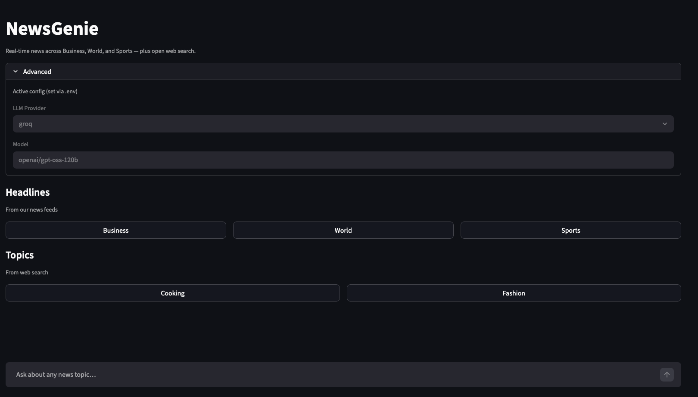
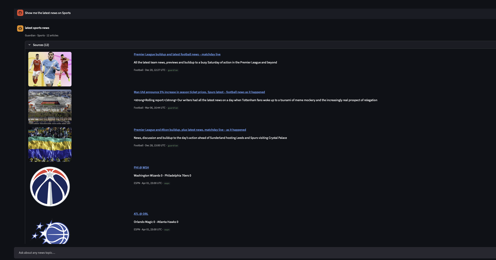

# Data Science & AI Systems Engineering Portfolio

**Tim Hayes**

I design and build production-grade AI systems — multi-agent pipelines, RAG architectures, deep learning models, and the data infrastructure that supports them — applying a consistent engineering methodology from exploration through deployment. What distinguishes this work is not the breadth of projects, but the rigor behind each one: failure analysis before implementation, structured evaluation, and systems designed to be extended and handed off.

Core focus areas include:

* Generative AI and Agentic Systems
* Retrieval-Augmented Generation (RAG)
* Multi-Agent Architectures
* End-to-End Data Pipelines
* Deep Learning and Computer Vision

---

## Methodology

A consistent engineering lifecycle is applied across every project in this repository:

**Exploration → Architecture → Critique → Implementation → Review → Evaluation → Refactor**

The critique phase — conducted before any code is written — is where most engineering failures are preventable and where most teams skip ahead. Structured evaluation closes the loop: it measures whether the system actually does what it claims to do under realistic conditions, not just whether the tests pass.

See [methodology/](methodology/) for the full engineering playbook: lifecycle phases, design patterns, principles, and the decision framework for selecting the right architecture.

---

## Highlighted Systems

### Agentic AI Systems

* [Agentic Healthcare Assistant](projects/agentic%20healthcare%20assistant/)
* [NewsGenie](projects/newsgenie/)
* [Exercise and Recovery Coach](projects/exercise_and_health_coach/)
* [Agentic Developer Memory](projects/developer%20memory/)
* [LLM Framework Benchmarking](projects/LLM%20Framework%20Benchmarking/)

### Retrieval-Augmented Generation (RAG)

* [HR Assistant](projects/hr_assistant/)
* [Chatbot DataPipeline](projects/Chatbot_DataPipeline/)

### Deep Learning & Computer Vision

* [3D Roof Reconstruction CNN](projects/3D%20Roof%20Reconstruction%20CNN/)
* [Aging VAE](projects/Aging%20VAE/)

### Full-Stack AI Applications

* [GeoPortugal](projects/Geoportugal/)
* [Image Designer Assistant](projects/image_designer_assistant/)

For the complete project catalog with full descriptions, skills, and tools, see [PROJECTS.md](PROJECTS.md).

---

# Projects

---

## Deep Learning & Computer Vision

### 3D Roof Reconstruction CNN

This application leverages deep learning models to predict azimuth, tilt, height, and perimeter of planes from a roof using aerial images and point cloud data.

**Approach:** Multi-input CNN (ResNet50 / EfficientNet) with multi-task outputs.

**Key Capability:** Fusion of aerial imagery and point cloud data for geometric prediction.

**Non-Augmented Models**

**Augmented Models**

🔗 [View Project](projects/3D%20Roof%20Reconstruction%20CNN/)

**Skills and Tools:** TensorFlow, Keras, Pandas, Matplotlib, Sklearn

---

### Aging VAE

A Variational Autoencoder-based system for facial age progression using latent space manipulation.

🔗 [View Project](projects/Aging%20VAE/)

**Skills Used**
Backend: TensorFlow, VAE, NumPy, OpenCV
Frontend: Gradio

---

### SAM v2 Image Segmentation

Segment Anything Model (SAM)-based segmentation system for aerial imagery.

🔗 [View Project](projects/SAM%20v2%20image%20segmentation/)

---

### Point Cloud Visualizer

PyQt-based application for 3D point cloud visualization.

🔗 [View Project](projects/Point%20Cloud%20Visualizer/)

---

### Roof Fusion

3D roof reconstruction preprocessing and visualization system.

🔗 [View Project](projects/roof%20fusion/)

---

## Generative AI & Agentic Systems

### Agentic Healthcare Assistant

A LangGraph-orchestrated clinical assistant that accepts natural-language queries, decomposes them into a sequential plan, and dispatches each sub-task across five specialized tool nodes (patient resolution, history retrieval, appointment booking, and disease research), returning a single synthesized response from one conversational interface.

🔗 [View Project](projects/agentic%20healthcare%20assistant/)

**Skills Used**
LangGraph, LangChain, LangGraph Checkpoint (SqliteSaver), OpenAI, Groq, Pydantic, FAISS, ragas, pypdf, SQLite, Poetry, Streamlit

### NewsGenie

LangGraph-based multi-agent news assistant that decomposes free-form queries into parallel domain fetches (Business, Sports, World) or web search, validated across four LLM configurations.

🔗 [View Project](projects/newsgenie/)

**Skills Used**
LangGraph, OpenAI, Groq, Pydantic, NewsAPI, Guardian API, ESPN Scoreboard, Streamlit

---

### Exercise and Recovery Coach

Multi-agent system generating personalized, safety-audited workout and recovery plans.

🔗 [View Project](projects/exercise_and_health_coach/)

**Skills Used**
LangChain, OpenAI, Pydantic, Gradio

---

### Agentic Developer Memory
A dynamic context isolation and state serialization engine engineered to mitigate token accumulation, eliminate message redundancy, and optimize long-term persistence within continuous AI software engineering workflows by decoupling transient execution loops from absolute system state transitions.

🔗 [View Project](projects/developer%20memory/)

Skills Used
Python, LangChain, OpenAI, Groq, Pydantic (Structured Outputs), Tenacity, Tokenizer Optimization, JSON/File Serialization, Poetry, Streamlit, pytest, pytest-cov, Ruff

---

### Image Designer Assistant

Conversational multi-turn image generation system using LangChain and DALL-E.

🔗 [View Project](projects/exercise_and_health_coach/)

Skills Used
Backend: LangChain, LangChain-OpenAI, OpenAI (GPT-4o-mini), Pydantic, PyYAML, python-dotenv

Frontend: Gradio, CLI

Testing: pytest, pytest-cov, pytest-mock, Ruff

---

### LLM Framework Benchmarking

Framework benchmarking system comparing LangGraph, CrewAI, and AutoGen.

🔗 [View Autogen Crop Yield Benchmark](projects/LLM%20Framework%20Benchmarking/autogen_crop_yield_simple_agent/)
🔗 [View Autogen MultiAgent Benchmark](projects/LLM%20Framework%20Benchmarking/autogen_multi_agent/)
🔗 [View CrewAI Crop Yield Benchmark](projects/LLM%20Framework%20Benchmarking/crewai_crop_yield_simple_agent/)
🔗 [View CrewAI MultiAgent Benchmark](projects/LLM%20Framework%20Benchmarking/crewai_multi_agent/)
🔗 [View LangGraph Crop Yield Benchmark](projects/LLM%20Framework%20Benchmarking/langgraph_crop_yield_simple_agent/)
🔗 [View LangGraph MultiAgent Benchmark](projects/LLM%20Framework%20Benchmarking/langgraph_multi_agent/)

---

## Retrieval-Augmented Generation (RAG) & Data Systems

### Chatbot DataPipeline

Modular ETL pipeline for transforming unstructured documents into semantically searchable data.

🔗 [Data Pipeline](projects/Chatbot_DataPipeline/data_pipeline/)
🔗 [Extract](projects/Chatbot_DataPipeline/extract_and_normalize/)
🔗 [Chunker](projects/Chatbot_DataPipeline/chunks/)
🔗 [Insert DB](projects/Chatbot_DataPipeline/insert_db/)

**Skills and Tools:** Prefect, Docker, Qdrant, Sentence Transformers

---

### HR Assistant

RAG-based chatbot with intent guardrails and evidence-backed responses.

🔗 [View Project](projects/hr_assistant/)

---

## Full-Stack AI Applications

### GeoPortugal

Geospatial full-stack application for exploring Portugal's administrative regions.

🔗 [View Project](projects/Geoportugal)

---

## Machine Learning & Data Science Foundations

### CNN - Dogs and Cats

🔗 [View Project](projects/CNN/Dogs%20and%20Cats)

---

### CNN - Seedling Classification

🔗 [View Project](projects/CNN/Seedlings%20Classification)

---

### Chatbot

🔗 [View Project](projects/Chatbot/)

---

### Ensemble Techniques

🔗 [View Project](projects/Ensemble%20Techniques/)

---

### GenAI - Aspect Sentiment Analysis

🔗 [View Project](projects/GenAI%20-%20Aspect%20Sentiment%20Analysis/)

---

### GenAI - Sentiment Analysis

🔗 [View Project](projects/GenAI%20-%20Sentiment%20Analysis/)

---

### Hypothesis Testing

🔗 [View Project](projects/Hypothesis%20Testing/)

---

### Image Captioning

🔗 [View Project](projects/Image%20Captioning/)

---

### LangChain - Aspect Sentiment Analysis

🔗 [View Project](projects/Langchain%20-%20Aspect%20Sentiment%20Analysis/)

---

### Linear Regression

🔗 [View Project](projects/Linear%20Regression/)

---

### Logistic Regression and Decision Trees

🔗 [View Project](projects/Logistic%20Regression%20and%20Decision%20Trees/)

---

### NLP

🔗 [View Project](projects/NLP/)

---

### Neural Networks

🔗 [View Project](projects/Neural%20Networks/)

---

### Pandas and Visualization

🔗 [View Project](projects/Pandas%20and%20Visualization/)

---

### Pdf Summarizer

🔗 [View Project](projects/Pdf%20Summarizer/)

---

### Pipelining and Hypertuning

🔗 [View Project](projects/Pipelining%20and%20Hypertuning/)

---

### Unsupervised Learning

🔗 [View Project](projects/Unsupervised%20Learning/)

---

### Voice Assistant

🔗 [View Project](projects/Voice%20Assistant/)

---

## Contact

I am open to selective consulting, advisory roles, and technically challenging engagements.

* **Email:** [thayes@oldzinsoftware.com](mailto:thayes@oldzinsoftware.com)
* **Website:** [www.oldzinsoftware.com](https://www.oldzinsoftware.com)
* **LinkedIn:** [linkedin.com/in/tim-hayes-b26103](https://www.linkedin.com/in/tim-hayes-b26103/)
* **GitHub:** [github.com/timhazed](https://github.com/timhazed)

