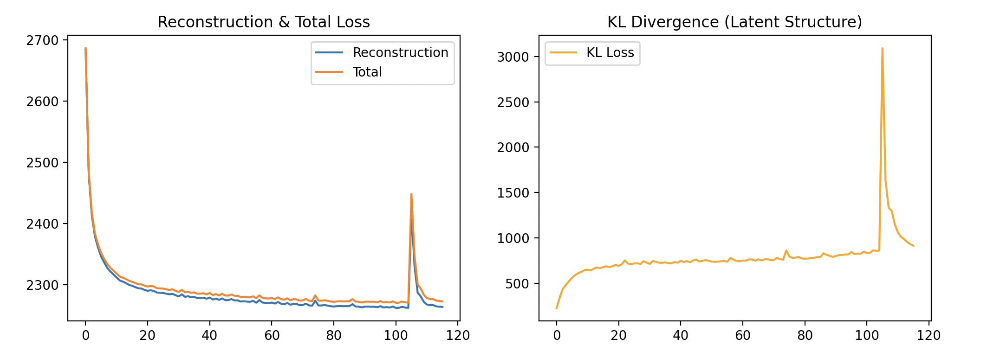
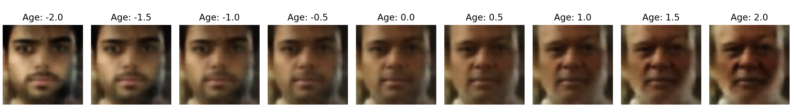
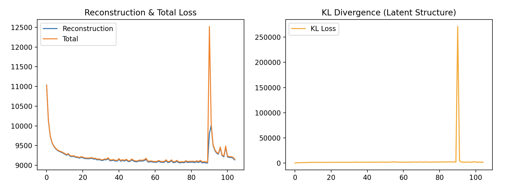
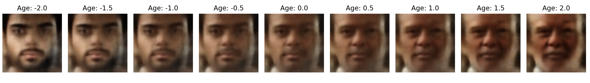
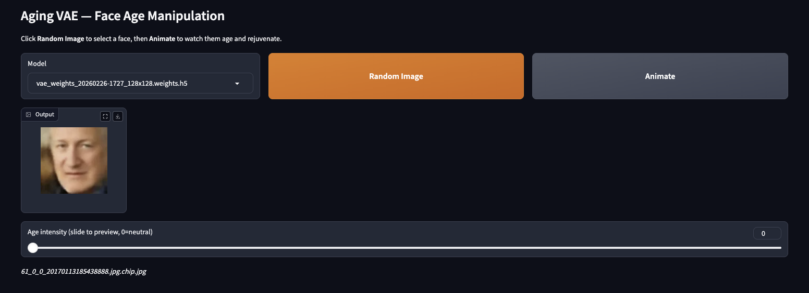
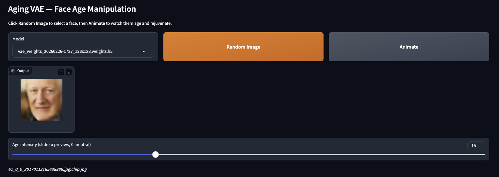
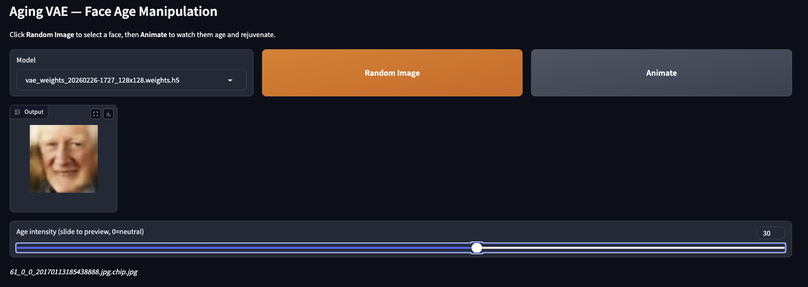
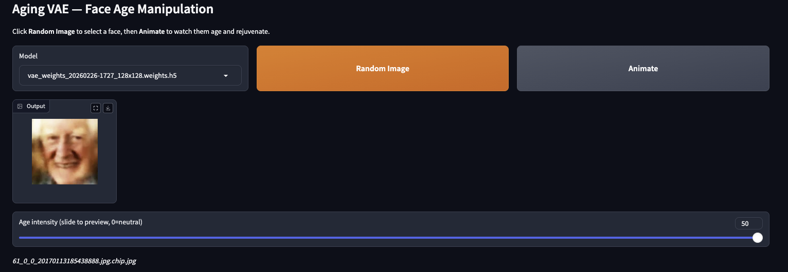

# Aging VAE

Face aging and attribute manipulation using Variational Autoencoders (VAE) on the UTKFace dataset.

## Features

- **Multi-resolution training**: Train models at 64x64 or 128x128 resolution
- **Latent space manipulation**: Age faces by traversing learned age directions in latent space
- **Gender-orthogonalized aging**: Age vector is purified to remove gender component, preventing unwanted gender shifts during aging
- **Interactive web interface**: Gradio-powered UI with animation and manual slider control
- **Multiple model support**: Switch between trained models in the web interface

## Networks

I experimented with both a 64x64 VAE Network and a 128x128 VAE Networks. The weights of both are available for testing in the models directory. I found the results of the 128x128 VAE network to have much better sharpness and fidelity. Both models were trained for 200 epochs I implemented early stopping and found at around epoch 105 for 64x64 and 91 for 128x128 network the KL Loss spiked likely from a gradient explosion in the data. See loss plots below for 64x64 and 128x128 networks.

### **64x64 Loss Plot**


**64x64 Age Progression**


### **128x128 Loss Plot**


### **128x128 Age Progression**


## Project Structure

```
src/
├── cli/
│   └── app.py              # CLI entry point (train/serve)
├── data_loading/
│   └── loader.py           # UTKFace dataset loading utilities
├── model/
│   ├── vae.py              # VAE model class with custom loss
│   ├── vae_factory.py      # Factory functions for 64x64 and 128x128 VAEs
│   ├── sampling.py         # Reparameterization trick layer
│   └── latent_math.py      # Age direction computation and manipulation
└── serve/
    ├── gradio_app.py       # Gradio web interface
    └── model_loader.py     # Model discovery and loading

models/                     # Saved model weights (auto-created)
images                      # Images showing training results and application snips
data/UTKFace/               # Dataset location
```

## Prerequisites

- Python 3.10+
- macOS with Apple Silicon (for GPU acceleration via tensorflow-metal) or NVIDIA GPU
- ~2GB disk space for UTKFace dataset


## Setup

```bash
poetry install
```

## Usage

Place the UTKFace dataset in `data/UTKFace`, then use the CLI to train or serve.

### Train a model

```bash
# Train 64x64 model (default)
poetry run python src/cli/app.py --train

# Train 128x128 model
poetry run python src/cli/app.py --train --resolution 128

# Custom dataset path
poetry run python src/cli/app.py --train --dataset-path /path/to/UTKFace
```

### Launch the web interface

```bash
poetry run python src/cli/app.py --serve
```

### CLI Options

| Option | Description |
|--------|-------------|
| `--train` | Train a new VAE model |
| `--serve` | Launch the Gradio web interface |
| `--resolution 64|128` | Image resolution for training (default: 64) |
| `--dataset-path PATH` | Path to UTKFace dataset (default: `data/UTKFace`) |

## Web Interface

The Gradio interface provides:

- **Model dropdown**: Select from available trained models
- **Random Image**: Load a random face from the dataset
- **Animate**: Watch the face age forward then return to neutral
- **Age slider**: Manually control aging intensity (0 = neutral, max = oldest)

### Images
Using the slider or the animation button shows the neutral image then it transitions along the age vector by multiplying up to 3.5 in 50 step increments. Each step in the animation and on the slider represents a multiplier of 3.5/50 or .07 to the age vector. The gender component of the data is removed so that only age is simulated.

#### **Neutral Default Image**


#### **Default Image aged (slider 15 → intensity 1.05)**


#### **Default Image aged (slider 30 → intensity 2.10)**


#### **Default Image aged (slider 50 → intensity 3.5)**



## Model Naming Convention

Model weights are saved with resolution embedded in the filename:

```
vae_weights_{timestamp}_{resolution}.weights.h5
```

Examples:
- `vae_weights_20260226-1603_64x64.weights.h5`
- `vae_weights_20260227-0900_128x128.weights.h5`

The web interface auto-detects resolution from the filename and loads images at the correct size.

## UTKFace Dataset

Download from: https://www.kaggle.com/datasets/moritzm00/utkface-cropped

Filename format: `[age]_[gender]_[race]_[date].jpg`
- Gender: 0 = Male, 1 = Female
- Age range used: 18-80

## How It Works

```
                              TRAINING
┌─────────────────────────────────────────────────────────────────────┐
│                                                                     │
│   Face Image ──► Encoder ──► z (512-dim) ──► Decoder ──► Face'     │
│       x                          │                          x̂       │
│                                  │                                  │
│                         minimize: reconstruction_loss + β·KL_loss   │
│                                                                     │
└─────────────────────────────────────────────────────────────────────┘

                           AGE VECTOR COMPUTATION
┌─────────────────────────────────────────────────────────────────────┐
│                                                                     │
│   mean(z | age=75) ─────┐                                           │
│                         ├──► age_vec = μ_old - μ_young              │
│   mean(z | age=18) ─────┘                                           │
│                                                                     │
│   age_vec ──► orthogonalize against gender_vec ──► pure_age_vec    │
│                                                                     │
└─────────────────────────────────────────────────────────────────────┘

                              INFERENCE
┌─────────────────────────────────────────────────────────────────────┐
│                                                                     │
│   Input ──► Encoder ──► z ──► z + α·age_vec ──► Decoder ──► Aged   │
│                                                                     │
│   α > 0: older    α = 0: neutral    α < 0: younger                  │
│                                                                     │
└─────────────────────────────────────────────────────────────────────┘
```

1. **Training**: The VAE learns to compress faces into a 512-dimensional latent space while reconstructing them
2. **Age direction**: Computed as the difference between mean latent vectors of 75-year-olds and 18-year-olds
3. **Orthogonalization**: The age vector is projected to be orthogonal to the gender vector, preventing gender leakage during aging
4. **Manipulation**: Adding/subtracting the age direction from a face's latent code ages/rejuvenates it

## Generative Optimization Algorithm

A troubleshooting guide for VAE training issues:

### Phase 1: Initial Sanity Check

If `reconstruction_loss` is not decreasing within the first 5 epochs:
- Check data normalization: Ensure `x_train` is scaled to [0, 1]
- Check data type: Ensure input is `float32` (required for Metal/GPU)
- Increase learning rate: Move from 1e-4 to 1e-3 to kickstart weights

### Phase 2: Addressing the "Blurry Average"

If output is a generic blurry face and `kl_loss` << `reconstruction_loss`:
- Lower Beta: Change from 1.0 to 0.1 or 0.01 to prioritize pixel accuracy
- Add BatchNormalization after each Conv block
- Increase model depth: Add more filters (32 → 64 → 128)

### Phase 3: Addressing Latent Space Collapse

If every input produces the exact same output (identity loss):
- Increase latent dimensions: Move from 128 to 512 or 1024
- Decrease Beta: The model is sacrificing reconstruction for a perfect Gaussian
- Lower learning rate to 2e-4

### Phase 4: Improving Attribute Disentanglement

If moving along `age_vec` causes no visual change:
- Increase epochs: Run for 150-200+ epochs (disentanglement is late-stage)
- Slightly increase Beta: If too low, the latent space lacks geometric structure
- Re-calculate anchors with clean age group averages

### Phase 5: Reaching Photo-Realism

If the model is stable but images lack sharpness:
- Switch to Perceptual (VGG) Loss
- Implement KL annealing: Start with β=0, linearly increase to β=0.1 over 20 epochs

## License

MIT License

Copyright (c) 2026 Old Zin Software Corp

Permission is hereby granted, free of charge, to any person obtaining a copy
of this software and associated documentation files (the "Software"), to deal
in the Software without restriction, including without limitation the rights
to use, copy, modify, merge, publish, distribute, sublicense, and/or sell
copies of the Software, and to permit persons to whom the Software is
furnished to do so, subject to the following conditions:

The above copyright notice and this permission notice shall be included in all
copies or substantial portions of the Software.

THE SOFTWARE IS PROVIDED "AS IS", WITHOUT WARRANTY OF ANY KIND, EXPRESS OR
IMPLIED, INCLUDING BUT NOT LIMITED TO THE WARRANTIES OF MERCHANTABILITY,
FITNESS FOR A PARTICULAR PURPOSE AND NONINFRINGEMENT. IN NO EVENT SHALL THE
AUTHORS OR COPYRIGHT HOLDERS BE LIABLE FOR ANY CLAIM, DAMAGES OR OTHER
LIABILITY, WHETHER IN AN ACTION OF CONTRACT, TORT OR OTHERWISE, ARISING FROM,
OUT OF OR IN CONNECTION WITH THE SOFTWARE OR THE USE OR OTHER DEALINGS IN THE
SOFTWARE.