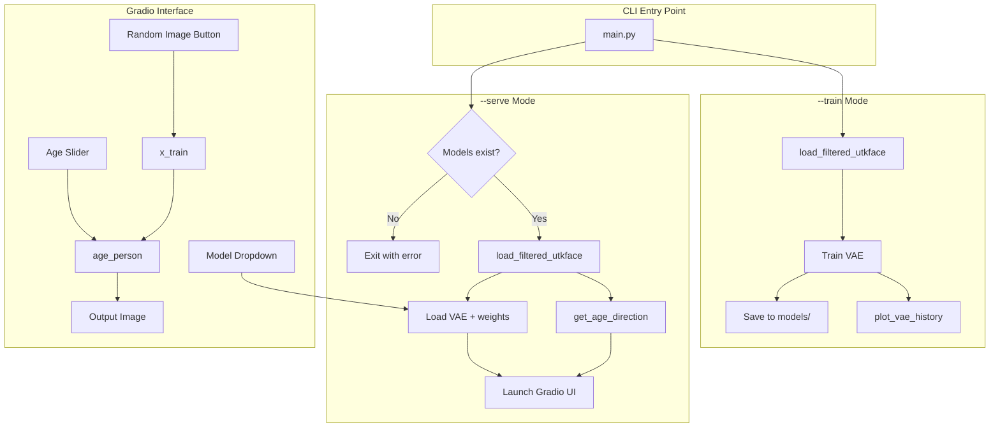

# Gradio Interface for Aging VAE

> **Status: Implemented**

## Architecture Overview



## Key Design Decisions

- **Dataset path**: Default `data/UTKFace` for serve mode (required for age vector computation and random image pool). Overridable via `--dataset-path`.
- **Model architecture**: All checkpoints assumed to be `build_vae_high_res(latent_dim=512)` (matches current training)
- **Model discovery**: Scan `models/` for `*.weights.h5` files; sort by modification time (most recent first)

---

## Implementation Summary

### 1. Gradio Dependency

Added `gradio = "^4.0"` to [pyproject.toml](pyproject.toml).

### 2. Model Loading Utility

**File**: `src/serve/model_loader.py`

- `get_available_models(models_dir)` — list of `(path, display_name)` tuples sorted by mtime descending
- `load_vae_from_weights(weights_path)` — built VAE with weights loaded
- `load_serve_state(dataset_path, models_dir)` — returns dict with `vae`, `vec_age`, `x_train`, `model_choices`, etc. Raises if no models exist.

### 3. Gradio UI Module

**File**: `src/serve/gradio_app.py`

- `create_app(serve_state)` — builds the Gradio Blocks interface
- Model dropdown with reload on change
- Random image button to select from training set
- Age slider (-3 to 3) for younger/older effect
- Output image showing `age_person` result

### 4. main.py CLI Modes

- `--train` — runs existing training pipeline
- `--serve` — launches Gradio web interface
- `--dataset-path` — defaults to `data/UTKFace`

### 5. Package Structure

- `src/serve/__init__.py` — exports `create_app`, `load_serve_state`, `load_vae_from_weights`, `get_available_models`
- `src/serve/model_loader.py` — model discovery and loading
- `src/serve/gradio_app.py` — Gradio UI definition

---

## Usage

```bash
# Train (existing behavior)
poetry run python main.py --train

# Serve web interface
poetry run python main.py --serve

# With custom dataset path
poetry run python main.py --serve --dataset-path data/UTKFace
```
