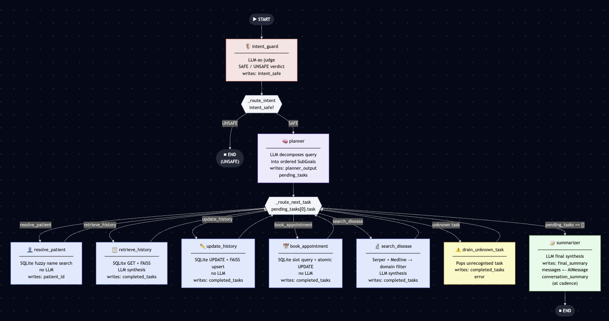
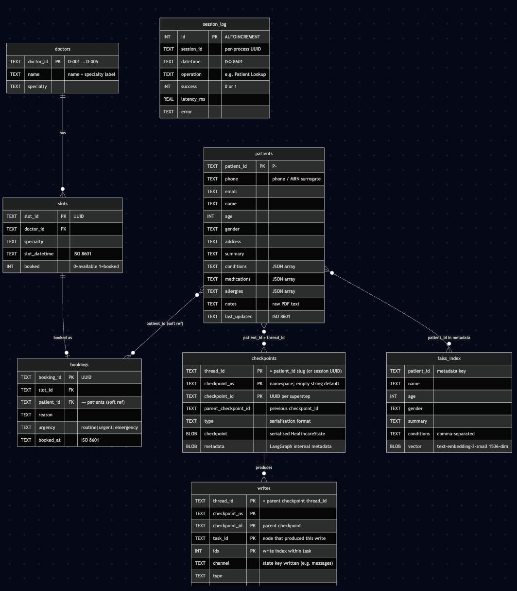
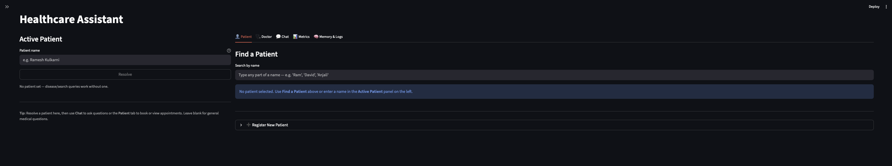
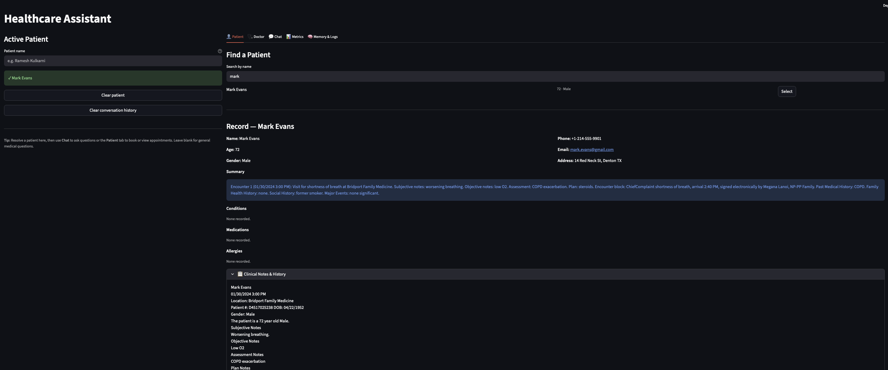
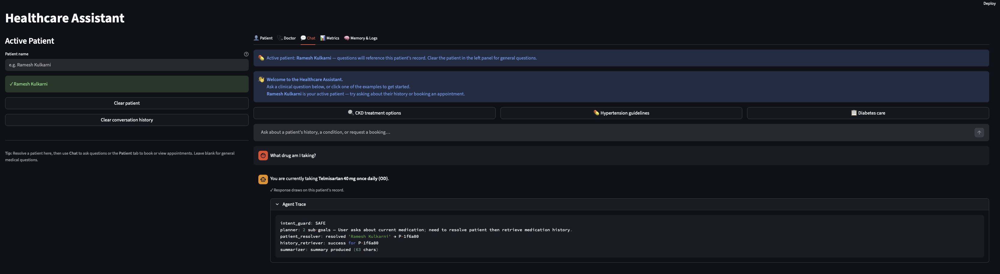
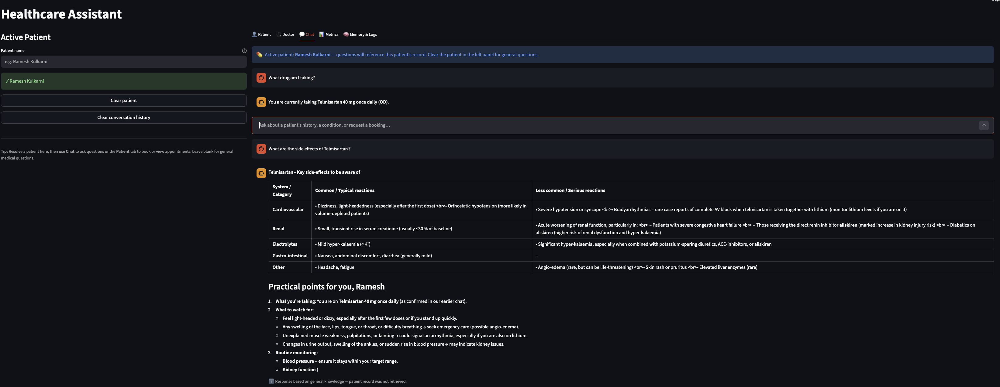
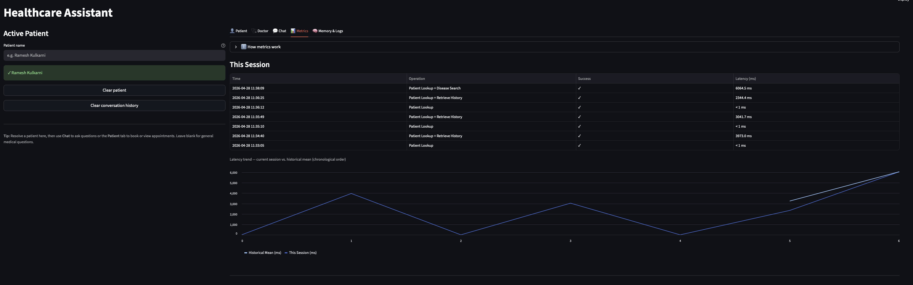
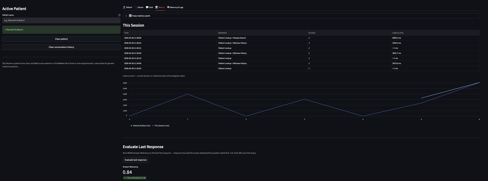
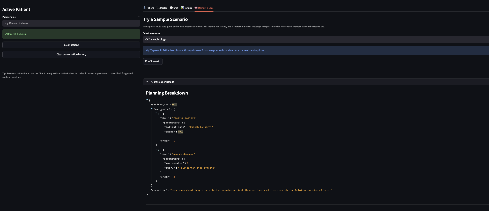

# Agentic Healthcare Assistant

**Created by Tim Hayes**

---

## Problem

Healthcare administration requires staff to coordinate multiple distinct operations — scheduling appointments, retrieving and updating patient histories, and researching current treatment guidelines — from a single patient encounter. Today, each of these operations lives in a different system: an EHR for records, a scheduling tool for appointments, a search engine for clinical guidelines. Staff must context-switch across all three to answer a single patient question.

Existing AI tools solve for one task at a time. A chatbot can answer a factual question but cannot book an appointment. A scheduling system can find available slots but knows nothing about the patient's conditions. A search engine can return clinical guidelines but cannot cross-reference them against a specific patient's current medications.

The Agentic Healthcare Assistant addresses this by acting as a unified clinical assistant: it accepts natural-language queries, decomposes them into an ordered plan of sub-tasks, dispatches each task to the correct tool, and returns a synthesized, clinically coherent response — all from a single conversational interface.

---

## Solution Overview

The assistant is built on a **LangGraph `StateGraph`** that orchestrates five distinct tools: patient identity resolution, history retrieval, history mutation, appointment booking, and disease information search. A planning LLM decomposes any multi-part query into an ordered queue of sub-goals. Each sub-goal is dispatched sequentially to its corresponding tool node, which writes its result into a shared typed state. A final synthesizer node composes all tool outputs into a single user-facing response.

The graph is intentionally asymmetric in its LLM usage: appointment booking and patient resolution are **pure Python + SQLite** operations with no LLM in the critical path. Disease search uses a **RAG pipeline** — parallel Serper (Google Search) and Medline (NCBI PubMed) retrieval followed by LLM summarization. History retrieval combines SQLite structured lookup with **FAISS vector similarity search** over embedded clinical PDFs. Each LLM-backed node receives a structured `ChatPromptTemplate` with explicit variable slots; the planner prompt injects bounded conversation memory from the LangGraph checkpoint so prior context informs task decomposition without unbounded prompt growth.

**Conversation memory** persists across sessions via **LangGraph `SqliteSaver` checkpointing** (`data/checkpoints.db`). Each patient maps to a dedicated checkpoint thread (`thread_id = patient_id`). When a patient is selected, prior H/A message pairs are read directly from their checkpoint and hydrated into the Chat tab automatically. A rolling summary is compressed and written back to the checkpoint every few turns, giving the assistant continuity without unbounded context growth. Users can clear a patient's conversation history at any time from the Active Patient panel.

Three evaluation experiments have been run to validate each tool's fitness for production. All three passed their architecture-defined thresholds. See [Experiments](#experiments--evaluation) and the [full findings](#experiment-findings) for results.

For complete technical details, see [docs/Architecture.md](docs/Architecture.md).

---

## Architecture

The system follows an **intent guard → planner → sequential task dispatch → synthesizer** pattern:



**Data stores:**
- **SQLite** (`data/healthcare.db`) — structured patient demographics, booking records, doctor schedules, and appointment slots
- **SQLite** (`data/checkpoints.db`) — LangGraph `SqliteSaver` checkpoint store; one thread per patient (`thread_id = patient_id`); persists the `messages` channel and rolling `conversation_summary` across sessions



- **FAISS** (`data/faiss/`) — vector index of clinical PDF notes and summaries; `text-embedding-3-small` embeddings; queried by history retrieval and updated by history writes

**Patient data:** 30 unique patients loaded at startup — 5 from original dataset (with PDF clinical reports), 20 from a synthetic generated dataset, and 5 PDF-only patients whose demographics are extracted from the clinical document headers.

### Sample Scenario — End-to-End Trace

> *"My 70-year-old father has chronic kidney disease. I want to book a nephrologist for him. Also, can you summarize the latest treatment methods."*

**Step 1 — Intent Guard.** The query is classified as healthcare-related (`SAFE`) and passes to the planner. Off-topic or adversarial inputs are blocked here before any tool runs.

**Step 2 — Planner.** The LLM decomposes the request into four ordered sub-goals: `resolve_patient → retrieve_history → book_appointment → search_disease`. Prior conversation memory for this patient (if any) is injected into the planner prompt so the plan accounts for context already established in earlier turns.

**Step 3 — Task dispatch.** The graph processes each sub-goal sequentially:
- `resolve_patient`: fuzzy name match in SQLite → resolves to patient slug `P-xxxxxx`
- `retrieve_history`: SQLite demographics + FAISS similarity search over embedded clinical PDFs → LLM synthesizes CKD history summary
- `book_appointment`: queries available Nephrology slots → atomically books the earliest → returns confirmed time and doctor name (no LLM call)
- `search_disease`: parallel Serper + Medline fetch → domain whitelist filter → LLM synthesis of CKD treatment guidelines with inline citations

**Step 4 — Synthesizer.** All four `TaskResult` objects are composed into a single response: patient history summary, appointment confirmation, and treatment guidelines — one cohesive reply from a single natural-language question.

For the full graph topology, state contract, node responsibilities, prompt templates, and SQLite schema, see [docs/Architecture.md](docs/Architecture.md).

---

## Setup

### Prerequisites

- Python 3.13+
- [Poetry](https://python-poetry.org/docs/#installation)

### Install

```bash
git clone <repo-url>
cd "agentic healthcare assistant"
poetry install
cp .env.example .env
# Edit .env and add your API keys (see table below)
```

### API Keys

| Key | Required for | Where to get |
|-----|-------------|--------------|
| `OPENAI_API_KEY` | FAISS embeddings (`text-embedding-3-small`) — **always required** | platform.openai.com |
| `GROQ_API_KEY` | LLM provider (default: `llama-3.3-70b-versatile`) | console.groq.com |
| `SERPAPI_API_KEY` | Disease search — SerpAPI provider | serpapi.com |
| `SERPER_API_KEY` | Disease search — Serper provider (alternative to SerpAPI) | serper.dev |

`OPENAI_API_KEY` is required regardless of LLM provider — it is used exclusively for FAISS embedding via `text-embedding-3-small`. `GROQ_API_KEY` is required for all LLM-backed nodes (intent guard, planner, history retrieval, disease search, summarizer). Either `SERPAPI_API_KEY` or `SERPER_API_KEY` is required for the disease search tool; the active provider is controlled by `config.yaml` (`search.provider`).

### Verify Setup

```bash
# Check API keys, config validity, and DB initialization
poetry run healthcare-cli --health
```

---

## Usage

### Streamlit UI (full five-tab interface)

```bash
poetry run streamlit-app
# or equivalently:
poetry run streamlit run src/ui/app.py
```

Open the URL shown in the terminal (default `http://localhost:8501`). The UI initialises the SQLite database and FAISS index on first launch — expect a spinner for 8–15 seconds on cold start.

**Tab overview:**

| Tab | Purpose |
|-----|---------|
| **Patient** | Search for a patient, view their record, book appointments, register new patients via PDF upload |
| **Doctor** | Search by patient, view encounter notes, update structured record fields, view doctor availability and schedules, view upcoming and historical appointments per patient |
| **Chat** | Full LangGraph pipeline — natural-language queries decomposed into tool calls; shows trace expander with planner output; chat history persists across sessions via LangGraph checkpointing and is hydrated from the patient's checkpoint thread when a patient is selected |
| **Metrics** | Live operation log, latency chart, RAGAS faithfulness evaluation on the last chat response, offline experiment runners |
| **Memory & Logs** | Run built-in clinical scenarios, inspect planner JSON and trace, run FAISS similarity search |

The **Active Patient** column on the left (available across all tabs) provides a global patient resolver — type a name to search, disambiguate multi-match results, and lock the resolved patient into session state. When a patient is resolved, their prior conversation history is automatically hydrated from their LangGraph checkpoint thread. The panel also exposes a **Clear conversation history** button that deletes the active patient's checkpoint thread and resets the Chat tab.

**Sidebar:** shows app version, active LLM provider and model, and a **Clear Session** button that resets all session state keys.

### CLI (backend integration testing)

```bash
# Check API keys, config, and database status
poetry run healthcare-cli --health

# List patients and available appointment slots
poetry run healthcare-cli --list-db

# Initialize the database (does nothing if already initialized)
poetry run healthcare-cli --init-db

# Run a free-form query
poetry run healthcare-cli --query "Book a nephrologist for Ramesh Kulkarni"

# Run named scenarios
poetry run healthcare-cli --scenario ckd
poetry run healthcare-cli --scenario hypertension
poetry run healthcare-cli --scenario diabetes
poetry run healthcare-cli --scenario all

# Show the agent plan and/or execution trace
poetry run healthcare-cli --query "..." --show-plan --show-trace

# Fail on any task-level error
poetry run healthcare-cli --scenario all --strict

# Pass a patient name hint to the planner
poetry run healthcare-cli --query "Retrieve history" --patient "Ramesh Kulkarni"

# Check on a patients medication, verify it remembered the question and output the checkpointing rows
# Step 1 — First query (creates the checkpoint thread):
poetry run healthcare-cli \
  --query "What medications is Ramesh on?" \
  --patient "Ramesh Kulkarni" \
  --show-plan

#Step 2 — Second query (proves the patient_id persists across invocations):
poetry run healthcare-cli \
  --query "What was my last question about?" \
  --patient "Ramesh Kulkarni"

#Step 3 — SQLite check (proves the rows are in checkpoints.db):
sqlite3 data/checkpoints.db \
  "SELECT rowid, thread_id, checkpoint_id FROM checkpoints ORDER BY rowid DESC LIMIT 5;"
```

---

## Configuration

All settings are loaded from `config.yaml`. Switch providers or adjust token budgets here — no code changes required.

### LLM Provider

```yaml
provider:
  groq:
    model: "openai/gpt-oss-120b"
    temperature: 0.1                   # structured/deterministic nodes
    temperature_summarizer: 0.3        # final synthesis
    temperature_search: 0.3            # disease search paraphrase
```

To switch to OpenAI, replace the `groq:` block with an `openai:` block using any `ChatOpenAI`-compatible model name. The `get_llm()` factory reads the provider key and constructs the correct `BaseChatModel` instance.

### Token Budgets

| Chain | Budget | Derivation |
|-------|--------|------------|
| Intent guard | 25 | `1 × 10 × 1 × 1.3` |
| Planner | 1024 | `5 sub-goals × 68 t/goal × 1.3`; ≥1024 required for Groq reasoning models |
| History summarizer | 400 | `10 fields × 30 t/field × 1.3` |
| Disease search summary | 650 | `8 snippets × 60 t/snippet × 1.3` |
| Appointment result | 150 | `6 fields × 15 t/field × 1.3` |
| Final synthesizer | 700 | `5 sections × 100 t/section × 1.3` |
| Memory summary rollup | 260 | `1 summary × ~200 t × 1.3`; uses `temperature_summarizer` |

All budgets follow the formula `(avg_fields × avg_tokens_per_field × num_items) × 1.3`. Do not use arbitrary round numbers — truncation mid-JSON breaks structured output parsing.

### Search Provider

```yaml
search:
  provider: "serper"    # or "serpapi" — both keys can be present; this key selects the active one
```

### Database & Checkpointing Configuration

```yaml
db:
  sqlite_path: "data/healthcare.db"      # patient records, appointments, doctor schedules
  checkpoint_db_path: "data/checkpoints.db"  # LangGraph SqliteSaver — one thread per patient
  checkpointing_enabled: true            # set false to disable SqliteSaver (e.g. local dev without persistence)
  faiss_path: "data/faiss"              # FAISS index; built from PDFs on first run
  max_recent_turns: 10                  # H/A pairs loaded into UI and passed to planner
  max_summary_chars: 1500               # character cap on rolling conversation_summary in checkpoint
  memory_summary_cadence_turns: 3       # compress conversation history every K user turns
```

`max_recent_turns` controls how many H/A message pairs are hydrated from the patient's checkpoint thread into the Chat tab and injected into the planner context. `memory_summary_cadence_turns` controls how frequently the rolling `conversation_summary` is refreshed in the checkpoint — lower values keep the summary more current at the cost of more LLM calls.

---

## Error Handling and Guardrails

The graph is designed to surface failures as informative messages rather than crashes at every failure boundary.

### Intent Guard

All queries pass through an LLM-as-judge intent classifier before reaching the planner. Off-topic queries (non-medical, adversarial, out-of-scope) are rejected immediately:

> *"I can only assist with medical appointments, patient records, and healthcare information."*

The graph routes to `END` without invoking any tool nodes.

### Structured Output Failure (Planner)

The planner uses `llm.with_structured_output(PlannerOutput)` with a 3-attempt retry loop (exponential backoff: 1s → 2s). If parsing fails on all three attempts:

> *"I wasn't able to understand your request. Please rephrase and try again."*

### Tool-Level Failures

Every tool node returns a typed `TaskResult(success=False, error=str(e))` on failure — exceptions are never propagated to the graph. The `error` field on `HealthcareState` is non-fatal; execution continues and the synthesizer surfaces the failure in its final response.

| Failure mode | User-facing message |
|---|---|
| Appointment slot unavailable | "No available slots found for {specialty} in the requested window. Try a different date or urgency level." |
| Disease search: 0 results after domain filter | "No results found from trusted sources for your query. Try a more specific medical term." |
| Patient not found | Resolver returns candidate list or not-found message; no crash |
| DB write failure | "Unable to update patient record at this time. Please try again shortly." |
| Unhandled exception | "An internal error occurred. Reference ID: {trace_id}" (trace_id logged server-side) |

### Double-Booking Prevention

The appointment booking operation uses an atomic `UPDATE slots SET booked=1 WHERE slot_id=? AND booked=0` pattern. A concurrent booking attempt on the same slot will have one succeed and one receive `AppointmentResult(success=False)` — no exception, no data corruption.

### Domain Whitelist (Disease Search)

Serper results are filtered against `TRUSTED_MEDICAL_DOMAINS` in `src/utils/search_provider.py` before being passed to the LLM summarizer. Medline (NCBI PubMed) results are placed first in the combined context to weight clinical source material higher than consumer web content.

---

## Performance

End-to-end response time varies by tool path. The summarizer is always the final step; its latency is additive to the tool latency below.

| Tool path | Observed mean latency | P95 | Notes |
|---|---|---|---|
| Appointment booking | 1ms | 2ms | Pure SQLite; no LLM in path |
| History write | < 10ms | — | SQLite UPDATE + FAISS upsert |
| History retrieval (QA) | 605ms | — | SQLite + FAISS + single LLM call |
| Disease search | 2,037ms | 2,855ms | Parallel Serper + Medline + LLM |
| Full graph (single-tool, P95) | < 8,000ms | architecture target | Includes planner + tool + summarizer |

Latency figures are from validated experiment runs on `llama-3.3-70b-versatile` (Groq). All observed values are well within the 8-second P95 architecture target.

**FAISS cold start:** on first launch, `DataLoader` embeds all 30 patients' clinical PDFs via `text-embedding-3-small`. This takes 8–15 seconds and is a one-time cost. Subsequent startups load the persisted FAISS index from `data/faiss/` in under 1 second.

**Retry budget:** the 3-attempt retry loop adds up to 3 seconds (1s + 2s) per chain invocation in the failure case. This is worst-case and does not affect the happy path.

---

## Experiments & Evaluation

Three experiments validate each tool's fitness before production promotion. Each experiment is standalone — no `src/` imports required for Experiments 2 and 3; Experiments 1 and 3 require the DB layer (`Phase 4+`). Results are persisted as JSON to `experiments/*/data/` and readable from the Metrics tab.

### Running the Experiments

```bash
# Experiment 2 — Disease Search (runs immediately after poetry install; no DB needed)
poetry run python experiments/search/search_experiment.py

# Experiment 1 — Medical History (requires DB initialization; run healthcare-cli first)
poetry run python experiments/history/history_experiment.py

# Experiment 3 — Appointment Booking (requires DB initialization)
poetry run python experiments/appointment/appointment_experiment.py
```

### Experiment Findings

#### Experiment 1 — Medical History Management

Full findings: [`experiments/history/findings/findings.md`](experiments/history/findings/findings.md)

| Metric | Result | Threshold |
|--------|--------|-----------|
| QA accuracy (5 pairs) | 5/5 — 100% | 100% round-trip |
| Write round-trip latency | 6ms | — |
| Mean QA latency | 605ms | — |
| Model | `llama-3.3-70b-versatile` (Groq) | — |


#### Experiment 2 — Disease Search

Full findings: [`experiments/search/findings/findings.md`](experiments/search/findings/findings.md)

| Metric | Result | Threshold |
|--------|--------|-----------|
| Success rate | 20/20 — 100% | 100% |
| RAGAS faithfulness | **0.960** | ≥ 0.80 |
| Mean latency | 2,037ms | < 8,000ms P95 |
| P95 latency | 2,855ms | < 8,000ms |
| Medline 0-result queries | 5/20 (25%) | — |
| Model | `llama-3.3-70b-versatile` (Groq) | — |


#### Experiment 3 — Appointment Booking

Full findings: [`experiments/appointment/findings/findings.md`](experiments/appointment/findings/findings.md)

| Metric | Result | Threshold |
|--------|--------|-----------|
| Scenario pass rate | 4/4 — 100% | ≥ 90% |
| Mean booking latency | 1ms | — |
| Model | None (pure SQLite assertions) | — |

---

## Development

### Run Tests

```bash
# Full suite with coverage
poetry run pytest

# Targeted by module
poetry run pytest tests/agents/ -v
poetry run pytest tests/db/ -v
poetry run pytest tests/chains/ -v
```

### Lint

```bash
poetry run ruff check src/ tests/
```

### Coverage Targets

| Scope | Target |
|-------|--------|
| Overall | ≥ 85% |
| `src/tools/` | ≥ 90% |
| `src/chains/` | ≥ 90% |
| `src/agents/` | ≥ 90% |
| `src/ui/` | Omitted — Streamlit render logic; `tests/ui/test_app.py` covers pure helpers only |

### Project Structure

```
src/
├── agents/       One factory function per agent node (make_X_node pattern)
├── chains/       LangChain chain builders — one chain per file
├── config/       YAML-backed Pydantic Settings (provider, search, embeddings, DB)
├── db/           SQLite CRUD (PatientDB, AppointmentDB, MetricsDB), FAISS adapter, DataLoader
├── graph/        LangGraph StateGraph assembly and compilation
├── llm/          get_llm() factory — Groq and OpenAI paths
├── models/       Pydantic v2 data models — one class per file
├── tools/        LangChain @tool wrappers for each DB/search operation
├── cli/          CLI entry point (healthcare-cli)
├── ui/           Streamlit package (app.py shell + tabs/ + panels/ + components/)
└── utils/        invoke_with_retry(), search_provider abstraction, build_invoke_config()

tests/            Mirrors src/ structure exactly
experiments/
├── experiment_runner.py          Abstract base: _time_invoke(), _save_results()
├── history/                      Experiment 1: history fidelity (findings/ + data/)
├── search/                       Experiment 2: disease search relevance (findings/ + data/)
└── appointment/                  Experiment 3: booking success rate (findings/ + data/)

dataset/          Source patient data — committed, read-only
data/             Runtime SQLite + FAISS + checkpoint DB — git-ignored, created on first run
docs/             Architecture.md (full technical specification)
config.yaml       Provider, model, token budget, search, DB configuration
```

### Streamlit Screenshots

*Startup Screen*


*Find Patient*


*What drug am I taking*


*Side effects of drug*


*Main Metrics*


*Ragas Metric*


*Planning Breakdown*


---
