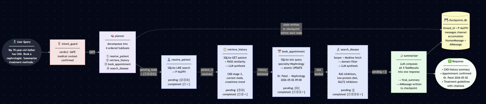

# Agentic Healthcare Assistant — Technical Architecture Specification

**Version:** 3.0
**Author:** Tim Hayes  
**Date:** 2026-04-15  

---
## 1. Goal & Scope

### Problem

Healthcare administration requires coordinating at least four distinct tool-backed operations — appointment booking, patient history retrieval, history mutation, and real-time disease information — from a single natural-language request. Existing siloed tools force staff to context-switch across systems and produce fragmented records.

### Objective

Build a **LangGraph-orchestrated** agentic assistant that decomposes multi-step patient queries into sequential sub-goals, dispatches each to the correct tool, and returns a synthesized clinical summary — all from a single conversational interface.

### Success Criteria

| Criterion | Threshold |
|-----------|-----------|
| Appointment booking success rate (Exp 3) | ≥ 90 % of valid slot requests |
| Disease search relevance score (RAGAS faithfulness, Exp 2) | ≥ 0.80 |
| History retrieval fidelity (Exp 1) | All structured fields round-trip losslessly |
| Graph execution latency (P95, Groq provider) | < 8 s for single-tool path |
| Test coverage | ≥ 85 % overall; ≥ 90 % on tool and chain modules |

### Out of Scope

- HIPAA compliance / PHI encryption (research prototype)
- Real EHR system integration (SQLite simulates the patient DB)
- Billing or insurance workflows
- Voice or image input modalities
- Multi-user concurrent session isolation

---

## 2. Pydantic Data Models

All models use Pydantic v2. Field `description` values are written for LLM format instruction use.

```python
# src/models/enums.py
from typing import Literal

# Single canonical definition — imported by HistoryUpdateRequest and UpdateHistoryParams.
# Add new field names here only; both consumers update automatically.
HistoryField = Literal["conditions", "medications", "allergies", "notes", "summary"]
```

```python
# src/models/patient.py
from pydantic import BaseModel, Field
from datetime import date, datetime
from typing import Literal

class PatientRecord(BaseModel):
    """Maps directly to records.xlsx schema + extended clinical fields.

    xlsx columns: Phone_number, Email, Name, Age, Gender, Address, Summary
    patient_id is a derived slug generated at load time (P-<hash6 of phone+name>).
    """
    patient_id: str = Field(description="Derived slug identifier, e.g. P-4a2f91 (generated from phone+name hash)")
    phone: str = Field(description="Patient phone number, e.g. '+91-98180-11245'")
    email: str | None = Field(default=None, description="Patient email address; may be null")
    name: str = Field(description="Full legal name of the patient")
    age: int = Field(ge=0, le=130, description="Age in years")
    gender: str = Field(description="Patient gender, e.g. 'Male' or 'Female'")
    address: str = Field(default="", description="Patient address from records.xlsx")
    summary: str = Field(default="", description="Pre-existing summary from records.xlsx or generated from PDF report")
    conditions: list[str] = Field(
        default_factory=list,
        description="List of active chronic or acute diagnoses, e.g. ['chronic kidney disease', 'hypertension']"
    )
    medications: list[str] = Field(
        default_factory=list,
        description="List of current medications with dosage, e.g. ['metformin 1000mg BID']"
    )
    allergies: list[str] = Field(default_factory=list, description="Known drug or food allergies")
    notes: str = Field(default="", description="Unstructured clinical notes extracted from PDF reports")
    last_updated: datetime = Field(default_factory=datetime.now)


# src/models/history_update_request.py
from src.models.enums import HistoryField

class HistoryUpdateRequest(BaseModel):
    patient_id: str = Field(description="Target patient identifier")
    field: HistoryField = Field(
        description="Which field of the patient record to update; 'summary' updates the free-text clinical summary"
    )
    value: str = Field(description="New value to append or set for the specified field")
    operation: Literal["append", "replace"] = Field(
        default="append",
        description="Whether to append the value to an existing list/string or fully replace it"
    )


# src/models/history_update_result.py
class HistoryUpdateResult(BaseModel):
    patient_id: str = Field(description="Patient identifier that was updated")
    field_updated: str = Field(description="Field that was modified")
    success: bool = Field(description="True if the update was persisted successfully")
    confirmation: str = Field(description="One-sentence confirmation of what was changed")
    error: str | None = Field(default=None, description="Error message if success is False")


# src/models/doctor_availability.py
class DoctorAvailability(BaseModel):
    doctor_id: str = Field(description="Unique doctor identifier, e.g. D-001")
    doctor_name: str = Field(description="Full name and specialty, e.g. 'Dr. Patel — Nephrology'")
    specialty: str = Field(description="Medical specialty, e.g. 'Nephrology'")
    available_slots: list[str] = Field(
        description="ISO 8601 datetime strings of open appointment slots"
    )


# src/models/appointment_request.py
class AppointmentRequest(BaseModel):
    patient_id: str = Field(description="Patient requesting the appointment")
    specialty: str = Field(description="Required medical specialty, e.g. 'Nephrology'")
    preferred_date: date | None = Field(default=None, description="Preferred appointment date (YYYY-MM-DD)")
    urgency: Literal["routine", "urgent", "emergency"] = Field(
        default="routine",
        description="Clinical urgency level"
    )
    reason: str = Field(default="", description="Brief clinical reason for the visit")


# src/models/appointment_result.py
class AppointmentResult(BaseModel):
    success: bool = Field(description="True if an appointment was successfully booked")
    appointment_id: str | None = Field(default=None, description="Unique booking reference if booked")
    doctor_name: str | None = Field(default=None, description="Name and specialty of the assigned doctor")
    slot: str | None = Field(default=None, description="Confirmed ISO 8601 datetime of the appointment")
    patient_id: str = Field(description="Patient for whom the appointment was booked")
    message: str = Field(description="Human-readable confirmation or failure reason")


# src/models/disease_search_request.py
class DiseaseSearchRequest(BaseModel):
    query: str = Field(description="Clinical search query, e.g. 'latest treatment methods for chronic kidney disease stage 3'")
    max_results: int = Field(default=5, ge=1, le=10, description="Maximum web results to retrieve")
    sources_filter: list[str] = Field(
        default_factory=lambda: ["medlineplus.gov", "who.int", "pubmed.ncbi.nlm.nih.gov"],
        description="Trusted domain whitelist; results outside these domains are deprioritised"
    )


# src/models/search_result_item.py
class SearchResultItem(BaseModel):
    title: str = Field(description="Title of the retrieved article or page")
    url: str = Field(description="Source URL")
    snippet: str = Field(description="Relevant excerpt from the source")
    source_domain: str = Field(description="Domain of the source, e.g. 'medlineplus.gov'")


# src/models/disease_search_result.py
class DiseaseSearchResult(BaseModel):
    query: str = Field(description="Original search query")
    items: list[SearchResultItem] = Field(description="Ranked list of retrieved results")
    summary: str = Field(description="LLM-generated synthesis of the retrieved information (2-4 paragraphs)")
    citations: list[str] = Field(description="List of source URLs cited in the summary")


# src/models/resolve_patient_params.py
class ResolvePatientParams(BaseModel):
    patient_name: str | None = Field(default=None, description="Patient full name for fuzzy name lookup")
    phone: str | None = Field(default=None, description="Phone number for exact lookup if name is ambiguous")

# src/models/retrieve_history_params.py
class RetrieveHistoryParams(BaseModel):
    patient_id: str = Field(description="Resolved slug ID — populated by resolve_patient node")
    query: str = Field(default="", description="Optional specific query about patient history")

# src/models/update_history_params.py
from src.models.enums import HistoryField

class UpdateHistoryParams(BaseModel):
    patient_id: str = Field(description="Resolved slug ID of the patient to update")
    field: HistoryField = Field(description="Which field to update")  # canonical Literal from enums.py
    value: str = Field(description="Value to append or replace")
    operation: Literal["append", "replace"] = Field(default="append")

# src/models/book_appointment_params.py
class BookAppointmentParams(BaseModel):
    patient_id: str = Field(description="Resolved slug ID of the patient")
    specialty: str = Field(description="Required medical specialty, e.g. 'Nephrology'")
    preferred_date: str | None = Field(default=None, description="Preferred date as YYYY-MM-DD string")
    urgency: Literal["routine", "urgent", "emergency"] = Field(default="routine")
    reason: str = Field(default="")

# src/models/search_disease_params.py
class SearchDiseaseParams(BaseModel):
    query: str = Field(description="Clinical search query string")
    max_results: int = Field(default=5, ge=1, le=10)


# src/models/sub_goal.py
class SubGoal(BaseModel):
    task: Literal["resolve_patient", "retrieve_history", "update_history", "book_appointment", "search_disease"] = Field(
        description="The atomic task type to execute"
    )
    parameters: dict[str, str | int | None] = Field(
        default_factory=dict,
        description="Key-value parameters for this task; keys match the corresponding typed params model"
    )
    order: int = Field(ge=1, description="Execution order (1 = first)")


# src/models/planner_output.py
class PlannerOutput(BaseModel):
    patient_id: str | None = Field(default=None, description="Resolved patient slug ID if already known; None if resolution is the first sub-goal")
    sub_goals: list[SubGoal] = Field(
        description="Ordered list of atomic sub-tasks to execute; must include resolve_patient first if patient_id is None"
    )
    reasoning: str = Field(description="One sentence explaining the decomposition decision")


# src/models/task_result.py  — typed accumulator for completed_tasks list
class TaskResult(BaseModel):
    task: str = Field(description="Task type that produced this result, e.g. 'retrieve_history'")
    success: bool = Field(description="Whether the task completed successfully")
    result: dict = Field(default_factory=dict, description="Serialized output of the task")
    error: str | None = Field(default=None, description="Error message if success is False")


# src/models/evaluation.py
class ExperimentMetrics(BaseModel):
    experiment_name: Literal["medical_history", "disease_search", "appointment_booking"] = Field(
        description="Which experiment these metrics belong to"
    )
    run_id: str = Field(description="UUID for this experiment run")
    timestamp: datetime = Field(default_factory=datetime.now)
    latency_ms: float = Field(description="End-to-end tool execution latency in milliseconds")
    success: bool = Field(description="Whether the primary operation succeeded")
    quality_score: float | None = Field(
        default=None, ge=0.0, le=1.0,
        description="Evaluator score (0.0–1.0): load_evaluator CORRECT/INCORRECT ratio for Exp 1; RAGAS faithfulness for Exp 2; None for Exp 3"
    )
    tool_calls_made: int = Field(description="Number of tool invocations in this run")
    error: str | None = Field(default=None, description="Error message if success is False")
```

---

## 3. LangGraph Chain Topology

### Graph Overview


### LangGraph State (TypedDict)

```python
# src/models/graph_state.py
from typing import Annotated, NotRequired, TypedDict
from langchain_core.messages import AnyMessage
from langgraph.graph.message import add_messages
from src.models.task_result import TaskResult

class HealthcareState(TypedDict):
    """LangGraph state shared across all nodes in the healthcare graph.

    Reducer annotations:
      - messages: add_messages — appends and deduplicates by message id across invocations.

    REPLACE semantics (no annotation — last write wins):
      - completed_tasks and trace are per-invocation only; accumulated in the UI layer
        (session_state["completed_tasks"]), NOT in the checkpoint.
      - conversation_summary uses REPLACE but is only written at cadence;
        absent from the delta between cadence triggers (LangGraph preserves last value).

    NotRequired fields:
      - conversation_summary may be absent from checkpoints predating this field.
        Always access via state.get("conversation_summary", "") — never state["conversation_summary"].
    """
    user_query: str                                      # Original user input
    patient_id: str | None                               # Resolved slug ID; None until resolve_patient runs
    messages: Annotated[list[AnyMessage], add_messages]  # Accumulates across invocations via checkpoint
    planner_output: PlannerOutput | None                 # Decomposed plan
    pending_tasks: list[SubGoal]                         # Task queue — REPLACE semantics (dequeued per node)
    completed_tasks: list[TaskResult]                    # REPLACE — per-invocation only; UI layer accumulates
    intent_safe: bool                                    # Guard verdict
    final_summary: str | None                           # Synthesized response
    error: str | None                                    # Non-fatal error surface
    trace: list[str]                                     # REPLACE — per-invocation audit log
    conversation_summary: NotRequired[str]               # Rolling summary; absent until first cadence fire
```

### State Contract (invariants — every node must uphold)

1. **Task dequeue:** Every tool node returns `{"pending_tasks": state["pending_tasks"][1:]}` alongside its result. This is the only mechanism that advances the queue. Failure to return the slice causes the graph to loop on the same task indefinitely. This is mediated by the GraphConfig value of recursion limit which will throw a GraphRecursionError if exceeded.
2. **completed_tasks accumulation (REPLACE semantics):** Every tool node must return the full accumulated list for the current invocation — not just a single-element list. With REPLACE semantics, returning `[result]` would silently drop all prior task results from earlier nodes in the same invocation. The correct pattern: `completed = list(state.get("completed_tasks", [])); completed.append(result); return {"completed_tasks": completed}`.
3. **patient_id propagation:** `patient_resolver_node` is the only node that writes `patient_id` to state. All downstream nodes read it; none overwrite it.
4. **error is non-fatal:** Setting `error` does not stop the graph. Nodes check `state.get("error")` and may surface it in the final summary. To halt execution, a node routes to `END` via a conditional edge, not by raising an exception.
5. **Typed params validation:** Every tool node must cast `state["pending_tasks"][0].parameters` through its typed params model before use — e.g. `params = ResolvePatientParams(**state["pending_tasks"][0].parameters)`. A `ValidationError` (wrong key name or type from the LLM) is caught and returned as `TaskResult(success=False, error=str(e))` with `pending_tasks[1:]` still dequeued so the graph continues rather than looping.
6. **HumanMessage injection:** Only `_build_initial_state()` (in `graph_runtime.py` and `run_query.py`) may introduce a `HumanMessage` into the `messages` channel — exactly one per user turn. The `summarizer_node` closes each turn by appending `AIMessage(content=summary)`. No other node writes `HumanMessage` objects to state.
7. **conversation_summary access:** Always read via `state.get("conversation_summary", "")` — never `state["conversation_summary"]`. The field may be absent from checkpoints predating its introduction.

### Node Responsibilities

| Node | Input consumed | Output produced | Implementation |
|------|---------------|----------------|----------------|
| `intent_guard` | `user_query` | `intent_safe: bool` | `_GUARD_PROMPT \| llm \| StrOutputParser` ([Section 3b](#3b-prompt-engineering--task-chaining)) |
| `planner` | `user_query`, `patient_id` | `planner_output`, `pending_tasks` | `_PLANNER_PROMPT \| llm.with_structured_output(PlannerOutput)` ([Section 3b](#3b-prompt-engineering--task-chaining)) |
| `task_router` | `pending_tasks[0].task` | conditional edge | pure Python |
| `patient_resolver` | `pending_tasks[0].parameters` (name/phone) | `patient_id`, `pending_tasks[1:]`, `completed_tasks` += `[TaskResult]` | SQLite fuzzy name query (`LIKE '%name%'`); returns top match or error `TaskResult` |
| `history_retriever` | `pending_tasks[0].parameters`, `patient_id` | `completed_tasks` += `[TaskResult]`, `pending_tasks[1:]` | SQLite get + FAISS similarity search → `_HISTORY_PROMPT \| llm \| StrOutputParser` ([Section 3b](#3b-prompt-engineering--task-chaining)) |
| `history_writer` | `pending_tasks[0].parameters`, `patient_id` | `completed_tasks` += `[TaskResult]`, `pending_tasks[1:]` | SQLite update + FAISS upsert; no LLM |
| `appointment_node` | `pending_tasks[0].parameters`, `patient_id` | `completed_tasks` += `[TaskResult]`, `pending_tasks[1:]` | **Pure Python + SQLite**: query slots by specialty/urgency/date → select earliest → insert booking → return `AppointmentResult`; no LLM |
| `disease_search_node` | `pending_tasks[0].parameters` | `completed_tasks` += `[TaskResult]`, `pending_tasks[1:]` | SerpAPI/Serper → domain filter → `_SEARCH_SUMMARY_PROMPT \| llm \| StrOutputParser` ([Section 3b](#3b-prompt-engineering--task-chaining)) |
| `task_complete_check` | `len(pending_tasks)` | conditional edge: `task_router` if > 0, else `summarizer` | pure Python |
| `summarizer` | `completed_tasks`, `user_query` | `final_summary: str` | `_SUMMARY_PROMPT \| llm \| StrOutputParser` ([Section 3b](#3b-prompt-engineering--task-chaining)) |

### Retry Strategy

Every `chain.invoke()` / `llm.with_structured_output().invoke()` call is wrapped:

```python
# src/utils/retry.py
import logging
import time
from langchain_core.exceptions import OutputParserException

logger = logging.getLogger(__name__)

def invoke_with_retry(chain, inputs: dict, node_name: str, max_attempts: int = 3) -> any:
    """Invoke a LangChain chain with exponential backoff on transient errors.

    Philosophy note: this function has multiple exit paths (return on success,
    raise on max-retries, raise on non-retryable error). This is an acknowledged
    exception to the single-exit rule — retry loops are the canonical case where
    early-return-on-success is clearer than a result-accumulator pattern.
    """
    for attempt in range(1, max_attempts + 1):
        try:
            return chain.invoke(inputs)  # single successful exit
        except (OutputParserException, ValueError) as e:
            if attempt == max_attempts:
                raise
            wait = 2 ** (attempt - 1)   # 1s, 2s
            logger.warning(f"[{node_name}] attempt {attempt} failed ({e}); retrying in {wait}s")
            time.sleep(wait)
        except Exception as e:
            logger.error(f"[{node_name}] non-retryable error: {e}")
            raise
```

- **Caught**: `OutputParserException` (malformed structured output), `ValueError` (schema mismatch)
- **Not retried**: `AuthenticationError`, `RateLimitError` (surface immediately)
- **Backoff**: 1 s → 2 s (exponential, max 3 attempts)
- **Applied at**: every node that calls `chain.invoke()` or `llm.invoke()`

---

## 3b. Prompt Engineering & Task Chaining

A structured prompt is defined for every LLM-backed node. Each is a `ChatPromptTemplate` with explicit variable slots and a system role that constrains scope.

**Canonical source (no duplicated wording here):** all templates live in [`src/chains/chain_prompts.py`](../src/chains/chain_prompts.py). Each subsection links to the constant and line range so this doc tracks the code when prompts change. In GitHub / GitLab web UI, the `#L…` fragment jumps to the line; locally, open the file at the line shown.

### Intent guard (`_GUARD_PROMPT`)

- **Template:** [`_GUARD_PROMPT`](../src/chains/chain_prompts.py#L24-L34) — input: `{user_query}`.
- **Chain:** [`intent_guard_chain.py`](../src/chains/intent_guard_chain.py): `_GUARD_PROMPT | llm | StrOutputParser | normalizer`.

### Planner (`_PLANNER_PROMPT`)

- **Template:** [`_PLANNER_PROMPT`](../src/chains/chain_prompts.py#L47-L88) — inputs: `{patient_context}`, `{memory_context}`, `{user_query}` (runtime context in the **human** turn; see comments in source).
- **Chain:** [`planner_chain.py`](../src/chains/planner_chain.py): `_PLANNER_PROMPT | llm.with_structured_output(PlannerOutput)`.

**`{memory_context}` construction (planner_node, built at invoke time):**

`build_planner_memory_inputs(patient_id, state, max_recent_turns)` reads exclusively from `HealthcareState` — no database calls. It combines the rolling `conversation_summary` field (written to checkpoint state by `summarizer_node` at cadence) with the most recent H/A message pairs from the `messages` channel (capped at `max_recent_turns * 2`):

```python
# From build_planner_memory_inputs in planner_node.py
summary = state.get("conversation_summary", "")
ha_pairs = [m for m in state.get("messages", []) if isinstance(m, HumanMessage | AIMessage)]
recent_text = "\n".join(
    f"{'User' if isinstance(m, HumanMessage) else 'Assistant'}: {m.content}"
    for m in ha_pairs[-max_recent_turns * 2:]
)
parts = []
if summary:
    parts.append(f"Summary: {summary}")
if recent_text:
    parts.append(recent_text)
memory_context = "\n\n".join(parts)   # empty string when no patient or no history
```

Memory context is injected in the **human** turn (not the system prompt) to limit prompt-injection exposure. An empty `memory_context` is valid — the prompt template handles it gracefully with no placeholder visible to the LLM.

### History retrieval (`_HISTORY_PROMPT`)

- **Template:** [`_HISTORY_PROMPT`](../src/chains/chain_prompts.py#L11-L22) — inputs: `{retrieved_chunks}`, `{query}` (chunks in the **human** turn; see source comments).
- **Chain:** [`history_chain.py`](../src/chains/history_chain.py): `_HISTORY_PROMPT | llm | StrOutputParser`.

### Search synthesis (`_SEARCH_SUMMARY_PROMPT`)

- **Template:** [`_SEARCH_SUMMARY_PROMPT`](../src/chains/chain_prompts.py#L90-L101) — inputs: `{search_results}`, `{query}`.
- **Chain:** [`search_chain.py`](../src/chains/search_chain.py): `_SEARCH_SUMMARY_PROMPT | llm | StrOutputParser`.

### Rolling memory summary (`_MEMORY_SUMMARY_PROMPT`)

- **Template:** [`_MEMORY_SUMMARY_PROMPT`](../src/chains/chain_prompts.py#L36-L45) — inputs: `{prior_summary}`, `{recent_turns}`, `{max_chars}`. Consumed exclusively by the `summarizer_node` closure via `memory_summary_chain`.
- **Chain:** [`memory_summary_chain.py`](../src/chains/memory_summary_chain.py): `_MEMORY_SUMMARY_PROMPT | llm | StrOutputParser`.
- **Trigger:** Fires inside `summarizer_node` every `memory_summary_cadence_turns` complete H/A turn pairs (counted by `HumanMessage` objects in the checkpoint `messages` channel). Result written to `state["conversation_summary"]` for persistence in the LangGraph checkpoint. Between cadence fires, the key is absent from the state delta — LangGraph preserves the last checkpoint value.

### Patient resolver (no LLM prompt)

Not LLM-driven — pure SQLite query. But if the name is ambiguous (multiple candidates), the resolver node returns an `error` TaskResult with candidate names serialized as a string, and the summarizer surfaces them to the user:

```
"Multiple patients found matching '{name}': Ramesh Kulkarni (P-xx), ...
Please specify the patient by full name or phone number."
```

### Final summarizer (`_SUMMARY_PROMPT`)

- **Template:** [`_SUMMARY_PROMPT`](../src/chains/chain_prompts.py#L103-L123) — inputs: `{completed_tasks}`, `{conversation_memory}` (system turn), `{user_query}` (human turn); see source for full rules text.
- **Chain:** [`summary_chain.py`](../src/chains/summary_chain.py): `_SUMMARY_PROMPT | llm | StrOutputParser`.

---

## 3c. Sample Scenario Trace

**Requirements scenario:** *"My 70-year-old father has chronic kidney disease. I want to book a nephrologist for him. Also, can you summarize latest treatment methods?"*

High-level visit order (time flows **left to right**). `task_router` and `task_complete_check` are collapsed into the arrows between tool nodes; see the table for every step.



**Planner prompt context injected at step 2:**
```
patient_context: "Name: unknown (father of requester), Age: 70, Conditions: ['chronic kidney disease']"
user_query: "My 70-year-old father has chronic kidney disease. I want to book a nephrologist
             for him. Also, can you summarize latest treatment methods?"
```

---

## 4. LLM Provider Config + Token Budget

### Provider Config

```yaml
provider:
  groq:                          # or "openai" — exactly one key
    model: "openai/gpt-oss-120b"
    temperature: 0.5             # reasoning models: 0.5–0.7 recommended (not 0.0–0.1)
    temperature_summarizer: 0.6
    temperature_search: 0.6
    # Reasoning models (gpt-oss, etc.) spend budget before the structured tool call;
    # 512 truncates PlannerOutput JSON → Groq tool_use_failed / invalid JSON.
    max_tokens_planner: 1536
    max_tokens_history: 400
    max_tokens_search: 650
    max_tokens_appointment: 150
    max_tokens_summarizer: 700
    max_tokens_guard: 1024          # reasoning models consume tokens on reasoning trace before output; 25 produces empty string
    # Groq reasoning controls — gpt-oss-120b specific
    # reasoning_format "parsed" is required when using tool-calling / structured output
    # (planner_chain uses with_structured_output — "raw" would cause a 400 error)
    reasoning_effort: "medium"
    reasoning_format: "parsed"

search:
  #provider: "serpapi"            # or "serper" — switch here to change 
  provider: "serper"           

embeddings:
  provider: "openai"            
  model: "text-embedding-3-small"

db:
  sqlite_path: "data/healthcare.db"
  checkpoint_db_path: "data/checkpoints.db"    # LangGraph SqliteSaver checkpoint store
  checkpointing_enabled: true                  # false disables SqliteSaver (tests, local dev)
  faiss_path: "data/faiss"
  max_recent_turns: 10
  max_summary_chars: 1500
  memory_summary_cadence_turns: 3

graph:
  recursion_limit: 100  # maximum number of supersteps to execute 
```

### Token Budget Derivation

| Chain | Calculation | × 1.3 | Budget |
|-------|------------|--------|--------|
| Intent guard | 1 field × 10 t/field × 1 item = 10 | 13 | **25** |
| Planner output | (5 sub-goals × 68 t/sub-goal) + 45 wrapper (patient_id + reasoning) = 385 | 500 | **1024** (see note) |
| History summarizer | 10 fields × 30 t/field × 1 patient = 300 | 390 | **400** |
| Disease search summary | 8 snippets × 60 t/snippet × 1 query = 480 | 624 | **650** |
| Appointment result | 6 fields × 15 t/field × 1 slot = 90 | 117 | **150** |
| Final summarizer | 5 sections × 100 t/section × 1 response = 500 | 650 | **700** |
| Memory summary rollup | 1 summary field × ~200 t/field × 1 item = 200 | 260 | **260** |

**Planner note:** each `SubGoal` averages 68 tokens — `task` (5t) + `order` (3t) + `parameters` dict (60t; e.g. `{"patient_id":"P-4a2f91","specialty":"Nephrology","preferred_date":"2026-04-15","urgency":"routine","reason":"CKD follow-up"}`). At 5 sub-goals this dominates the budget; 150 would truncate multi-step plans mid-JSON. On **Groq reasoning models** (`openai/gpt-oss-*` with `reasoning_format: parsed`), part of the token budget is consumed by internal reasoning before visible tool arguments — values below 1024 truncate the tool JSON. Default: **1024**; set higher (e.g. 1536) in `config.yaml` for reasoning-model configs.

**Memory summary rollup** uses `temperature_summarizer` (same controlled-paraphrase task); no separate temperature key required.

**Temperature:** `0.1` for guard, planner, history retrieval, and appointment (structured/deterministic output). `0.3` for summarizer and disease search chains — controlled paraphrase diversity without risking fabricated citations. Per-chain temperatures are separate keys in `config.yaml` (`temperature_summarizer`, `temperature_search`); `get_llm()` receives the appropriate value at graph construction time, not per-request.

### LLM Singleton Pattern

```python
# src/llm/llm_factory.py
def get_llm(
    provider: str,
    model: str,
    temperature: float = 0.1,
    max_tokens: int = 512,
) -> BaseChatModel:
    """Construct one LLM instance per application boundary — not per request."""
    if provider == "openai":
        return ChatOpenAI(model=model, temperature=temperature, max_tokens=max_tokens)
    elif provider == "groq":
        return ChatGroq(model=model, temperature=temperature, max_tokens=max_tokens)
    raise ValueError(f"Unsupported provider: {provider!r}")
```

Each node receives a pre-constructed LLM instance injected at graph construction time. No node instantiates an LLM directly.

---

## 5. Safety & Guardrails

### Input Validation

| Layer | Rule | Enforcement |
|-------|------|-------------|
| `user_query` length | Max 1 000 characters | Pydantic `max_length=1000` on state input |
| `patient_id` format | Alphanumeric + hyphens | `Field(pattern=r'^[A-Za-z0-9\-]+$')` |
| `specialty` field | Enum of known specialties | `Literal[...]` in `AppointmentRequest` |
| Search `query` | Max 300 chars | Pydantic field constraint |
| Web results | Domain whitelist filtering | Applied in `DiseaseSearchTool` before LLM |

### Intent Guard (LLM-as-Judge)

Canonical template is [`_GUARD_PROMPT`](../src/chains/chain_prompts.py#L24-L34); narrative in **Section 3b** (Intent guard). No duplication here.

- **SAFE** → proceed to planner node
- **UNSAFE** → graph routes to `END`; user sees: `"I can only assist with medical appointments, patient records, and healthcare information."`

### Structured Output Validation

`llm.with_structured_output(PlannerOutput)` enforces schema on every planner call. If parsing fails after 3 retries, the node returns `error = "Planning failed — please rephrase your request."` and routes to `END` without calling downstream tools.

### Error Surface (User-Facing)

| Failure | User message |
|---------|-------------|
| Intent UNSAFE | "I can only assist with medical appointments, patient records, and healthcare information." |
| Planner parse failure (3 retries) | "I wasn't able to understand your request. Please rephrase and try again." |
| Appointment slot unavailable | "No available slots found for {specialty} in the requested window. Try a different date or urgency level." |
| Disease search returns 0 results | "No results found from trusted sources for your query. Try a more specific medical term." |
| DB write failure | "Unable to update patient record at this time. Please try again shortly." |
| Unhandled exception | "An internal error occurred. Reference ID: {trace_id}" (trace_id logged server-side) |

---

## 5b. Experiments (LLMOps Evaluation)

There are three named experiments to measure tool API fitness across **latency** and **information quality**. Each experiment is an isolated, repeatable run that writes an `ExperimentMetrics` record as JSON to its `data/` subdirectory and surfaces results in the UI Metrics tab.

### Evaluation Strategy

`QAEvalChain` is deprecated in LangChain ^0.3. The three experiments use different evaluators matched to what each experiment actually measures:

| Experiment | Evaluator | Rationale |
|-----------|-----------|-----------|
| Exp 1 — Medical History | `load_evaluator("qa")` (LangChain ^0.3) | Ground-truth QA pairs exist in xlsx; measures CORRECT/INCORRECT ratio against known answers |
| Exp 2 — Disease Search | **RAGAS** (`faithfulness` + `answer_relevancy`) | RAG experiment — need to detect hallucination relative to retrieved documents, not just string match |
| Exp 3 — Appointment Booking | **Pure assertions** — no LLM evaluator | Deterministic operation; `success == True` and correct slot returned is sufficient |

**Exp 1 evaluator (`load_evaluator`):**

```python
from langchain.evaluation import load_evaluator

evaluator = load_evaluator("qa", llm=eval_llm)
# eval_llm: separate instance at temperature=0.0, constructed once at experiment boundary
result = evaluator.evaluate_strings(
    prediction=llm_summary,          # string output from history_retriever chain
    input=question,                   # e.g. "What is Ramesh's diagnosis?"
    reference=ground_truth_answer,    # e.g. "Essential Hypertension"
)
# result["score"] → 1 (CORRECT) or 0 (INCORRECT)
quality_score = sum(scores) / len(scores)
```

**Exp 2 evaluator (RAGAS):**

```python
# RAGAS 0.4.x API (Python 3.13 compatible)
# LLM: hardcoded ChatGroq — no production settings stack required
from langchain_groq import ChatGroq
from ragas import evaluate, EvaluationDataset, SingleTurnSample
from ragas.metrics import Faithfulness, AnswerRelevancy

samples = [
    SingleTurnSample(
        user_input=question,
        response=llm_summary,
        retrieved_contexts=[snippet1, snippet2, ...],   # raw search result snippets pre-LLM
        reference=gt_answer,
    )
    for question, llm_summary, gt_answer in test_cases
]
ragas_dataset = EvaluationDataset(samples=samples)
result = evaluate(dataset=ragas_dataset, metrics=[Faithfulness(), AnswerRelevancy()])
quality_score = result["faithfulness"]   # primary metric; answer_relevancy logged separately
```

RAGAS `faithfulness` score measures what fraction of claims in the LLM summary are grounded in the retrieved snippets — directly catching the failure mode of fabricating treatment options not in the Medline/WHO results.

**Persistence:** Each experiment writes JSON output to its own `data/` subdirectory (e.g., `experiments/history/data/{experiment_name}_{run_id}.json`). Findings and takeaways are captured as markdown in the sibling `findings/findings.md`. No SQLite dependency from the `experiments/` package — keeping the import boundary clean. The Metrics tab in the UI reads these JSON files at load time.

---

### Experiment 1 — Medical History Management

> **Run completed 2026-04-10.** Full findings: [`experiments/history/findings/findings.md`](../experiments/history/findings/findings.md).
> Summary: 5/5 QA pairs CORRECT (100%), write round-trip lossless at 6ms, mean QA latency 605ms.
> Promotion decision: **promote to production** (FAISS retrieval + inline Groq chain confirmed as the correct history_chain architecture).

**Measures:** Fidelity of structured record retrieval and mutation round-trips.

| Metric | How measured |
|--------|-------------|
| `latency_ms` | Wall-clock time from `history_tool.invoke()` call to `HistoryUpdateResult` returned |
| `quality_score` | `load_evaluator("qa")` grades: query = "What are {patient}'s current medications?"; ground truth = known xlsx value; prediction = LLM summary from FAISS retriever |
| `success` | `HistoryUpdateResult.success == True` for all write operations |
| `tool_calls_made` | Number of SQLite reads/writes + FAISS upserts per run |

**Dataset used:** Sample of 5 patients from `original_data/records.xlsx` (after dedup). Append `"metformin 500mg"` to David Thompson's medications → retrieve → verify it appears in the summary.

**QA pairs (ground truth):**

See [Diseases Q&A](experiments/history/data/history_qanda.jsonl)

---

### Experiment 2 — Disease Search

> **Latest run: 2026-04-14** (baseline: 2026-04-09). Full findings: [`experiments/search/findings/findings.md`](../experiments/search/findings/findings.md).
> Summary: 20/20 queries succeeded (100%), RAGAS faithfulness **0.960** (threshold ≥ 0.80 ✓), mean latency 2,037ms (+377ms vs baseline from `[Title/Abstract]` Medline expansion), Medline 0-result queries reduced from 35% → 25%. Domain whitelist (`TRUSTED_MEDICAL_DOMAINS`) and Medline priority ordering confirmed correct.
> Promotion decision: **production quality confirmed** — all architecture thresholds met.

**Measures:** Relevance and accuracy of RAG-synthesised disease summaries from web sources.

| Metric | How measured |
|--------|-------------|
| `latency_ms` | Wall-clock time from `search_tool.invoke()` to `DiseaseSearchResult` returned (includes HTTP + LLM) |
| `quality_score` | RAGAS `faithfulness` score — fraction of summary claims grounded in retrieved snippets |
| `success` | `len(DiseaseSearchResult.items) > 0` and at least one citation from the whitelist domains |
| `tool_calls_made` | Number of search API calls + LLM summarisation calls |

**QA pairs (ground truth):**

See [Diseases Q&A](experiments/search/data/diseases_qanda.jsonl)

---

### Experiment 3 — Appointment Booking

> **Run completed 2026-04-10.** Full findings: [`experiments/appointment/findings/findings.md`](../experiments/appointment/findings/findings.md).
> Summary: 4/4 scenarios passed (100%), mean latency 1ms, DB seed 7ms. No API keys required.
> Promotion decision: **promote to production** (atomic booking + graceful failure paths confirmed correct).

**Measures:** Success rate and latency of slot discovery and booking against the simulated doctor schedule.

| Metric | How measured |
|--------|-------------|
| `latency_ms` | Wall-clock time from `appointment_tool.invoke()` to `AppointmentResult` returned |
| `quality_score` | Not applicable (deterministic booking) — set to `None`; success rate used instead |
| `success` | `AppointmentResult.success == True` |
| `tool_calls_made` | Number of SQLite queries (slot lookup + insert) |

**Test cases:**

| Scenario | Expected outcome |
|----------|-----------------|
| Book nephrologist for Ramesh, routine | `success=True`, slot assigned |
| Book nephrologist, no slots available | `success=False`, informative message |
| Book with urgency=emergency | Earliest available slot returned |
| Book for unknown patient_id | `success=False`, patient not found message |

---

### Experiment LLM Pattern

Experiments are standalone evaluation scripts. They do **not** consume the production `Settings` / `ProviderConfig` / `get_llm()` stack — doing so would create a dependency on infrastructure that may not be built yet. Instead, each runner instantiates its LLM directly:

```python
# Canonical pattern for all experiment runners
from langchain_groq import ChatGroq

llm = ChatGroq(model="llama-3.3-70b-versatile", temperature=0.0)
# temperature=0.0 for deterministic grading
```

`ChatGroq` is the project default and requires only `GROQ_API_KEY`. Note: Exp 1 and Exp 2 also require `OPENAI_API_KEY` for `text-embedding-3-small` — Exp 1 for FAISS retrieval, Exp 2 for RAGAS internal embeddings — but that dependency comes from the evaluation framework, not from the LLM call itself.
---

## 6. Streamlit UI

The interface is implemented as a **package** under `src/ui/`. **`src/ui/app.py`** is orchestration-only (on the order of 100 lines including the module docstring): `main()` sets page config, initialises session state, renders the sidebar, loads cached resources, lays out columns and tabs, and delegates to tab and panel modules. A read-only snapshot of the pre-modular entry lives in `src/ui/app_orig.py` (not imported). Widget key registry, session contract, circular import rules, and UI maintenance guidelines are documented in §6.5–6.8 below.

### 6.1 Package layout

| Module / path | Role |
|---------------|------|
| `app.py` | Public entry: `main()` — `streamlit run src/ui/app.py` / Poetry `streamlit-app` → `src.ui.app:main` |
| `runtime.py` | `load_dotenv()`, `settings = load_settings()`, `_SESSION_ID` |
| `resources.py` | `@st.cache_resource` `_load_resources()` — calls `_ensure_db_initialized`, builds graph and DB / vector store handles; returns 6-tuple `(graph, patient_db, appt_db, metrics_db, vector_store, checkpointer)` |
| `constants.py` | Version, scenarios, sample queries, specialty lists, task/experiment labels, quality legend (no Streamlit import) |
| `session_state.py` | `_init_session_state()`, `_reset_session_for_sidebar_clear()` — single template for default session keys |
| `metrics_session.py` | `_record_metric()` for operations that bypass the graph |
| `graph_runtime.py` | `_build_initial_state`, `_invoke_and_update`, `_hydrate_chat_from_checkpoint`, `set_resolved_patient_with_hydration`, `user_facing_assistant_text` |
| `components/patient_record.py` | Read-only `PatientRecord` layout |
| `tabs/patient_tab.py` | Patient (MA): search, record, appointments, booking, registration |
| `tabs/doctor_tab.py` | Doctor: search, schedules, availability, encounter notes, structured updates |
| `tabs/chat_tab.py` | Chat: LangGraph Q&A, onboarding samples, inline trace expander |
| `tabs/metrics_tab.py` | Live metrics, RAGAS button, experiment runners, benchmark table |
| `tabs/memory_tab.py` | Sample scenarios, developer expander (planner JSON, trace), FAISS search |
| `panels/left_panel.py` | Active Patient column (resolve / disambiguation) |
| `panels/sidebar.py` | Version, provider line, **Clear session** |

### 6.2 Tabs and layout

**Tab order:** Patient → Doctor → Chat → Metrics → Memory & Logs.

| Tab | Module | Primary behavior |
|-----|--------|-------------------|
| Patient | `tabs/patient_tab.py` | SQLite + `AppointmentDB` for booking; PDF registration + FAISS upsert |
| Doctor | `tabs/doctor_tab.py` | Direct DB writes (notes, field updates); schedule / availability views |
| Chat | `tabs/chat_tab.py` | Full graph pipeline; `resolved_patient_name` passed as planner hint; chat history hydrated from SQLite on patient select; persisted cross-session |
| Metrics | `tabs/metrics_tab.py` | `session_metrics`, historical means, RAGAS, offline experiments reading `experiments/*/data/*.json` |
| Memory & Logs | `tabs/memory_tab.py` | `_invoke_and_update` for scenarios; last planner output and trace from session |

**Layout:**

```
st.set_page_config(layout="wide", page_title="Healthcare Assistant")

col_left (ratio=1): "Active Patient" + left_panel (global resolve / clear patient)
col_right (ratio=3): st.tabs([Patient, Doctor, Chat, Metrics, Memory & Logs])
```

**Sidebar:** Implemented in `panels/sidebar.py` — app version, provider and model caption (from `settings`), session summary, **Clear session** (resets the same keys as `session_state._SESSION_STATE_DEFAULTS`).

> **Design note:** Internal `patient_id` slugs (e.g. `P-4a2f91`) are not shown in the UI; the user sees display names. Resolver and graph behavior are unchanged; only presentation and module boundaries moved.

### 6.3 Session state

Shared keys include `resolved_patient_id`, `resolved_patient_name`, `chat_history`, `last_planner_output`, `last_trace`, `completed_tasks`, `has_chatted`, `_left_panel_matches`, `session_metrics`, `last_query_for_eval`, `last_answer_for_eval`, and transient `_doctor_field_update_flash` (Doctor tab: success message after record field update + rerun). Authoritative defaults: `src/ui/session_state.py`.

**`chat_history` is cross-session.** It is backed by the LangGraph checkpoint (`SqliteSaver` writing to `data/checkpoints.db`). When a patient is selected (resolved), `_hydrate_chat_from_checkpoint(graph, patient_id)` wipes `chat_history` unconditionally and reads the last `max_recent_turns` H/A message pairs from the patient's checkpoint thread (`thread_id = patient_id`). The `messages` channel in `HealthcareState` accumulates `HumanMessage` (injected by `_build_initial_state`) and `AIMessage` (injected by `summarizer_node`) across invocations via the `add_messages` reducer. No explicit post-invoke persistence call is needed — the `SqliteSaver` checkpointer persists state automatically after every superstep.

### 6.4 Built-in sample scenarios (Memory tab)

| Scenario | Query |
|----------|--------|
| CKD + Nephrologist | My 70-year-old father has chronic kidney disease. Book a nephrologist and summarize treatment options. |
| Hypertension Checkup | Retrieve Ramesh Kulkarni's history and update his medication to Telmisartan 80mg. |
| Diabetes Search | Find the latest diabetes management guidelines and book a follow-up for David Thompson. |

### 6.5 Streamlit widget `key=` registry (do not change)

Changing any of these strings breaks persisted widget state in active sessions and can cause duplicate-key errors on rerun. Any future refactor must preserve these values exactly.

**Left panel**

| Key | Widget |
|-----|--------|
| `global_patient_name` | Name input (resolve) |
| `left_clear_patient` | Clear patient button |
| `left_resolve` | Resolve button |
| `left_sel_{pid}` | Per-candidate select button (dynamic) |
| `left_clear_history` | Clear conversation history button (only rendered when a patient is active) |

**Patient tab**

| Key | Widget |
|-----|--------|
| `hist_search` | History search input |
| `sel_{patient_id}` | Select patient button (dynamic) |
| `reg_name`, `reg_phone`, `reg_email`, `reg_age`, `reg_gender`, `reg_address`, `reg_pdf`, `reg_submit` | Registration expander fields |

**Book appointment**

| Key | Widget |
|-----|--------|
| `appt_specialty`, `appt_urgency`, `appt_date_select`, `appt_time_select`, `appt_reason`, `appt_book` | Booking form fields |

**Doctor tab**

| Key | Widget |
|-----|--------|
| `doc_search` | Doctor patient search |
| `doc_sel_{patient_id}` | Select button (dynamic) |
| `doc_note`, `doc_save_note` | Encounter note + save |
| `doc_field`, `doc_value`, `doc_op`, `doc_update` | Structured field update form |

**Chat tab**

| Key | Widget |
|-----|--------|
| `hint_{label[:8]}` | Sample query buttons — emoji prefix included; byte-slice logic must stay identical |
| *(no key)* | `st.chat_input` — Streamlit default; **do not add a key** (adding one changes session state binding) |

**Metrics tab**

| Key | Widget |
|-----|--------|
| `metrics_eval`, `metrics_exp`, `metrics_run` | Evaluate / experiment / run buttons |

**Memory & Logs tab**

| Key | Widget |
|-----|--------|
| `scenario_select`, `scenario_run` | Scenario selector and run button |
| `mem_query`, `mem_search` | FAISS search input and button |

**Sidebar**

| Key | Widget |
|-----|--------|
| `sidebar_clear` | Clear session button |

### 6.6 Session state contract

Keys initialised in `_init_session_state` and cleared by **Clear session** in `_render_sidebar` must stay aligned. Authoritative source: `src/ui/session_state.py::_SESSION_STATE_DEFAULTS`.

| Key | Type | Purpose |
|-----|------|---------|
| `resolved_patient_id` | `str \| None` | Active patient slug |
| `resolved_patient_name` | `str \| None` | Display name |
| `chat_history` | `list` | Graph conversation thread |
| `last_planner_output` | `dict \| None` | Developer expander payload |
| `last_trace` | `list` | Trace for Memory tab |
| `completed_tasks` | `list` | Last graph run's TaskResults |
| `has_chatted` | `bool` | Suppresses onboarding banner after first message |
| `_left_panel_matches` | `list` | Multi-match candidates from resolver |
| `session_metrics` | `list` | Rows accumulated for Metrics tab table |
| `last_query_for_eval` | `str \| None` | Last chat query (RAGAS input) |
| `last_answer_for_eval` | `str \| None` | Last chat answer (RAGAS input) |
| `_doctor_field_update_flash` | `bool` | Transient success flash after Doctor tab field update |

Any new module that touches session reset logic must use the `SESSION_RESET_KEYS` constant from `session_state.py` rather than duplicating the key list.

---

## 6b. Long-Term Conversation Memory (LangGraph Checkpointing)

Long-term memory retains conversation context across app restarts, browser refreshes, and sessions via **LangGraph `SqliteSaver` checkpointing** — the sole persistence layer for conversation state.

### Architecture

- `thread_id = patient_id` — each patient maps to one LangGraph checkpoint thread in `data/checkpoints.db`.
- The `messages` channel (`Annotated[list[AnyMessage], add_messages]`) accumulates `HumanMessage` and `AIMessage` objects across invocations automatically via the `add_messages` reducer.
- The `conversation_summary` field stores a rolling compressed summary of prior turns (written by `summarizer_node` at cadence; read by `build_planner_memory_inputs`).
- No explicit post-invoke persistence call is needed — `SqliteSaver` checkpoints state after every superstep.

### `thread_id` Contract

Every `graph.invoke()` call must include `configurable.thread_id`. `build_invoke_config(patient_id, settings, session_id=_SESSION_ID)` in `src/utils/graph_config.py` enforces this for all callers:

| Context | `thread_id` value |
|---------|------------------|
| Patient resolved | `patient_id` (slug string) |
| No patient, UI session | `_SESSION_ID` (per-process UUID from `src/ui/runtime.py`) |
| CLI with no patient | Fresh `uuid.uuid4()` per invocation |

### Hydration on Patient Resolve

Every site that writes `resolved_patient_id` to session state calls `_hydrate_chat_from_checkpoint(graph, patient_id)`:

```python
def _hydrate_chat_from_checkpoint(graph, patient_id) -> None:
    st.session_state["chat_history"] = []   # mandatory wipe — prevents A→B leakage
    st.session_state["has_chatted"] = False
    if not getattr(graph, "checkpointer", None) or not patient_id:
        return
    config = build_invoke_config(patient_id, settings, session_id=str(patient_id).strip())
    snapshot = graph.get_state(config)
    if not snapshot or not snapshot.values:   # StateSnapshot(values={}) for new threads
        return
    messages = snapshot.values.get("messages", [])
    pairs = [
        ("user" if isinstance(m, HumanMessage) else "assistant", m.content)
        for m in messages if isinstance(m, HumanMessage | AIMessage)
    ][-settings.db.max_recent_turns:]
    if pairs:
        st.session_state["chat_history"] = list(pairs)
        st.session_state["has_chatted"] = True
```

The five resolve sites:
- `left_panel.py` — clear patient, unambiguous resolve, disambiguation select
- `patient_tab.py` — select patient, register new patient
- `doctor_tab.py` — select patient

`set_resolved_patient_with_hydration(graph, patient_id, display_name)` in `graph_runtime.py` centralizes the two-step pattern (write session keys + hydrate).

### Rolling Summary Maintenance

Every `memory_summary_cadence_turns` complete H/A turn pairs (counted by `HumanMessage` objects in the checkpoint `messages` channel), `summarizer_node` calls `memory_summary_chain` inside its closure:

```
Cadence guard: turn_count > 0 and turn_count % cadence == 0
Turn count:    sum(1 for m in state.get("messages", []) if isinstance(m, HumanMessage))
Empty guard:   new_summary.strip() and len(new_summary.strip()) >= 20
Char cap:      capped = new_summary.strip()[:settings.db.max_summary_chars]
```

`memory_summary_chain` = `_MEMORY_SUMMARY_PROMPT | llm | StrOutputParser()`. Built once in `build_graph()`; injected into `make_summarizer_node` as a closure parameter. Never returned from `build_graph()` — internal to the summarizer. If the rollup chain fails or returns a short/empty string, the prior `conversation_summary` in the checkpoint is kept unchanged.

### Scoped Clear Conversation History

The **Clear conversation history** button (`key="left_clear_history"`) in `left_panel.py` calls `graph.checkpointer.delete_thread(str(patient_id).strip())` (takes a `str`, not a config dict) and resets `chat_history`, `has_chatted`, and `last_planner_output` in session state. Rendered only inside the `if resolved_name:` branch. The sidebar's **Clear session** button continues to reset all session-state keys without touching the checkpoint DB.

---

## 7. Project Structure

```
agentic-healthcare-assistant/
├── src/
│   ├── __init__.py
│   ├── agents/
│   │   ├── __init__.py
│   │   ├── planner_node.py           # PlannerOutput via llm.with_structured_output
│   │   ├── patient_resolver_node.py  # SQLite fuzzy name lookup → patient_id
│   │   ├── history_retriever_node.py # SQLite get + FAISS similarity → history_chain
│   │   ├── history_writer_node.py    # SQLite update + FAISS upsert; no LLM
│   │   ├── appointment_node.py       # Pure Python + SQLite slot query and booking; no LLM
│   │   ├── disease_search_node.py    # SerpAPI/Serper + domain filter + summary_chain
│   │   └── summarizer_node.py        # Final synthesis via summary_chain
│   ├── chains/
│   │   ├── __init__.py
│   │   ├── chain_prompts.py          # ChatPromptTemplate definitions (_GUARD_PROMPT, _PLANNER_PROMPT, …); Section 3b links here
│   │   ├── intent_guard_chain.py     # _GUARD_PROMPT | llm | StrOutputParser (canonical)
│   │   ├── planner_chain.py          # _PLANNER_PROMPT | llm.with_structured_output(PlannerOutput); {memory_context} in human turn
│   │   ├── history_chain.py          # _HISTORY_PROMPT | llm | StrOutputParser
│   │   ├── search_chain.py           # _SEARCH_SUMMARY_PROMPT | llm | StrOutputParser (temperature_search=0.3)
│   │   ├── summary_chain.py          # _SUMMARY_PROMPT | llm | StrOutputParser (temperature_summarizer=0.3)
│   │   └── memory_summary_chain.py   # _MEMORY_SUMMARY_PROMPT | llm | StrOutputParser (rollup; temperature_summarizer=0.3, max_tokens=260)
│   ├── config/
│   │   ├── __init__.py
│   │   ├── settings.py               # Settings — top-level Pydantic-settings model; loads config.yaml
│   │   ├── provider_config.py        # ProviderConfig — model/temperature/max_tokens per chain
│   │   ├── search_config.py          # SearchConfig — provider key ("serpapi" | "serper")
│   │   └── db_config.py              # DBConfig — sqlite_path, checkpoint_db_path, checkpointing_enabled, faiss_path, max_recent_turns, max_summary_chars, memory_summary_cadence_turns
│   ├── db/
│   │   ├── __init__.py
│   │   ├── patient_db.py             # SQLite CRUD for PatientRecord
│   │   ├── appointment_db.py         # SQLite CRUD for AppointmentResult, DoctorAvailability seed
│   │   ├── patient_vector_store.py   # FAISS adapter for patient note/summary embeddings
│   │   ├── data_loader.py            # Ingests records.xlsx + PDF reports → SQLite + FAISS
│   │   └── initializer.py            # _ensure_db_initialized() — shared by CLI and Streamlit app
│   ├── graph/
│   │   ├── __init__.py
│   │   └── healthcare_graph.py       # StateGraph construction + compilation
│   ├── llm/
│   │   ├── __init__.py
│   │   └── llm_factory.py            # get_llm()
│   ├── models/
│   │   ├── __init__.py
│   │   ├── enums.py                  # HistoryField Literal (canonical — imported by HistoryUpdateRequest + UpdateHistoryParams)
│   │   ├── patient.py                # PatientRecord
│   │   ├── history_update_request.py # HistoryUpdateRequest (imports HistoryField from enums)
│   │   ├── history_update_result.py  # HistoryUpdateResult
│   │   ├── doctor_availability.py    # DoctorAvailability
│   │   ├── appointment_request.py    # AppointmentRequest
│   │   ├── appointment_result.py     # AppointmentResult
│   │   ├── disease_search_request.py # DiseaseSearchRequest
│   │   ├── search_result_item.py     # SearchResultItem
│   │   ├── disease_search_result.py  # DiseaseSearchResult
│   │   ├── resolve_patient_params.py # ResolvePatientParams
│   │   ├── retrieve_history_params.py # RetrieveHistoryParams
│   │   ├── update_history_params.py  # UpdateHistoryParams (imports HistoryField from enums)
│   │   ├── book_appointment_params.py # BookAppointmentParams
│   │   ├── search_disease_params.py  # SearchDiseaseParams
│   │   ├── sub_goal.py               # SubGoal
│   │   ├── planner_output.py         # PlannerOutput
│   │   ├── task_result.py            # TaskResult
│   │   ├── graph_state.py            # HealthcareState (TypedDict) with reducer annotations
│   │   └── evaluation.py             # ExperimentMetrics
│   ├── tools/
│   │   ├── __init__.py
│   │   ├── appointment_tool.py       # LangChain @tool wrapping appointment_db
│   │   ├── history_tool.py           # LangChain @tool wrapping patient_db + FAISS
│   │   └── search_tool.py            # LangChain @tool wrapping SerpAPI/Serper
│   ├── cli/
│   │   ├── __init__.py
│   │   └── run_query.py              # CLI entry point — tests Part 1 agentic functionality
│   ├── ui/
│   │   ├── __init__.py
│   │   ├── app.py                    # Streamlit entry — main() only; delegates to tabs/panels
│   │   ├── app_orig.py               # Reference snapshot (pre-modular); not imported
│   │   ├── constants.py            # UI literals (no Streamlit)
│   │   ├── runtime.py              # load_dotenv, settings, _SESSION_ID
│   │   ├── resources.py            # @st.cache_resource _load_resources()
│   │   ├── session_state.py        # Session defaults + sidebar clear contract
│   │   ├── metrics_session.py      # _record_metric
│   │   ├── graph_runtime.py        # _build_initial_state, _invoke_and_update, _hydrate_chat_from_checkpoint, set_resolved_patient_with_hydration, user_facing_assistant_text
│   │   ├── components/
│   │   │   ├── __init__.py
│   │   │   └── patient_record.py
│   │   ├── tabs/
│   │   │   ├── __init__.py
│   │   │   ├── patient_tab.py
│   │   │   ├── doctor_tab.py
│   │   │   ├── chat_tab.py
│   │   │   ├── metrics_tab.py
│   │   │   └── memory_tab.py
│   │   └── panels/
│   │       ├── __init__.py
│   │       ├── left_panel.py
│   │       └── sidebar.py
│   └── utils/
│       ├── __init__.py
│       ├── graph_config.py           # build_invoke_config() — always provides thread_id for graph.invoke()
│       ├── retry.py                  # invoke_with_retry()
│       └── search_provider.py        # SerpAPI / Serper abstraction
├── tests/
│   ├── __init__.py
│   ├── conftest.py                   # Shared fixtures: mock LLM, in-memory SQLite, tmp FAISS
│   ├── config/
│   │   ├── test_settings.py          # YAML loads correctly, invalid config raises ValidationError
│   │   ├── test_provider_config.py   # model/temperature/max_tokens fields validated
│   │   ├── test_search_config.py     # provider key validation (serpapi | serper)
│   │   └── test_db_config.py         # sqlite_path / faiss_path presence
│   ├── agents/
│   │   ├── test_planner_node.py
│   │   ├── test_planner_node_memory.py   # memory context from checkpoint state: resolved/unresolved patient, turn cap
│   │   ├── test_patient_resolver_node.py  # exact match, fuzzy match, ambiguous, not found
│   │   ├── test_history_retriever_node.py # FAISS patient_id filter, cross-patient exclusion
│   │   ├── test_history_writer_node.py
│   │   ├── test_appointment_node.py       # pure Python; no mock LLM needed
│   │   ├── test_disease_search_node.py
│   │   └── test_summarizer_node.py        # AIMessage injection, cadence rollup, between-cadence no-op
│   ├── chains/
│   │   ├── test_intent_guard_chain.py
│   │   ├── test_planner_chain.py
│   │   ├── test_planner_memory_injection.py  # {memory_context} in prompt variables
│   │   ├── test_history_chain.py
│   │   ├── test_search_chain.py
│   │   ├── test_summary_chain.py
│   │   └── test_memory_summary_chain.py   # rollup chain builds and produces non-empty string
│   ├── db/
│   │   ├── test_patient_db.py
│   │   ├── test_appointment_db.py
│   │   ├── test_patient_vector_store.py
│   │   └── test_data_loader.py       # dedup, slug generation, PDF extraction, xlsx ingestion, medication seeding
│   ├── graph/
│   │   └── test_healthcare_graph.py
│   ├── tools/
│   │   ├── test_appointment_tool.py
│   │   ├── test_history_tool.py
│   │   └── test_search_tool.py
│   ├── utils/
│   │   ├── test_graph_config.py      # build_invoke_config: patient_id, session_id fallback, UUID fallback, recursion_limit
│   │   ├── test_retry.py
│   │   └── test_search_provider.py
│   ├── ui/
│   │   ├── test_app.py               # Pure helpers: graph_runtime, metrics_tab (Streamlit renderers omitted)
│   │   ├── test_graph_runtime.py     # _hydrate_chat_from_checkpoint, set_resolved_patient_with_hydration, _build_initial_state
│   │   ├── test_memory_summary_rollup.py # rollup cadence, empty guard, failure keeps prior; no invoke_with_retry outside graph
│   └── cli/
│       └── __init__.py               # no unit tests — CLI is an integration entry point; covered by Phase 9 gate
├── dataset/                          # Source data (read-only, committed)
│   ├── original_data/                # 5 unique patients (3 deduped from Rebeca Nagle duplicates)
│   │   ├── records.xlsx              # header row 1; 7 rows (incl. 3 Rebeca Nagle dupes)
│   │   ├── sample_report_anjali.pdf
│   │   ├── sample_report_ramesh.pdf
│   │   └── sample_report_david.pdf
│   └── generated_data/               # 20 synthetic patients; richer clinical variety
│       ├── records.xlsx              # header row 3 (rows 1–2 are label rows)
│       └── report_<First>_<Last>.pdf # 20 PDFs, all follow this pattern consistently
├── experiments/                      # Top-level — standalone evaluation scripts (not imported by src/)
│   ├── __init__.py
│   ├── experiment_runner.py          # Abstract base: _time_invoke(), _save_results()
│   ├── history/                      # Experiment 1: Medical History fidelity
│   │   ├── history_experiment.py     # HistoryExperiment runner
│   │   ├── data/                     # Input test cases + JSON output per run (git-ignored)
│   │   └── findings/                 # findings.md — takeaways written after each run
│   ├── search/                       # Experiment 2: Disease Search relevance
│   │   ├── search_experiment.py      # SearchExperiment runner
│   │   ├── data/                     # Input queries + RAGAS JSON output (git-ignored)
│   │   └── findings/                 # findings.md — takeaways written after each run
│   └── appointment/                  # Experiment 3: Appointment Booking success rate
│       ├── appointment_experiment.py # AppointmentExperiment runner
│       ├── data/                     # Booking assertions + JSON output (git-ignored)
│       └── findings/                 # findings.md — takeaways written after each run
├── data/                             # Derived / runtime (git-ignored)
│   ├── faiss/                        # FAISS index built from dataset/ on first run
│   ├── healthcare.db                 # SQLite DB seeded from records.xlsx on first run
│   └── checkpoints.db                # LangGraph SqliteSaver checkpoint store (created on first run)
├── docs/
│   └── Architecture.md               
├── config.yaml
├── pyproject.toml
├── .env.example
├── .gitignore
└── README.md
```
---

## 8. Test Plan

### Unit Tests

Every public function and class method requires an isolated unit test. Key targets:

| Module | Test focus |
|--------|-----------|
| `llm_factory.get_llm()` | Groq path, OpenAI path, invalid provider raises |
| `settings.Settings` | YAML loads correctly, missing required keys raise `ValidationError` |
| `provider_config.ProviderConfig` | All token budget keys present; invalid temperature raises |
| `search_config.SearchConfig` | Valid values: "serpapi", "serper"; invalid value raises |
| `db_config.DBConfig` | sqlite_path and faiss_path required; relative paths accepted |
| `patient_db.PatientDB` | create, read, update, not-found, fuzzy name search |
| `appointment_db.AppointmentDB` | slot query by specialty/urgency, book, double-book rejection |
| `patient_vector_store` | upsert, similarity search, empty-store edge case |
| `intent_guard_chain` | SAFE verdict, UNSAFE verdict, whitespace-only input |
| `search_chain` | results returned + summarized, empty results, domain-filtered results |
| `planner_chain` | single-task plan, multi-task plan, patient unknown → resolve_patient first |
| `planner_node` | state delta: pending_tasks set correctly, patient_id passed through; memory context built from checkpoint state (messages + conversation_summary) |
| `graph_config.build_invoke_config` | patient_id → thread_id; None + session_id → session_id; None + None → UUID; recursion_limit always present |
| `memory_summary_chain` | chain builds without error; produces non-empty string output given non-empty inputs |
| `patient_resolver_node` | exact name match, fuzzy match, ambiguous → error TaskResult, not found |
| `history_retriever_node` | patient found + FAISS hit, patient found + no FAISS, patient not found |
| `history_writer_node` | append to conditions, replace notes, write to summary field, DB failure |
| `appointment_node` | slot found → booked (no LLM), no slots available, unknown patient_id, emergency urgency returns earliest |
| `disease_search_node` | results returned + summarized, 0 results after domain filter, search API error |
| `history_retriever_node` | patient found + FAISS hit (same patient_id), cross-patient FAISS hit excluded, patient not found |
| `summarizer_node` | single TaskResult, mixed success/failure; AIMessage in result delta; cadence rollup fires; between-cadence no conversation_summary key |
| `task_result.TaskResult` | serialization round-trip via model_dump/model_validate |
| `retry.invoke_with_retry` | succeeds on first try, recovers on second, raises after max, non-retryable error passes through |
| `search_provider` | SerpAPI path, Serper path, domain filter applied, invalid provider raises |

### Integration Tests

| Test | Scope | Mock boundary |
|------|-------|---------------|
| Full graph: single-tool path (history retrieval) | `healthcare_graph.py` | Mock LLM returns fixed `PlannerOutput` + `PatientRecord` |
| Full graph: multi-step path (history + appointment) | `healthcare_graph.py` | Mock LLM, real in-memory SQLite |
| Full graph: UNSAFE intent short-circuit | `healthcare_graph.py` | Mock LLM returns UNSAFE |

### Coverage Targets

| Scope | Target |
|-------|--------|
| Overall | ≥ 85 % |
| `src/tools/` | ≥ 90 % |
| `src/chains/` | ≥ 90 % |
| `src/agents/` | ≥ 90 % |
| `src/chains/memory_summary_chain.py` | ≥ 90 % |
| `src/utils/graph_config.py` | ≥ 90 % (invoked on every graph call) |
| `src/ui/` | omitted from coverage (Streamlit render logic); `tests/ui/` covers pure helpers and checkpoint hydration via mocked session state |

### Key Edge Cases

- **Unnamed patient in query:** planner emits `resolve_patient` first; resolver returns ambiguous candidates — summarizer surfaces them cleanly without crashing
- **Patient not in DB:** `patient_resolver_node` returns `TaskResult(success=False)`; graph continues; summarizer reports not found
- **Task dequeue bug check:** integration test asserts `len(pending_tasks)` decreases by exactly 1 per node execution
- **`completed_tasks` accumulation:** integration test asserts all TaskResults present after multi-step graph run (reducer correctness)
- **Appointment with zero slots:** `appointment_node` returns `AppointmentResult(success=False, message="No slots available")`; no exception
- **Disease search all-filtered:** after domain whitelist applied, 0 items → `DiseaseSearchResult` with empty `items` and `summary="No results found from trusted sources"`
- **Retry exhaustion on planner:** graph routes to `END` with `error` set; `final_summary` is None; UI shows error message
- **Summary field update:** `history_writer_node` with `field="summary"` updates the full text column; FAISS re-embeds the new value

---

## 9. Poetry Dependencies

```toml
[tool.poetry]
name = "agentic-healthcare-assistant"
version = "0.1.0"
description = "Agentic Healthcare Assistant for Medical Task Automation"
authors = ["timhazed <thayes@oldzinsoftware.com>"]
readme = "README.md"
packages = [{include = "src"}]

[tool.poetry.dependencies]
python = "^3.13"
langchain = "^0.3"
langchain-core = "^0.3"
langchain-community = "^0.3"
langchain-openai = "^0.3"
langchain-groq = "^0.2"
langgraph = "^0.3"
langgraph-checkpoint-sqlite = "^2.0"  # SqliteSaver for conversation checkpointing
pydantic = "^2.0"
pydantic-settings = "^2.0"
python-dotenv = "^1.0"
pyyaml = "^6.0"
faiss-cpu = "^1.9"
streamlit = "^1.40"
google-search-results = "^2.4"
httpx = "^0.27"
openai = "^1.0"
openpyxl = "^3.1"
pypdf = "^6.0"
ragas = "^0.4"
datasets = "^4.0"

[tool.poetry.group.dev.dependencies]
ruff = "^0.8"
ipykernel = "^6.0"
pytest = "^8.0"
pytest-mock = "^3.12"
pytest-cov = "^4.1"
pytest-asyncio = "^0.24"

[tool.poetry.scripts]
streamlit-app = "src.ui.streamlit_cli:main"
healthcare-cli = "src.cli.run_query:main"

[tool.pytest.ini_options]
testpaths = ["tests"]
python_files = ["test_*.py"]
python_classes = ["Test*"]
python_functions = ["test_*"]
asyncio_mode = "auto"
cache_dir = "/tmp/.pytest_cache"
addopts = ["-v", "--tb=short", "-ra", "--cov=src", "--cov-report=term-missing"]

[tool.ruff]
target-version = "py313"
line-length = 100

[tool.ruff.lint]
select = ["E", "F", "I", "UP"]

[tool.coverage.run]
source = ["src"]
branch = true
data_file = "/tmp/.coverage"
omit = ["src/ui/*", "src/cli/*", "*/__init__.py"]

[tool.coverage.report]
fail_under = 85
show_missing = true
exclude_lines = [
    "pragma: no cover",
    "if __name__ == .__main__.:",
    "raise NotImplementedError",
]

[build-system]
requires = ["poetry-core"]
build-backend = "poetry.core.masonry.api"
```

### .gitignore

```gitignore
# Environment
.env
.env.*

# Python
__pycache__/
*.pyc
*.pyo
*.pyd
.venv/
venv/
*.egg-info/
dist/
build/

# Runtime data (git-ignored; seeded on first run)
data/
experiments/history/data/
experiments/search/data/
experiments/appointment/data/
*.db
*.faiss

# IDE
.vscode/
.idea/
*.DS_Store

# Jupyter
.ipynb_checkpoints/
```

### .env.example

```dotenv
# OpenAI — REQUIRED always (text-embedding-3-small for FAISS; optionally also the LLM provider)
OPENAI_API_KEY=

# Groq — set if using Groq as LLM provider
GROQ_API_KEY=

# Web search — set both; active provider controlled by config.yaml search.provider
SERPAPI_API_KEY=
SERPER_API_KEY=

# Optional — LangSmith tracing
LANGCHAIN_TRACING_V2=false
LANGCHAIN_API_KEY=
```

**Subsections 9a–9c** (below) cover the SQLite schema, first-run data initialization, and the healthcare CLI — persistence and tooling that accompany the dependency set in **9**.

---

## 9a. SQLite Schema

All tables live in `data/healthcare.db`. Schema is created by `src/db/appointment_db.py::init_db()`, `src/db/patient_db.py::init_db()`, and `src/db/metrics_db.py::init_db()` on first run (via `_ensure_db_initialized()`). LangGraph checkpoint state lives in `data/checkpoints.db` (managed by `SqliteSaver`).


### Doctor Schedule Seed Data

Synthetic roster seeded into `appointment_db.py::init_db()`. Covers all conditions present in the patient dataset.

| doctor_id | name | specialty |
|-----------|------|-----------|
| D-001 | Dr. Aisha Patel | Nephrology |
| D-002 | Dr. James Okafor | Cardiology |
| D-003 | Dr. Priya Sharma | Endocrinology |
| D-004 | Dr. Carlos Mendes | General Medicine |
| D-005 | Dr. Sarah Chen | Pulmonology |

**Seed strategy:** Each doctor gets 30-minute slots for every weekday in the next 30 days from DB init date — morning block 08:00–11:30 and afternoon block 13:00–16:30 (16 slots/day, skipping the 12:00–12:30 lunch hour). Generated programmatically in `init_db()`, not hardcoded strings, so the fixture stays valid regardless of when first run. Yields ~344 slots per doctor, ~1720 total.

### Key Query Patterns

| Operation | SQL |
|-----------|-----|
| Fuzzy name resolve | `SELECT * FROM patients WHERE name LIKE '%?%' LIMIT 5` |
| Slot lookup by specialty + urgency | `SELECT s.* FROM slots s JOIN doctors d ON s.doctor_id=d.doctor_id WHERE d.specialty=? AND s.booked=0 AND s.slot_datetime >= ? ORDER BY s.slot_datetime LIMIT 1` |
| Book a slot (atomic) | `UPDATE slots SET booked=1 WHERE slot_id=? AND booked=0`; then `INSERT INTO bookings ...` |
| Double-book guard | The `AND booked=0` predicate in the UPDATE ensures idempotency; if 0 rows affected, return `AppointmentResult(success=False)` |
| Patient history update (append list field) | Read → JSON parse → append → JSON serialize → `UPDATE patients SET {field}=? WHERE patient_id=?` |

---

## 9b. Data Initialization

All initialization runs **once on first Streamlit process** when `src/ui/resources.py` `_load_resources()` runs (cached): it calls `_ensure_db_initialized` before the graph is built. Subsequent requests reuse the cached resource tuple; DB steps remain idempotent (`CREATE TABLE IF NOT EXISTS` + row-count checks).

### Table Population State at Startup

| Table | Pre-populated? | Source | Notes |
|-------|---------------|--------|-------|
| `doctors` | **Yes — required** | Hardcoded seed in `appointment_db.py` | System cannot book appointments without doctors |
| `slots` | **Yes — required** | Generated programmatically in `appointment_db.init_db()` | System cannot book without available slots |
| `patients` | **Yes — required** | `records.xlsx` + PDF reports via `data_loader` | Core domain data |
| `bookings` | **No — starts empty** | Created at runtime by `appointment_node` | Filled as users book appointments |

### Initialization Order (must be sequential — dependencies shown)

```
1. appointment_db.init_db()   → creates schema; seeds doctors (required) + slots (required)
        ↓
2. patient_db.init_db()       → creates patients + bookings tables (bookings starts empty)
        ↓
3. data_loader.load_all()     → reads dataset/ → populates patients table + FAISS index
```

### Step 1 — `appointment_db.py::init_db()`

Responsibility: create and seed the `doctors` and `slots` tables.

```python
# Pseudocode for init_db()
def init_db(db_path: str) -> None:
    # 1. CREATE TABLE IF NOT EXISTS doctors, slots, bookings
    # 2. If doctors table is empty:
    #    INSERT 5 rows (D-001 … D-005) from DOCTOR_SEED constant
    # 3. If slots table is empty:
    #    For each doctor, for each weekday in next 30 days:
    #      Morning block: 08:00–11:30, every 30 min  (8 slots)
    #      Afternoon block: 13:00–16:30, every 30 min  (8 slots)
    #    → 16 slots/day × 5 days/week × ~4.3 weeks = ~344 slots per doctor
    #    → 5 doctors × ~344 = ~1720 total slots
    #    slot_id = UUID, booked = 0
    #    INSERT all rows in a single transaction
```

**No external data required** — fully self-contained. Must run before any appointment operation.

### Step 2 — `patient_db.py::init_db()`

Responsibility: create the `patients` table schema only. No rows inserted here — that is `data_loader`'s job. The `bookings` table is owned by `appointment_db.init_db()` (Step 1) because it references both `slots` and `patients`.

```python
def init_db(db_path: str) -> None:
    # CREATE TABLE IF NOT EXISTS patients (...)
    # No data inserted — data_loader.load_all() populates it
```

### Step 3 — `data_loader.py::load_all()`

Responsibility: read all source files from `dataset/original_data/` and `dataset/generated_data/`, populate `patients` + FAISS index. Must run after `patient_db.init_db()`.

**Data responsibility split:**

| Store | Holds | Source |
|-------|-------|--------|
| SQLite `patients` | Structured demographics: name, phone, email, age, gender, address | `records.xlsx` (both subdirs) |
| FAISS | Clinical narrative: full PDF text embedded as vectors | PDF reports (both subdirs) |

The PDF is the authoritative clinical record. SQLite holds identity; FAISS holds history.

```python
def load_all(db_path: str, faiss_path: str, dataset_dir: str) -> None:
    # dataset_dir is the root (e.g. "dataset/")
    # Discovers both subdirectories automatically:
    subdirs = [
        Path(dataset_dir) / "original_data",
        Path(dataset_dir) / "generated_data",
    ]

    for subdir in subdirs:
        # --- Phase A: load xlsx demographics ---
        xlsx_path = subdir / "records.xlsx"
        # Detect header row dynamically: scan rows until first cell == "Phone_number"
        # original_data: header on row index 0; generated_data: header on row index 2
        rows = _load_xlsx_rows(xlsx_path)   # returns list[dict] after header detection
        for row in rows:
            slug = "P-" + sha256((str(row["Phone_number"]) + row["Name"]).encode()).hexdigest()[:6]
            # Dedup: skip if patient_id already in patients table
            # INSERT into patients (patient_id, phone, email, name, age, gender, address)
            # Note: summary + notes columns left empty here — PDFs populate them

        # --- Phase B: match PDFs → patients, embed into FAISS ---
        for pdf_path in subdir.glob("*.pdf"):
            first, last = _extract_name_from_filename(pdf_path.name)
            # _extract_name_from_filename tries patterns in order:
            #   1. "report_{first}_{last}.pdf"  → strip "report_", split on "_" (generated_data)
            #   2. "sample_report_{first}.pdf"  → strip "sample_report_", match by first name (original_data)

            text = _extract_pdf_text(pdf_path)   # concatenate all pages

            patient_id = _match_patient_by_name(first, last, db_path)

            if patient_id is None:
                # PDF-only path: no xlsx row exists — extract demographics from PDF header
                # PDF header format: "Name\nDate\nLocation: ...\nPatient #: <MRN> DOB: <dob>\nGender: <gender>"
                demo = _extract_demographics_from_pdf(text)
                # demo = {"name": str, "gender": str, "dob": str, "mrn": str}
                # Slug: sha256(mrn + name)[:6] — MRN acts as phone surrogate
                slug = "P-" + sha256((demo["mrn"] + demo["name"]).encode()).hexdigest()[:6]
                # INSERT into patients (patient_id=slug, phone=demo["mrn"], name=demo["name"],
                #                       gender=demo["gender"], age=calculated_from_dob,
                #                       email="", address="")
                # Log warning if filename name ≠ PDF header name (data quality check)
                patient_id = slug

            # UPDATE patients SET notes = text (all encounters concatenated)
            # patient_vector_store.upsert(patient_id, text, metadata={...})

    # 3. Persist FAISS index to faiss_path
```

**PDF filename → patient matching (two-pattern fallback):**

The generated_data directory represents synthetic data generated for testing purposes through llm prompts.

| Pattern | Location | Example | Extracts |
|---------|----------|---------|---------|
| `report_{First}_{Last}.pdf` | `generated_data/` | `report_Ava_Martinez.pdf` | First=Ava, Last=Martinez |
| `sample_report_{first}.pdf` | `original_data/` | `sample_report_anjali.pdf` | First=anjali (match by first name) |

**Source → store mapping (30 total unique patients):**

| Source | Rows loaded | SQLite path | FAISS target |
|--------|-------------|------------|--------------|
| `original_data/records.xlsx` (7 rows → 5 unique after dedup) | demographics from xlsx | INSERT via xlsx path | — |
| `original_data/*.pdf` (3 files — Anjali, Ramesh, David) | — | `patients.notes` updated | ✓ embedded |
| `generated_data/records.xlsx` (20 rows, all unique) | demographics from xlsx | INSERT via xlsx path | — |
| `generated_data/*.pdf` (20 files matching xlsx rows) | — | `patients.notes` updated | ✓ embedded |
| `generated_data/*.pdf` (5 PDF-only: Jasmine Lee, Kevin Harris, Mark Evans, Olivia Turner, Sarah Mitchell) | demographics from PDF header | INSERT via PDF-only path | ✓ embedded |

### Adding New Patients at Runtime

New patients can be added two ways:

**1. Via Tab 3 — Patient History (registration form)**

An `st.expander("Register New Patient")` beneath the retrieve form exposes:

**Demographics → SQLite `patients` table:**

| Widget | Variable | Maps To | Constraints |
|--------|----------|---------|-------------|
| `st.text_input` | `new_name` | `PatientRecord.name` | Required |
| `st.text_input` | `new_phone` | `PatientRecord.phone` | Required; used in slug generation |
| `st.text_input` | `new_email` | `PatientRecord.email` | Optional |
| `st.number_input` | `new_age` | `PatientRecord.age` | 0–130 |
| `st.selectbox` | `new_gender` | `PatientRecord.gender` | ["Male", "Female", "Other"] |
| `st.text_input` | `new_address` | `PatientRecord.address` | Optional |

**Clinical record → FAISS:**

| Widget | Variable | Maps To | Constraints |
|--------|----------|---------|-------------|
| `st.file_uploader` | `new_patient_pdf` | `PatientRecord.notes` + FAISS | Required; PDF only; max 10 MB |
| `st.button("Register")` | — | triggers full registration flow | Disabled if name, phone, or PDF missing |
| `st.success / st.error` | `reg_status` | Result of INSERT + upsert | Conditional render |

On Register:
1. `patient_id = "P-" + sha256(phone + name).hexdigest()[:6]`
2. `patient_db.create_patient(PatientRecord(...))` — INSERT demographics only; duplicate slug = informative error shown
3. Extract PDF text: `notes = pypdf.extract_text(new_patient_pdf)`
4. `patient_db.update_notes(patient_id, notes)` — store raw text in `patients.notes` for reference
5. FAISS upsert — embed the PDF text as the clinical vector:
   ```python
   patient_vector_store.upsert(
       patient_id=patient_id,
       text=notes,                          # full PDF text is what gets embedded
       metadata={
           "patient_id": patient_id,        # slug — primary retrieval key
           "name": new_name,                # for display in Tab 5 memory results
           "age": new_age,                  # for context-aware retrieval
           "gender": new_gender,            # for clinical context in prompts
           "source": "pdf",                 # distinguishes PDF vectors from future sources
           "pdf_filename": new_patient_pdf.name,  # traceability
       }
   )
   ```
   - `patient_vector_store.upsert()` calls `text-embedding-3-small` → 1536-dim vector
   - Index persisted to `settings.db.faiss_path` after every upsert
   - PDF is required (Register button disabled until PDF is uploaded); a patient without a PDF cannot be registered through this form

> **Design principle:** SQLite = who the patient is. FAISS = what their clinical record says. The PDF is the required bridge between the two for history retrieval to work.

### FAISS Vector Metadata Schema (canonical)

Every vector stored in `patient_vector_store` carries this metadata dict. All fields are required — `patient_vector_store.upsert()` validates presence before writing.

| Field | Type | Value | Purpose |
|-------|------|-------|---------|
| `patient_id` | `str` | `"P-4a2f91"` | Primary retrieval key — links vector back to SQLite row |
| `name` | `str` | `"Ramesh Kulkarni"` | Displayed in Tab 5 memory results (`patient_id, score, snippet` columns) |
| `age` | `int` | `68` | Included in prompt context for age-relevant clinical reasoning |
| `gender` | `str` | `"Male"` | Included in prompt context for gender-relevant clinical guidance |
| `source` | `str` | `"pdf"` | Distinguishes PDF clinical records from future vector sources (e.g. lab results) |
| `pdf_filename` | `str` | `"sample_report_ramesh.pdf"` | Traceability — which file produced this vector; shown in retrieval results |

**2. Via the Chat (agentic path)**

If the planner identifies a registration intent (e.g. "Add a new patient named Fatima Malik, age 45..."), it emits an `update_history` sub-goal with `operation="replace"` on a newly generated slug. The `patient_resolver_node` handles `INSERT OR IGNORE` for unknown slugs, then `history_writer_node` populates the fields. This path is best-effort — explicit registration via Tab 3 is preferred for new records.

---

## 9c. CLI Interface

The CLI provides a non-UI path to invoke the full LangGraph pipeline — intent guard → planner → tool nodes → summarizer — from the terminal to validate Part 1 (Agentic System Design).

### Entry Point

```
src/cli/run_query.py
```

Registered as a Poetry script:

```toml
[tool.poetry.scripts]
healthcare-cli = "src.cli.run_query:main"
```

### Command Interface

```
Mutually exclusive input modes (exactly one required):
  --query TEXT          Natural language query to send to the graph
  --scenario KEY        Run a built-in scenario: ckd | hypertension | diabetes | all
  --health              Check API keys, config, and DB/FAISS status (no LLM calls)
  --list-db             Show patient count, specialties, and available slot counts
  --init-db             Ensure databases are initialized

Options (compatible with --query and --scenario):
  --patient TEXT        Optional patient name hint (injected as planner context)
  --provider TEXT       LLM provider: "groq" or "openai" (default: from config.yaml)
  --strict              Exit 1 if any TaskResult.success is False (not just missing summary)
  --show-trace          Print the full HealthcareState.trace after execution
  --show-plan           Print the full PlannerOutput JSON after planning
  --help                Show this message and exit
```

### Example Invocations

```bash
# 1. Verify environment before any LLM calls
poetry run healthcare-cli --health

# 2. Ensure database initializes and exits
poetry run healthcare-cli --init-db

# 3. Inspect seeded DB — confirm specialties and slot availability
poetry run healthcare-cli --list-db

# 4. Known-patient history + medication update (expect 0 errors)
poetry run healthcare-cli --scenario hypertension --strict

# 5. Patient lookup + disease search + appointment booking
poetry run healthcare-cli --scenario diabetes --strict --show-trace

# 6. Anonymous patient — disease search only (no patient tasks)
poetry run healthcare-cli --scenario ckd --strict

# 7. Full gate — all three scenarios, strict mode
poetry run healthcare-cli --scenario all --strict

# 8. Ad-hoc query with full diagnostic output
poetry run healthcare-cli \
  --query "What conditions does Ramesh Kulkarni have?" \
  --patient "Ramesh Kulkarni" \
  --show-plan --show-trace --strict
```

**Built-in `--scenario` presets** (same queries as the Tab 5 interactive scenarios):

| Scenario key | Injected query | Expected tasks |
|-------------|---------------|---------------|
| `ckd` | "My 70-year-old father has chronic kidney disease. Book a nephrologist and summarize treatment options." | `search_disease` only (anonymous patient) |
| `hypertension` | "Retrieve Ramesh Kulkarni's history and update his medication to Telmisartan 80mg." | `resolve_patient → retrieve_history → update_history` |
| `diabetes` | "Find the latest diabetes management guidelines and book a follow-up for David Thompson." | `resolve_patient → search_disease → book_appointment` |
| `all` | Runs all three sequentially; prints pass/fail and strict summary | 3/3 passed |

### Output Format

```
[QUERY]  Retrieve Ramesh Kulkarni's history and update his medication to Telmisartan 80mg.
[PLAN]   resolve_patient → retrieve_history → update_history
[RESULT] Patient: Ramesh Kulkarni (ID P-1f6a80) ...
[TRACE]  intent_guard → planner → patient_resolver → history_retriever → history_writer → summarizer
[STATUS] ✓ 3 tasks completed  |  0 errors  |  latency: 2.6 s
  ✓  resolve_patient
  ✓  retrieve_history
  ✓  update_history
```

Task breakdown is always printed after `[STATUS]` — ✓ for success, ✗ with the error message for failures. This makes it immediately visible which nodes are working vs broken without reading the synthesized summary.

When `--show-plan` is set, the full `PlannerOutput` JSON is printed after `[PLAN]`. When `--show-trace` is set, full trace entries are printed instead of the compact node sequence.

For `--scenario all`, a gate summary line is printed after all runs:

```
=== Scenario gate: 3/3 passed  |  strict (error-free): 2/3 clean ===
```

### Exit Codes

| Code | Condition |
|------|-----------|
| `0` | All scenarios produced `final_summary`; no strict violations |
| `1` | Any scenario missing `final_summary` (fatal graph failure) |
| `1` | `--strict` and any `TaskResult.success is False` |
| `1` | `--health` detected a missing API key or storage problem |

### Implementation Notes

- `run_query.py` imports `build_graph()` from `src/graph/healthcare_graph.py` and `_ensure_db_initialized()` from `src/db/initializer.py` — the same initializer used inside Streamlit `src/ui/resources._load_resources()`; no logic is duplicated
- The CLI does not import Streamlit; it has no UI dependency
- `--health` , `--list-db` and `--init-db` exit before building the graph — no LLM calls, no embeddings loaded
- `argparse` mutually exclusive group enforces that exactly one input mode is provided

### Startup Guard (`src/db/initializer.py`)

Shared by the CLI (`src/cli/run_query.py`) and Streamlit (`src/ui/resources._load_resources()`, which passes embeddings into the initializer). Lives in `src/db/` — no Streamlit dependency in this module.

```python
# src/db/initializer.py (signature abbreviated)
def _ensure_db_initialized(settings, embeddings_model) -> None:
    """Run all init steps idempotently on first startup.

    Called by the CLI and by Streamlit `_load_resources()` before any graph
    invocation. Safe to call multiple times — all steps are idempotent.
    """
    appointment_db.init_db(settings.db.sqlite_path)
    patient_db.init_db(settings.db.sqlite_path)
    # metrics_db.init_db, legacy table cleanup, and conditional DataLoader.load_all(...) — see source
```
---