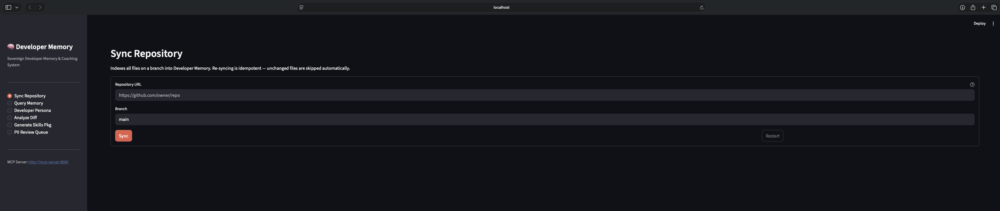
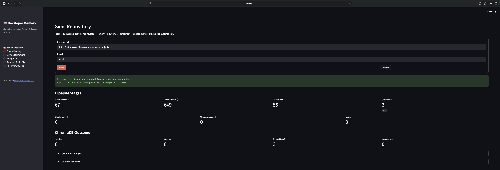
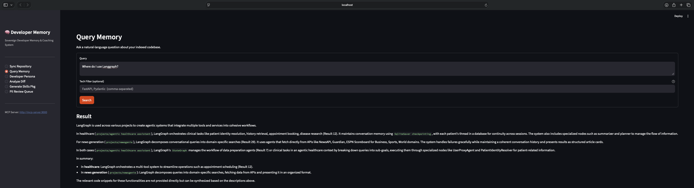
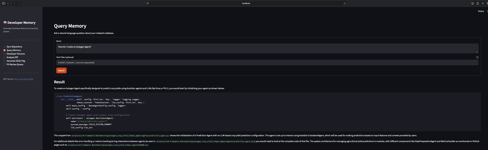
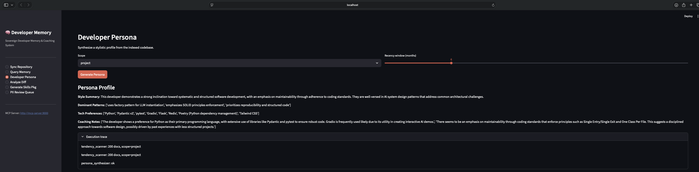
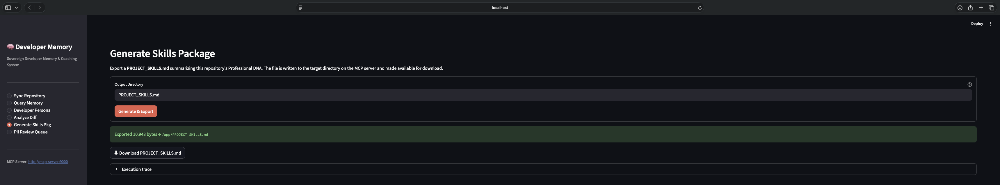

# Developer Memory MCP v2.5

**Created by Tim Hayes**

---

Sovereign Developer Memory & Coaching System — on-device, zero-trust.

Captures *why* code was written the way it was (not just *what* it does) by indexing
repositories into a local ChromaDB vector store with LLM-generated intent summaries, then
exposes five MCP tools that any MCP-capable client (Claude Code, Cursor, VS Code
extensions) can invoke. All inference runs locally via Ollama on Apple Silicon — no
content ever leaves the machine.

## Why This Exists

Developer context is lost between sessions, projects, and teammates. This system acts
as a persistent memory layer: it indexes every changed file into a ChromaDB vector
store with LLM-generated intent summaries, then lets you query your own coding
patterns, synthesize a developer persona, and get coaching on diffs against that
persona — all without touching a cloud service.

## Prerequisites

- macOS with Apple Silicon (M-series) — tested on M4 Max, 36 GB Unified Memory
- Python 3.13.8 via [pyenv](https://github.com/pyenv/pyenv)
- [Poetry](https://python-poetry.org/) `>=1.8`
- [Ollama](https://ollama.com/) (native macOS install — required for Metal GPU acceleration)
- Docker Desktop ≥ 4.30 (for ChromaDB and MCP server/Streamlit containers)

## Installation

```bash
# 1. Pull required Ollama models (native macOS — Metal acceleration)
ollama pull gemma4:26b
ollama pull mxbai-embed-large

# 2. Allow CORS from Docker containers to native Ollama (one-time, persists across reboots)
launchctl setenv OLLAMA_ORIGINS "*"

# 3. Install Python dependencies
poetry install

# 4. Configure environment
cp .env.example .env
# Edit .env — set GITHUB_TOKEN if syncing private repos
```

> **Model selection**: `gemma4:26b` is the default (best ingest + persona quality). On machines
> with < 16 GB RAM the server automatically falls back to `gemma4:e4b` at startup.
> For skills synthesis, set `OLLAMA_SKILLS_MODEL=gpt-oss:20b` for best evidence citation quality.

## Environment Configuration

Copy `.env.example` to `.env` and edit before starting. The full set of variables:

```bash
# ── Git access ──────────────────────────────────────────────────────────────
GITHUB_TOKEN=ghp_REPLACE_ME          # Optional — required only for private repos

# ── Ollama ───────────────────────────────────────────────────────────────────
# When running via docker-compose, docker-compose.yml overrides this to
# http://host.docker.internal:11434 so containers can reach the native Ollama process.
# Set to http://localhost:11434 only when running the MCP server outside Docker.
OLLAMA_HOST=http://localhost:11434
OLLAMA_MODEL=gemma4:26b              # Primary model; auto-falls-back to gemma4:e4b when RAM < 16 GB
OLLAMA_SKILLS_MODEL=gpt-oss:20b      # Skills synthesis override; falls back to OLLAMA_MODEL if unset
OLLAMA_EMBED_MODEL=nomic-embed-text  # Embedding model
OLLAMA_ORIGINS=*                     # Set on the macOS HOST via launchctl — do not put this in Docker env
OLLAMA_NUM_CTX=8192                  # Token context window per request
OLLAMA_NUM_PARALLEL=2                # Max concurrent Ollama inference calls

# ── ChromaDB ─────────────────────────────────────────────────────────────────
# docker-compose sets this to http://chromadb:8000 (service name on the internal network).
# Empty string = local PersistentClient (useful for running outside Docker).
CHROMA_HOST=http://chromadb:8000
CHROMA_COLLECTION=developer_memory_v1

# ── MCP server ───────────────────────────────────────────────────────────────
MCP_PORT=9000
MCP_TRANSPORT=http

# ── Logging & PII ────────────────────────────────────────────────────────────
LOG_LEVEL=INFO
PRESIDIO_SPACY_MODEL=en_core_web_lg  # spaCy model for Presidio NER (loaded once at startup)

# ── Ingest performance ───────────────────────────────────────────────────────
PARSER_WORKERS=6                     # Parallel workers for multimodal_parser; halved when RAM < 16 GB
```

## Docker Stack

`docker-compose.yml` defines four services on a private bridge network (`developer-memory-net`).

```bash
# Start all containers (detached)
make up

# Stop all containers
make down

# Check service health
make health
```

### Services

| Service | Host port | Purpose |
|---------|-----------|---------|
| `mcp-server` | `127.0.0.1:9000` | FastMCP HTTP server — five MCP tools + REST routes |
| `streamlit` | `127.0.0.1:8501` | Streamlit Command Center UI |
| `chromadb` | *(internal only)* | ChromaDB 0.5.20 vector store — no host port by design |
| `ollama` | *(commented out)* | Disabled — CPU-only Docker does not meet ≥ 50 tok/s requirement |

**`mcp-server`** depends on `chromadb` passing its healthcheck before starting. It mounts
`~/.ssh` read-only so the container can clone private repos via SSH. The `sha_store_data`
named volume persists `sha_store.json` (last-synced commit SHAs) across `make down`/`make up`
cycles. The `.env` file is bind-mounted into the container; `OLLAMA_HOST` is overridden to
`http://host.docker.internal:11434` in the compose file so the container reaches the native
Ollama process rather than looking for Ollama inside Docker.

**`streamlit`** depends on `mcp-server` passing its healthcheck. It never connects to ChromaDB
or imports `src.*` directly — all communication goes through `MCP_SERVER_URL=http://mcp-server:9000`
over the internal network.

**`chromadb`** exposes no host port — only `mcp-server` talks to it, over the internal
`developer-memory-net` bridge. `ANONYMIZED_TELEMETRY=FALSE` disables ChromaDB's default
telemetry. Data is persisted in the `chroma_data` named volume at `/chroma/chroma`.

**`ollama` (commented out)** — the native macOS Ollama process is used instead. Docker's
`vllm-metal` backend failed benchmark requirements on M4 Max hardware; re-enable only when
Docker promotes it out of beta.

### Named Volumes

| Volume | Persisted by | Contents |
|--------|-------------|----------|
| `chroma_data` | `chromadb` service | ChromaDB collection data (`developer_memory_v1`) |
| `sha_store_data` | `mcp-server` service | `sha_store.json` — last-synced commit SHAs + skills SHA cache |

`make down` stops containers but leaves both volumes intact. Running `make clean` (or
`docker compose down -v`) removes volumes and resets all indexed state.

### Network

`developer-memory-net` is a bridge network with `internal: false`. The `internal: false`
setting is required so `mcp-server` can reach external git hosts (GitHub, GitLab) during
repository sync. Without it, Docker blocks outbound traffic from the network.

## Running the Application

```bash
# Start all containers (ChromaDB + MCP server + Streamlit UI)
make up

# Verify all services healthy
make health

# Open Streamlit UI in browser
make ui
```

| Service | Port | Notes |
|---------|------|-------|
| MCP server (FastMCP HTTP) | `9000` | MCP clients connect here |
| Streamlit Command Center | `8501` | localhost only |
| ChromaDB | internal | no host port exposed |

## Running Tests

```bash
# Full suite with coverage
poetry run pytest

# Specific file
poetry run pytest tests/agents/test_summarize_and_upsert.py -v

# Lint
poetry run ruff check src/ tests/ ui/
```

Coverage floor: **85%** (`--cov-fail-under=85`). Applies to `src/` only — `ui/`, `src/cli/`, and `experiments/` are excluded from measurement.

## Configuration Reference

All settings are in `src/config/settings.py` (read from `.env` via `pydantic-settings`).

| Env Var | Default | Description |
|---------|---------|-------------|
| `OLLAMA_MODEL` | `gemma4:26b` | Primary Ollama model; falls back to `gemma4:e4b` when RAM < 16 GB |
| `OLLAMA_SKILLS_MODEL` | `""` | Override for skills synthesis (e.g. `gpt-oss:20b`); falls back to `OLLAMA_MODEL` |
| `CHROMA_HOST` | `""` | Full ChromaDB URL (e.g. `http://chromadb:8000`); empty = local `PersistentClient` |
| `CHROMA_DATA_PATH` | `chroma_data` | Local path when `CHROMA_HOST` is empty |
| `CHROMA_COLLECTION` | `developer_memory_v1` | ChromaDB collection name |
| `PARSER_WORKERS` | `6` | Parallel workers for multimodal_parser; halved automatically when RAM < 16 GB |
| `SKILLS_EXPORT_DIR` | `""` | Root dir for skills export write guard; `""` = `Path.cwd()` |
| `GITHUB_TOKEN` | `""` | Optional GitHub PAT for private repo access |
| `GIT_CLONE_TIMEOUT_SECS` | `120` | Subprocess git clone timeout in seconds; `0` = no timeout |
| `CACHE_FILTER_ENABLED` | `true` | Set `false` to force full re-index (e.g. after schema migration) |
| `SHA_FRESHNESS_ENABLED` | `true` | Set `false` for offline/local repos without network access |
| `MCP_PORT` | `9000` | MCP server listen port |
| `MCP_TRANSPORT` | `http` | MCP transport protocol |
| `OLLAMA_NUM_PARALLEL` | `1` | Max concurrent Ollama inference calls |
| `MCP_SERVER_URL` | `http://localhost:9000` | Streamlit → MCP server URL |

`CHROMA_HOST` is validated at startup — bare hostnames without `http://` raise a clear error before any connection is attempted.

## MCP Tools

| Tool | Parameters | Description |
|------|------------|-------------|
| `sync_repository` | `repo_url: str`, `branch: str = "main"` | Incremental delta ingest of a git repository |
| `query_memory` | `query: str`, `tech_filter: list[str] \| None` | Semantic search across indexed developer memory |
| `get_dev_persona` | `scope: str = "project"`, `recency_months: int = 6` | Synthesize developer tendency profile |
| `analyze_diff` | `diff_text: str` | Coaching analysis of a unified diff vs historical persona |
| `generate_skills_pkg` | `target_path: str`, `force: bool = False` | Export `PROJECT_SKILLS.md`; `force=True` bypasses SHA cache |

### Connecting MCP Clients

```bash
# Ollama
ollama run gemma4:26b --mcp http://localhost:9000

# Claude Code / Cursor / other MCP clients
{
  "mcpServers": {
    "developer-memory": {
      "transport": "http",
      "url": "http://localhost:9000"
    }
  }
}
```

## Project Layout

```
developer-memory/
├── src/
│   ├── server.py                # thin shim — preserves python -m src.server entry point
│   ├── mcp_server/              # FastMCP server package (startup, container, sync_jobs, git_client, server)
│   ├── agents/                  # 20 LangGraph node factories (make_*_node)
│   ├── chains/                  # 5 LangChain chain builders (build_*_chain)
│   ├── graphs/                  # 5 StateGraph builders (build_*_graph)
│   ├── models/                  # Pydantic models + TypedDicts (state, chunk, analysis, persona, skills, quarantine, trace_event)
│   ├── db/                      # ChromaLibrarianClient, SHAStore
│   ├── middleware/               # PIIFilter (Presidio + spaCy), validate_repo_url, validate_target_path
│   ├── config/                  # Settings (pydantic-settings, env-validated)
│   ├── llm/                     # get_llm() factory (ChatOllama)
│   ├── utils/                   # retry, chroma_aggregation, parsers (pdf, markdown, python)
│   └── cli/                     # eval harness, standalone ingest utility
├── ui/
│   ├── streamlit_app.py         # thin shim — page config + sidebar + router
│   ├── config.py                # _SERVER_BASE, _MCP_URL constants
│   ├── state.py                 # session state init, _sync_is_active()
│   ├── http_client.py           # all HTTP calls to MCP server
│   └── pages/                   # one module per page (sync_repository, query_memory, etc.)
├── tests/
│   ├── mcp_server/              # server package tests (startup, sync_jobs, git_client, routes)
│   ├── agents/                  # one test file per node
│   ├── chains/                  # one test file per chain
│   ├── graphs/                  # one test file per graph
│   ├── db/                      # chroma_client, sha_store
│   ├── contracts/               # sync state contract golden-file tests
│   ├── ui/                      # config, state, http_client, pages
│   └── conftest.py              # shared fixtures
├── experiments/                 # standalone validation scripts; results gitignored
├── scripts/
│   └── backfill_source_file_sha.py   # one-time migration for cache_filter
├── docs/
│   ├── AgenticArchitecture.md   # full architecture specification
│   └── DeveloperMemoryRequirements.pdf
├── pyproject.toml
├── .env.example
└── Makefile
```

## Architecture Overview

Five LangGraph pipelines (sync, query, persona, diff, skills) run behind a FastMCP HTTP server at port 9000. The Streamlit UI at port 8501 talks to the MCP server exclusively via HTTP — it never imports `src.*` directly or connects to ChromaDB.


ChromaDB (`developer_memory_v1` collection) stores PII-sanitized chunks with SHA-256 content hashes for idempotency. Ollama runs natively on macOS and is reached by Docker containers via `host.docker.internal`. All five graphs are compiled once at startup as singletons in `src/mcp_server/container.py`.

The sync pipeline includes a SHA freshness gate (skips unchanged repos), a pre-PII cache filter (bulk file-hash check before Presidio scan), and a SHA write guard (stores commit SHA only on clean completion). The skills pipeline includes a SHA gate that skips re-synthesis when the indexed corpus has not changed since the last generation.

See [docs/AgenticArchitecture.md](docs/AgenticArchitecture.md) for full graph topology, LLM token budgets, ChromaDB schema, PII sanitizer design, and the complete decision log.

## Known Limitations

- **Single-repo per deployment**: ChromaDB `get_indexed_repo_metadata()` fetches an arbitrary document — only valid when all chunks share the same `repo_url`/`branch`. Multi-repo skills caching is out of scope.
- **Apple Silicon only**: `mxbai-embed-large` and the default Ollama models are validated on M-series hardware. CPU-only inference (~5–15 tok/s) does not meet the ≥ 50 tok/s ingest requirement.
- **`source_file_sha` backfill required**: existing ChromaDB documents indexed before `cache_filter` was deployed lack `source_file_sha` metadata — run `scripts/backfill_source_file_sha.py` once before the pre-PII cache filter provides any speedup.
- **Mode B (Docker Model Runner) deferred**: `vllm-metal` backend failed under benchmark conditions on M4 Max hardware. Re-evaluate when Docker promotes it out of beta.
- **PII sanitizer is single-threaded per node invocation**: parallelization with `ThreadPoolExecutor` is a known improvement; deferred until after current UI refactor work.

## Makefile Targets

### Stack management

| Target | Description |
|--------|-------------|
| `make up` | Build images and start all services (detached). Checks that `.env` exists and Ollama is running before starting, then waits up to 60 s for all services to become healthy. |
| `make up-fg` | Same as `make up` but runs in the foreground — useful for watching startup logs. |
| `make down` | Stop and remove all containers. Volumes are preserved — indexed data survives. |
| `make restart` | Restart all running containers without rebuilding images. |
| `make status` | Show container status (`docker compose ps`). |
| `make health` | Probe all four service health endpoints: MCP server (`/health`), Streamlit (`/_stcore/health`), ChromaDB (heartbeat inside container), and native Ollama (`/api/tags`). |
| `make ui` | Open `http://localhost:8501` in the default browser. |

### Logs

| Target | Description |
|--------|-------------|
| `make logs` | Tail all service logs. |
| `make logs-mcp` | Tail MCP server logs only. |
| `make logs-ui` | Tail Streamlit logs only. |
| `make logs-chroma` | Tail ChromaDB logs only. |

### Build

| Target | Description |
|--------|-------------|
| `make build` | Build Docker images using the layer cache. |
| `make build-no-cache` | Force a full image rebuild (no cache). |

### Data management

| Target | Description |
|--------|-------------|
| `make dump` | Stop containers and delete both named volumes (`chroma_data`, `sha_store_data`). All indexed data and SHA cache are lost — a full resync is required after `make up`. |
| `make clean` | Prompts for confirmation, then runs `docker compose down -v`. Destroys all volumes. Equivalent to `make dump` but routed through compose for volume cleanup. |
| `make reset-chroma` | Delete the ChromaDB volume only (`chroma_data`), leaving the SHA store intact. Stops and restarts `chromadb` and `mcp-server`. Useful after a schema migration. |

### Development

| Target | Description |
|--------|-------------|
| `make test` | Run the full pytest suite with coverage (`--cov-fail-under=85`). |
| `make test-cov` | Run pytest with a detailed per-file coverage report (`--cov-report=term-missing`). |
| `make lint` | Run `ruff check src/ tests/ experiments/ ui/`. |
| `make lint-fix` | Run `ruff check --fix` to auto-correct safe violations. |
| `make shell-mcp` | Open a bash shell inside the `mcp-server` container. |
| `make shell-chroma` | Open a shell inside the `chromadb` container. |

### Ollama helpers

| Target | Description |
|--------|-------------|
| `make pull-model` | Pull `gemma4:26b` into native Ollama (recommended default). |
| `make pull-model-e4b` | Pull `gemma4:e4b` (quantized fallback; activates automatically when RAM < 16 GB). |
| `make list-models` | List all models currently available in native Ollama. |

### Streamlit Screenshots

*Startup Screen*


*Post Synch Repo Screen*


*Query Memory - Langgraph*


*Query Memory - Autogen*


*Developer Persona*


*Generate Skills Package*


