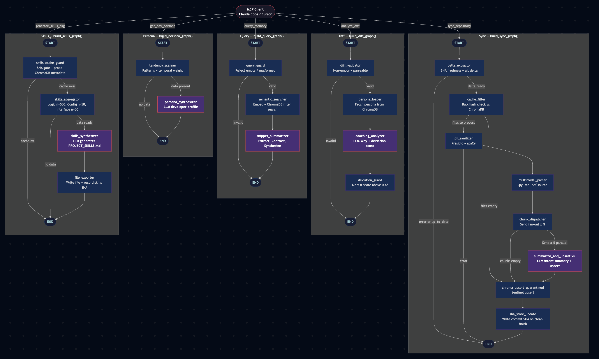
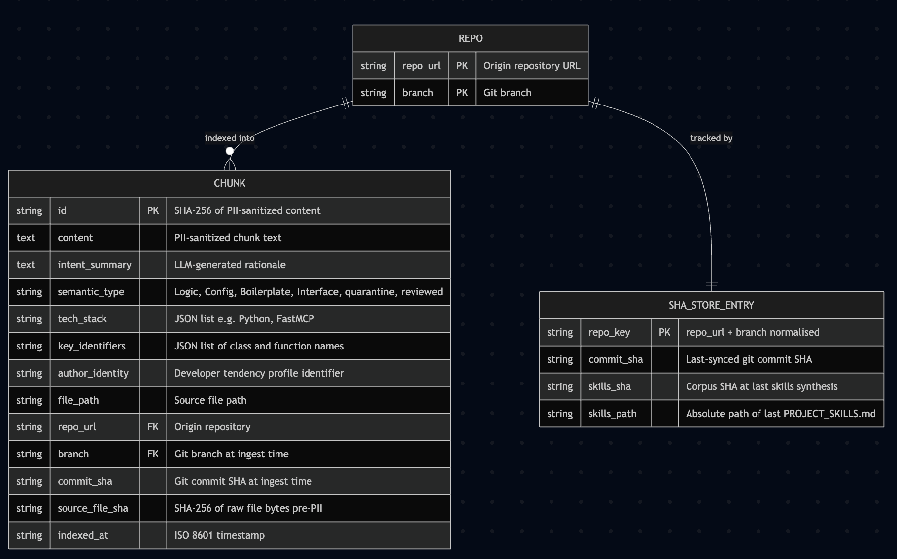
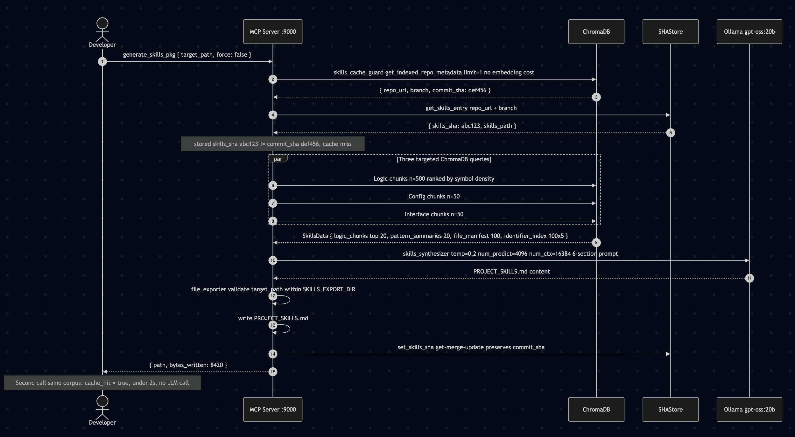
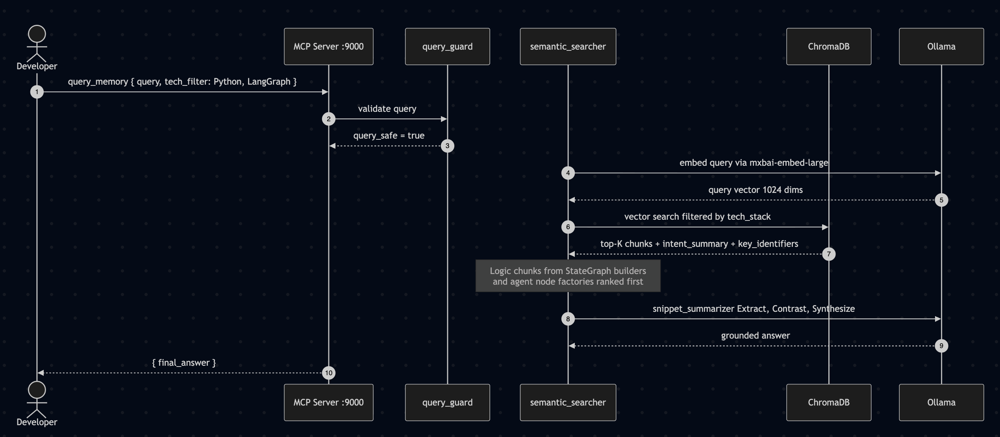

# Developer Memory MCP v2.5 — Agentic Architecture Specification

> **Author:** Tim Hayes  
> **Source Requirements**: `docs/DeveloperMemoryRequirements.pdf`  
> **Python Runtime**: 3.13.8 (pyenv — `/Users/timhazed/.pyenv/shims/python`)  
> **Spec Version**: 2.5 | **Date**: 2026-05-13  
> **Status**: Current — reflects implemented codebase as of 2026-05-13  
> **Deployment**: Mode A (Hybrid) only — Mode B (Docker Model Runner / vllm-metal) deferred pending Docker beta stabilisation  
> **Empirical baseline**: Both models ~75 tok/s at decode saturation on M4 Max; bandwidth-bound. `gemma4:26b` is default (better ingest + persona quality); `gemma4:e4b` is low-memory fallback and leads on coaching rationale quality. 100% structured-output compliance on both models with correct `num_predict` budgets.  
> **Portfolio retrieval baseline**: Raw chunk embedding (677 chunks, 3 projects) achieves 60% hit / 40% partial / 0% miss on 20 portfolio-level semantic queries. Structured Extract→Contrast→Synthesize synthesis prompt doubles hit rate vs. open-ended prompt. `intent_summarizer` is the architectural justification — implicit patterns are not retrievable from raw chunks.

---

## 1. Goal & Scope

### Problem Statement

The Developer Memory bridges the gap between static code repositories and active developer intelligence. Developers lose institutional memory across projects, sessions, and teams — this system acts as a **Sovereign Developer Memory**: it captures *why* code was written the way it was, not just *what* it does.

### Top-Level User Intent

A developer (or MCP-capable client such as Claude Code / Cursor) invokes one of five MCP tools. Each tool triggers a distinct LangGraph pipeline that orchestrates local Ollama inference + ChromaDB retrieval — all on-device, zero-trust.

### In Scope

- Five MCP tools exposed via `fastmcp`: `sync_repository`, `query_memory`, `get_dev_persona`, `analyze_diff`, `generate_skills_pkg`
- Incremental (delta-only) repository ingestion via GitPython
- Local LLM inference via Ollama (no cloud calls)
- Persistent ChromaDB vector store with SHA-256 idempotency
- PII/IP masking middleware before any content is indexed
- Multimodal parsing: `.py`, `.ts`, `.md`, `.pdf`, and common source files
- Tendency Engine: pattern extraction + proactive coaching alerts
- Streamlit Command Center UI
- SHA freshness gate: skip re-sync when HEAD SHA unchanged
- Pre-PII cache filter: bulk file-hash check before PII scan
- Skills SHA gate: skip re-synthesis when corpus is unchanged

### Out of Scope

- Cloud LLM providers (OpenAI, Anthropic, Groq) — sovereignty requirement forbids it
- Remote ChromaDB / cloud vector stores
- Multi-user / multi-tenant access control
- Real-time collaborative editing
- Mode B (Docker Model Runner / vllm-metal) — deferred until beta exits

### Success Criteria

| Criterion | Target |
|-----------|--------|
| Ingest throughput | ≥ 50 tokens/sec LLM summarization on M4 Max |
| Delta reindex latency | ≤ 5s for files changed in last commit on repos < 50k LOC |
| `query_memory` P95 latency | ≤ 3s end-to-end (embed + search + summarize) |
| Persona synthesis | Coherent profile from ≥ 10 indexed files |
| Idempotency | Re-ingesting same file produces 0 new ChromaDB documents |
| PII leakage | 0 PII tokens in ChromaDB `content` or `intent_summary` fields |
| Re-sync (no changes) | < 5s after SHA freshness gate detects no change |

---

## 2. Agent Roster

The system exposes **five MCP tools**, each backed by its own LangGraph `StateGraph` pipeline. Shared infrastructure (Ollama client, ChromaDB client, PII sanitizer) is injected via factory closures — never constructed inside node functions.



| MCP Tool | Pipeline | Graph Builder | LLM? |
|---|---|---|---|
| `sync_repository(repo_url, branch)` | Sync | `build_sync_graph()` | Yes — `_llm_exact` for `summarize_and_upsert` |
| `query_memory(query, tech_filter)` | Query | `build_query_graph()` | Yes — `_llm_light` for `snippet_summarizer` |
| `get_dev_persona(scope, recency_months)` | Persona | `build_persona_graph()` | Yes — `_llm_creative` for `persona_synthesizer` |
| `analyze_diff(diff_text)` | Diff Analysis | `build_diff_graph()` | Yes — `_llm_exact` for `coaching_analyzer` |
| `generate_skills_pkg(target_path, force)` | Skills Export | `build_skills_graph()` | Yes — `_llm_balanced` for `skills_synthesizer` |

The active model for all pipelines is determined at startup by `_check_memory()` and set via `OLLAMA_MODEL` in `.env`. LLM references below refer to whichever model is configured, not a specific model.

### 2.1 Sync Pipeline (`sync_repository`)

| Agent Node | Role | Triggered When | Input (from state) | Output (to state) | LLM? |
|---|---|---|---|---|---|
| `delta_extractor` | Check SHA freshness, compute Δ = current − previous file hashes | Always first | `repo_url`, `branch` | `changed_files`, `commit_sha`, `repo_root`, `head_sha`, `cached_sha`, `already_up_to_date` | No |
| `cache_filter` | Bulk file-hash check against ChromaDB; removes already-indexed files before PII | After delta (when not up-to-date) | `changed_files`, `repo_root`, `repo_url` | `changed_files` (filtered), `file_shas`, `cache_filtered_count` | No |
| `pii_sanitizer` | Mask PII/IPs before indexing (sovereignty) | For each changed (new/modified) file | `changed_files`, `repo_root` | `sanitized_files`, `quarantined_files`, `pii_files_done`, `pii_files_total` | No |
| `multimodal_parser` | Parse `.py`, `.md`, `.pdf`, source into text chunks | After sanitization | `sanitized_files` | `parsed_chunks` | No |
| `chunk_dispatcher` | Fan out each chunk to a parallel `summarize_and_upsert` invocation | After parsing | `parsed_chunks` | `list[Send]` or trace-only dict | No |
| `summarize_and_upsert` | LLM summarizes one chunk **and** immediately upserts it to ChromaDB | One per chunk via `Send` fan-out | `chunk`, `repo_url`, `branch`, `commit_sha`, `_job_id`, `chunk_index`, `chunks_total`, `file_shas` | `upsert_results` (via `operator.add`), `trace`, `trace_events` | Yes |
| `chroma_upsert_quarantined` | Idempotent upsert of quarantined files with per-file sentinel content | After `chunk_dispatcher` (always runs) | `quarantined_files`, `repo_url`, `branch`, `commit_sha` | `upsert_results` (via `operator.add`), `trace`, `trace_events` | No |
| `sha_store_update` | Write commit SHA to `sha_store.json` on clean completion | After `chroma_upsert_quarantined` | `commit_sha`, `repo_url`, `branch`, `upsert_results`, `error` | `trace` | No |

### 2.2 Query Pipeline (`query_memory`)

| Agent Node | Role | Triggered When | Input (from state) | Output (to state) | LLM? |
|---|---|---|---|---|---|
| `query_guard` | Reject empty/malformed queries | Always first | `query`, `tech_filter` | `query_safe` | No |
| `semantic_searcher` | Embed query → ChromaDB filtered search | After guard passes | `query`, `tech_filter` | `raw_results` | No |
| `snippet_summarizer` | LLM synthesizes results using structured Extract→Contrast→Synthesize prompt | After search | `raw_results`, `query` | `final_answer` | Yes |

### 2.3 Persona Pipeline (`get_dev_persona`)

| Agent Node | Role | Triggered When | Input (from state) | Output (to state) | LLM? |
|---|---|---|---|---|---|
| `tendency_scanner` | Aggregate `author_identity` + `semantic_type` patterns with temporal weighting (last 6 months × 3) | Always first | `scope`, `recency_months` | `tendency_data` | No |
| `persona_synthesizer` | LLM synthesizes tendencies into stylistic developer profile | After scan | `tendency_data` | `persona_profile` | Yes |

### 2.4 Diff Analysis Pipeline (`analyze_diff`)

| Agent Node | Role | Triggered When | Input (from state) | Output (to state) | LLM? |
|---|---|---|---|---|---|
| `diff_validator` | Validate diff_text is non-empty and parseable | Always first | `diff_text` | `diff_safe` | No |
| `persona_loader` | Load current persona from ChromaDB for context | After validation | `diff_safe` | `persona_context` | No |
| `coaching_analyzer` | LLM explains "Why" + flags deviations from persona | After persona loaded | `diff_text`, `persona_context` | `analysis_result` | Yes |
| `deviation_guard` | Surface coaching alert if deviation score > 0.65 | After analysis | `analysis_result` | `coaching_alert` | No |

### 2.5 Skills Export Pipeline (`generate_skills_pkg`)

| Agent Node | Role | Triggered When | Input (from state) | Output (to state) | LLM? |
|---|---|---|---|---|---|
| `skills_cache_guard` | SHA gate: probe ChromaDB metadata, compare to stored skills SHA | Always first | `target_path`, `force` | `cache_hit`, `repo_url`, `branch`, `synced_sha`, optional `export_result` | No |
| `skills_aggregator` | Three targeted ChromaDB queries (Logic/Config/Interface); ranks chunks by source type + symbol density | After cache miss | `target_path` | `skills_data` | No |
| `skills_synthesizer` | LLM generates `PROJECT_SKILLS.md` content; selects source-code or docs-only system prompt | After aggregation | `skills_data` | `skills_markdown` | Yes |
| `file_exporter` | Write `PROJECT_SKILLS.md` to `target_path`; record skills SHA | After synthesis | `skills_markdown`, `target_path`, `synced_sha`, `repo_url`, `branch` | `export_result` | No |

---

## 3. Data Models

### 3.1 Pipeline State TypedDicts

```python
# src/models/sync_state.py
import operator
from typing import Annotated, NotRequired, TypedDict
from src.models.chunk import ParsedChunk, UpsertResult
from src.models.sanitized_file import SanitizedFile
from src.models.trace_event import TraceEvent

class SyncState(TypedDict):
    repo_url: str
    branch: str
    commit_sha: str                    # Git SHA at sync time; written by delta_extractor
    repo_root: str                     # Absolute cloned path; used by pii_sanitizer to resolve paths
    changed_files: list[str]           # delta_extractor output; replaced (not appended) by cache_filter
    sanitized_files: list[SanitizedFile]
    parsed_chunks: list[ParsedChunk]   # SINGLE-WRITER: only multimodal_parser writes this
    quarantined_files: list[SanitizedFile]
    upsert_results: Annotated[list[UpsertResult], operator.add]
    error: str | None
    trace: Annotated[list[str], operator.add]
    trace_events: Annotated[list[TraceEvent], operator.add]  # REQUIRED — every node must include [] on all paths
    _job_id: NotRequired[str | None]
    head_sha: NotRequired[str]             # Remote HEAD SHA from git ls-remote
    cached_sha: NotRequired[str]           # Last-synced SHA from sha_store.json
    already_up_to_date: NotRequired[bool]  # True → SHA match, skip entire pipeline
    file_shas: NotRequired[dict[str, str]] # {relative_path: sha256_of_raw_bytes}
    cache_filtered_count: NotRequired[int]
    pii_files_done: NotRequired[int]
    pii_files_total: NotRequired[int]
```

```python
# src/models/query_state.py
class QueryState(TypedDict):
    query: str
    tech_filter: list[str] | None
    query_safe: bool
    raw_results: list[dict]
    final_answer: str | None
    error: str | None
    trace: Annotated[list[str], operator.add]
```

```python
# src/models/persona_state.py
class PersonaState(TypedDict):
    scope: str                        # "project" | "file" | "author"
    recency_months: int               # lookback window (default 6)
    tendency_data: TendencyData | None
    persona_profile: PersonaProfile | None
    error: str | None
    trace: Annotated[list[str], operator.add]
```

```python
# src/models/diff_state.py
class DiffState(TypedDict):
    diff_text: str
    diff_safe: bool
    persona_context: PersonaProfile | None
    analysis_result: AnalysisResult | None
    coaching_alert: CoachingAlert | None
    error: str | None
    trace: Annotated[list[str], operator.add]
```

```python
# src/models/skills_state.py
class SkillsState(TypedDict):
    target_path: str
    skills_data: SkillsData | None
    skills_markdown: str | None
    export_result: dict | None        # {"path": str, "bytes_written": int}
    error: str | None
    trace: Annotated[list[str], operator.add]
    repo_url: NotRequired[str]        # set by skills_cache_guard from ChromaDB probe
    branch: NotRequired[str]          # set by skills_cache_guard
    synced_sha: NotRequired[str]      # current commit SHA from ChromaDB metadata
    cache_hit: NotRequired[bool]      # True when skills_sha matches synced_sha
    force: NotRequired[bool]          # True to bypass SHA gate
```

### 3.2 Pydantic Models

```python
# src/models/sanitized_file.py
class SanitizedFile(BaseModel):
    path: str     # original file path — needed to route by extension in multimodal_parser
    content: str  # PII-masked content; "[CONTENT_QUARANTINED — PII review required]" if quarantined
```

```python
# src/models/trace_event.py
class TraceEventType(StrEnum):
    OK = "ok"; QUARANTINE = "quarantine"; SKIP = "skip"
    CACHED = "cached"; DISPATCHED = "dispatched"; ERROR = "error"

class TraceEvent(BaseModel):
    node: str                    # canonical node name: "pii_sanitizer", "cache_filter", etc.
    event: TraceEventType        # closed enum — typo is a ValueError at construction time
    path: str | None = None      # file path when file-scoped; None for aggregate events
    count: int | None = None     # numeric payload (e.g. filtered count, chunks dispatched)
    detail: str | None = None    # free-form context for logs only; never parsed by UI
```

```python
# src/models/analysis.py
class AnalysisResult(BaseModel):
    deviation_score: float = Field(ge=0.0, le=1.0)  # 0.0=aligned; 1.0=complete deviation; alert threshold: >0.65
    rationale: str
    patterns_matched: list[str]

class CoachingAlert(BaseModel):
    message: str
    severity: Literal["info", "warning", "critical"]
```

```python
# src/models/skills.py — extended fields (7 new in SkillsPipelineRework)
class SkillsData(BaseModel):
    tech_stacks: list[str] = Field(default_factory=list)
    semantic_type_distribution: dict[str, int] = Field(default_factory=dict)
    pattern_summaries: list[str] = Field(default_factory=list)
    doc_count: int = 0
    file_manifest: list[str] = Field(default_factory=list)     # capped at 100; py/ipynb first
    module_groups: dict[str, list[str]] = Field(default_factory=dict)  # dir → [file_paths]
    identifier_index: dict[str, list[str]] = Field(default_factory=dict)  # file → [class/fn names]; 100×5 cap
    logic_chunks: list[dict] = Field(default_factory=list)    # top-20; py/ipynb first, ranked by symbol density
    notebook_files: list[str] = Field(default_factory=list)
    repo_url: str = ""
    has_source_code: bool = True   # False → docs-only system prompt variant in skills_synthesizer
```

```python
# src/models/quarantine.py
class QuarantineItem(BaseModel):
    doc_id: str; file_path: str; quarantine_reason: str; repo_url: str; indexed_at: str

class QuarantineListResponse(BaseModel):
    items: list[QuarantineItem]; total: int
```

### 3.3 State Contract Rules

- `parsed_chunks`: **SINGLE-WRITER** — only `multimodal_parser` writes it. `chunk_dispatcher` reads it once via `Send` fan-out. No reducer needed.
- `upsert_results`: `operator.add` — one `UpsertResult` per `summarize_and_upsert` invocation; one per quarantined file from `chroma_upsert_quarantined`.
- `trace`: `operator.add` — append-only.
- `trace_events`: `operator.add`, **required field** — every node must return `"trace_events": []` on all code paths including no-op paths, or LangGraph raises `KeyError` at merge.
- `changed_files`: single-writer replacement — `cache_filter` replaces it, not appends.
- `error`: non-fatal; pipeline continues to `END` with error surfaced; no stack traces exposed.

---

## 4. Graph Topology

### 4.1 Sync Pipeline

```
START
  ↓
[delta_extractor]   ── error ──────────────────────────────────► END
                    ── already_up_to_date=True ────────────────► END
  ↓
[cache_filter]      ── changed_files empty after filter ───────► [chroma_upsert_quarantined]
  ↓
[pii_sanitizer]     ── error ──────────────────────────────────► END
  ↓
[multimodal_parser]
  ↓
[chunk_dispatcher]  ── parsed_chunks empty ─────────────────────► [chroma_upsert_quarantined]
                    ── Send("summarize_and_upsert", sub_state) × N (parallel)
  ↓
[summarize_and_upsert] × N
  ↓
[chroma_upsert_quarantined]   (always runs — even on empty-chunks path)
  ↓
[sha_store_update]            (writes commit_sha only on clean completion)
  ↓
END
```

**Routing functions in `src/graphs/sync_graph.py`**:

```python
def route_after_delta(state: SyncState) -> str:
    if state.get("error"):       return END
    if state.get("already_up_to_date"): return END   # SHA freshness short-circuit
    return "cache_filter"

def route_after_cache_filter(state: SyncState) -> str:
    if not state.get("changed_files"): return "chroma_upsert_quarantined"
    return "pii_sanitizer"
```

**Why collapsed `summarize_and_upsert`**: Eliminates the fan-in bottleneck — each chunk is upserted to ChromaDB immediately after LLM summarization rather than waiting for all N chunks to complete. The first chunk lands in ChromaDB before the last LLM call finishes.

**Skip-before-LLM fast path**: `summarize_and_upsert` calls `chroma.exists(chunk_id)` before any LLM call. Same SHA-256 content hash → skip, no Ollama call, ~1ms.

**`sha_store_update` write guard**: writes `commit_sha` only when `state["error"] is None` AND no `UpsertResult` has `action="error"`.

**`trace_events` contract**: `route_after_dispatch` adds `"trace_events": []` to every `Send` payload. All sequential nodes return `"trace_events": []` on no-op paths.

### 4.2 Query Pipeline

```
START → [query_guard] ── query_safe=False ──→ END
                      ── query_safe=True ──→ [semantic_searcher] → [snippet_summarizer] → END
```

### 4.3 Persona Pipeline

```
START → [tendency_scanner] ── no data ──→ END
                           ── data present ──→ [persona_synthesizer] → END
```

### 4.4 Diff Analysis Pipeline

```
START → [diff_validator] ── diff_safe=False ──→ END
                         ── diff_safe=True ──→ [persona_loader] → [coaching_analyzer] → [deviation_guard] → END
```

**Note**: `deviation_guard` populates `coaching_alert` when `deviation_score > 0.65`; the graph always proceeds to END.

### 4.5 Skills Export Pipeline

```
START → [skills_cache_guard] ── cache_hit=True ──────────────────────────────────► END*
                              ── cache_hit=False ──► [skills_aggregator] ── skills_data=None ──► END
                                                                          ── skills_data set ──► [skills_synthesizer]
                                                                                                       ↓
                                                                                               [file_exporter] → END
```

\* On cache hit, `skills_cache_guard` copies the cached file to `target_path` and populates `export_result` — no further nodes run.

**SHA gate logic** (`src/agents/skills_cache_guard.py`):
1. Call `chroma.get_indexed_repo_metadata()` — no embedding cost (`collection.get(limit=1)`).
2. If `force=True` or empty metadata → cache miss.
3. Call `sha_store.get_skills_entry(repo_url, branch)` — single lock acquisition returns `skills_sha` + `skills_path`.
4. If `stored_sha == commit_sha` and `skills_path` exists on disk → copy to `target_path`, `cache_hit=True`.
5. Otherwise → `cache_hit=False`, write `repo_url`, `branch`, `synced_sha` to state for `file_exporter`.

**`skills_aggregator` query strategy**: Three targeted queries instead of one broad query:
- Logic n=500 (`where={"semantic_type": "Logic"}`) — primary structural evidence
- Config n=50 (`where={"semantic_type": "Config"}`) — convention evidence
- Interface n=50 (`where={"semantic_type": "Interface"}`) — API boundary evidence

Ranking: Python/notebook source first, then by `len(non_import_key_identifiers)` descending. Tech-stack cardinality ranking is prohibited (surfaces README chunks, not source).

**Caps enforced as module-level constants in `src/agents/skills_aggregator.py`**:
```python
_MAX_LOGIC_CHUNKS = 20          # top Logic chunks for synthesizer
_MAX_PATTERN_SUMMARIES = 20     # combined Config + Interface signals
_MAX_FILE_MANIFEST = 100        # deduplicated source file paths
_MAX_IDENTIFIER_FILES = 100     # files in identifier_index
_MAX_IDENTIFIERS_PER_FILE = 5   # CRITICAL: uncapped ≈ 118k tokens
_CONTEXT_CHAR_LIMIT = 42_000    # chars ÷ 3 ≈ 14,000 token estimate
```

**Dual system prompt in `src/chains/skills_chain.py`**: `build_skills_chain(llm, *, has_source_code: bool = True)` selects `_SYSTEM_SOURCE_CODE` (six sections) or `_SYSTEM_DOCS_ONLY` (three sections) at chain-build time. Both chains pre-built at factory time in `make_skills_synthesizer_node` — zero chain construction per request.

---

## 5. LLM Provider Config + Token Budget

### Provider: Ollama

All LLM interaction is via `langchain-ollama` `ChatOllama`. The client is constructed once at server startup in `src/llm/factory.py` and injected into all node factories.

```python
# src/llm/factory.py
from functools import lru_cache
from langchain_ollama import ChatOllama

@lru_cache(maxsize=None)
def get_llm(model: str = "gemma4:26b", temperature: float = 0.0,
            num_ctx: int = 8192, num_predict: int = 2048) -> ChatOllama:
    return ChatOllama(model=model, temperature=temperature,
                      num_predict=num_predict, num_ctx=num_ctx)
```

### LLM Singletons (constructed in `src/mcp_server/container.py`)

```python
_model = _check_memory()                                        # "gemma4:26b" or "gemma4:e4b"
_skills_model = Settings().ollama_skills_model or _model        # OLLAMA_SKILLS_MODEL override
_llm_exact    = get_llm(model=_model, temperature=0.0, num_ctx=8192)    # summarize_and_upsert, coaching_analyzer
_llm_light    = get_llm(model=_model, temperature=0.1, num_ctx=8192)    # snippet_summarizer
_llm_creative = get_llm(model=_model, temperature=0.3, num_ctx=8192)    # persona_synthesizer
_llm_balanced = get_llm(model=_skills_model, temperature=0.2,
                         num_ctx=16384, num_predict=4096)               # skills_synthesizer
```

### Per-Node Token Budget

| Node | Temperature | `num_predict` | `num_ctx` |
|------|-------------|--------------|-----------|
| `summarize_and_upsert` | 0.0 | 1024 | 8192 |
| `snippet_summarizer` | 0.1 | 1024 | 8192 |
| `persona_synthesizer` | 0.3 | 2048 | 8192 |
| `coaching_analyzer` | 0.0 | 1024 | 8192 |
| `skills_synthesizer` | 0.2 | **4096** | **16384** |

Skills synthesizer requires larger context: ~8,984 token input + 4,096 token output = ~13,080 total, with 20% headroom under `num_ctx=16384`.

### Embedding Model

```python
# src/ingest/embeddings.py
EMBEDDING_MODEL = "mxbai-embed-large"   # 1024 dims; 512-token context window
# Max safe chunk size: ~1500 chars at ~3 chars/token
# Alternative: nomic-embed-text (2048-token window) allows ~3000-char chunks
```

### Retry Strategy

```python
# src/utils/retry.py
def invoke_with_retry(chain, inputs, max_attempts=3, backoff_base=1.5):
    """Exponential backoff retry for LangChain Runnable.invoke().
    Never catches: ValidationError, KeyboardInterrupt.
    Catches: OllamaConnectionError, httpx errors, any other Exception.
    """
```

---

## 6. Safety & Guardrails

### 6.1 PII / Sovereignty Middleware

- `pii_sanitizer` runs before any content reaches ChromaDB or the LLM
- Masks: email addresses, IPv4/IPv6, phone numbers, API keys (regex patterns), AWS ARNs, SSH keys
- Implementation: `presidio-analyzer` + `presidio-anonymizer` (local, no cloud)
- PII confidence threshold: **0.8** — entities below this threshold trigger quarantine
- `QUARANTINE_SENTINEL = "[CONTENT_QUARANTINED — PII review required]"`
- **State invariant**: a file appears in exactly one of `sanitized_files` or `quarantined_files` — never both, never neither
- Quarantined files are upserted by `chroma_upsert_quarantined` with per-file sentinel content (`f"{QUARANTINE_SENTINEL}\npath:{file.path}"`) so hash collisions across multiple quarantined files are prevented

### 6.2 Quarantine REST Endpoints

The Streamlit UI has zero direct ChromaDB access. All quarantine data flows through:

```
GET  /quarantine
     → Returns QuarantineListResponse JSON
     → Calls chroma.get_quarantined() — no LLM, no embedding

POST /quarantine/{doc_id}/release
     → Updates semantic_type from "quarantine" to "reviewed" in ChromaDB
     → Uses get-merge-update: collection.get() first to preserve all metadata fields
     → Returns {doc_id, status: "released"} or 404
     → doc_id from request.path_params["doc_id"], NOT the request body
```

`ChromaLibrarianClient.release_quarantine_item(doc_id)` uses get-merge-update: `collection.update()` replaces the entire metadata dict, so `get()` is called first to preserve `file_path`, `tech_stack`, `indexed_at`, etc.

### 6.3 Intent Filter (Query Guard)

`query_guard` rejects: empty string, whitespace-only, queries > 2000 characters, queries containing shell metacharacters (`; | && || > <`) without escaping.

### 6.4 Repo URL Domain Allowlist

`sync_repository` validates `repo_url` via `validate_repo_url()` in `src/middleware/url_guard.py`. Allowed hosts: `github.com`, `gitlab.com`, `bitbucket.org`. Rejects path traversal (`..`) and null bytes.

### 6.5 `target_path` Write Guard (Skills Export)

`generate_skills_pkg` validates `target_path` via `validate_target_path()` in `src/middleware/path_guard.py`. Resolved path must fall within `SKILLS_EXPORT_DIR` (default: `Path.cwd()`). Path traversal and null bytes rejected at the Pydantic model layer.

### 6.6 Configuration Validation

`Settings._validate_chroma_host()` (pydantic `@model_validator`) rejects `CHROMA_HOST` values that are not valid `http://` or `https://` URLs at container startup. Error message includes the required format:

```
"CHROMA_HOST must be a full HTTP URL (e.g. 'http://chromadb:8000'). Got: {value!r}."
```

### 6.7 Error Surface Contract

No pipeline exposes stack traces, ChromaDB internal IDs, or raw LLM output to MCP clients. Node error pattern: catch → log at ERROR → return `{"error": "Human-readable message", ...}`.

### 6.8 Agent Loop Guardrails

- `recursion_limit=10_000` on `_GRAPH_CONFIG` (LangGraph counts each `Send()` against the limit; default 50 causes `RecursionError` on repos with > ~50 changed files)
- `num_predict` cap enforced at `ChatOllama` constructor — cannot be overridden by prompt
- All structured-output LLM calls use `with_structured_output()` bound to a Pydantic model
- All containers on `developer-memory-net` bridge network — no outbound public internet

---

## 7. MCP Server Architecture (`src/mcp_server/`)

`src/server.py` is a thin shim (≤ 20 lines) that preserves the `python -m src.server` Docker entry point and re-exports `sync_repository` for `src/cli/ingest.py`. All business logic lives in `src/mcp_server/`.

### Package Layout

```
src/
├── server.py                    # SHIM — re-exports sync_repository; calls mcp.run()
└── mcp_server/
    ├── __init__.py              # empty
    ├── startup.py               # logging config, signal handlers, _check_memory(), _log_memory()
    ├── container.py             # ALL module-level singletons: LLMs, chroma, pii, graphs, mcp
    ├── sync_jobs.py             # SyncJob dataclass, _JOBS registry, run_sync_job, callbacks
    ├── git_client.py            # make_git_client() — subprocess clone + 3-tuple return
    └── server.py                # All @mcp.tool() + @mcp.custom_route() registrations
```

### Import DAG

```
startup.py          (root — no internal deps)
    │
git_client.py       (imports Settings; no sync_jobs/container)
    │
sync_jobs.py        (imports startup; lazy-imports container inside run_sync_job body only)
    │  ← lazy import breaks the cycle
container.py        (imports startup + git_client + sync_jobs at module level)
    │
mcp_server/server.py  (imports container + sync_jobs)
    │
src/server.py (shim)  (imports mcp_server/server + container.mcp + startup.logger)
```

**Circular import resolution**: `container.py` imports `_sync_progress_callback` / `_pii_progress_callback` from `sync_jobs` at module level. `sync_jobs.run_sync_job` lazy-imports `_sync_graph` / `_GRAPH_CONFIG` from `container` inside the function body — by the time any sync thread starts, `container` is fully initialised.

### Registered Surfaces

| Decorator | Path | Method |
|-----------|------|--------|
| `@mcp.custom_route` | `/health` | GET |
| `@mcp.custom_route` | `/quarantine` | GET |
| `@mcp.custom_route` | `/quarantine/{doc_id}/release` | POST |
| `@mcp.custom_route` | `/sync` | POST |
| `@mcp.custom_route` | `/sync/status/{job_id}` | GET |
| `@mcp.tool()` | `sync_repository` | — |
| `@mcp.tool()` | `query_memory` | — |
| `@mcp.tool()` | `get_dev_persona` | — |
| `@mcp.tool()` | `analyze_diff` | — |
| `@mcp.tool()` | `generate_skills_pkg` | — |

### Singleton Construction Sequence (`src/mcp_server/container.py`)

1. `_check_memory()` — preflight RAM guard; returns active model tag or raises
2. LLM singletons (`_llm_exact`, `_llm_light`, `_llm_creative`, `_llm_balanced`)
3. `_chroma = ChromaLibrarianClient()`, `_pii = PIIFilter()`, `_sha_store = SHAStore()`
4. Five compiled graphs (`_sync_graph`, `_query_graph`, `_persona_graph`, `_diff_graph`, `_skills_graph`)
5. `_GRAPH_CONFIG = RunnableConfig(recursion_limit=10_000)`
6. `mcp = FastMCP("developer-memory")`

### `_sanitize_result()`

Lives in `src/mcp_server/server.py`. Recursively converts `BaseModel` instances to dicts before JSON serialization — all MCP tool returns pass through it. Required because `SyncState` contains `SanitizedFile`, `UpsertResult`, and `ParsedChunk` Pydantic instances.

### Background Job Lifecycle

`POST /sync` registers a `SyncJob` in `_JOBS` (module-level dict in `sync_jobs.py`) and starts a daemon thread targeting `run_sync_job`. `GET /sync/status/{job_id}` snapshots the job state under `_JOBS_LOCK`. `SyncJobStage` literals: `queued`, `cloning`, `cache_filtering`, `pii_scanning`, `parsing`, `summarizing`, `done`, `error`.

---

## 8. UI Architecture (`ui/`)

`ui/streamlit_app.py` is a shim (≤ 45 lines) that owns only: `st.set_page_config`, session state initialisation, sidebar navigation, and page dispatch. All business logic in sub-modules.

### Package Layout

```
ui/
├── __init__.py              # empty
├── streamlit_app.py         # SHIM — page config + sidebar + router
├── config.py                # _SERVER_BASE, _MCP_URL, _STAGE_LABELS constants from env
├── state.py                 # _STATE_DEFAULTS, init_session_state(), _sync_is_active()
├── http_client.py           # _post_sync, _poll_sync_status, _call_tool, _mcp_error,
│                            #   _get_quarantine, _release_quarantine
└── pages/
    ├── __init__.py
    ├── sync_repository.py   # page() + all sync-specific helpers
    ├── query_memory.py      # page()
    ├── developer_persona.py # page()
    ├── analyze_diff.py      # page()
    ├── generate_skills.py   # page()
    └── pii_review_queue.py  # page()
```

**Key invariant**: UI imports nothing from `src.*` directly. All ChromaDB/graph access goes through HTTP to the MCP server. `ui/config.py` is the only file reading environment variables.

---

## 9. Configuration & Environment

All settings in `src/config/settings.py` (`pydantic-settings`; reads from `.env` file via `SettingsConfigDict(env_file=".env")`).

| Env Var | Field | Type | Default | Description |
|---------|-------|------|---------|-------------|
| `OLLAMA_MODEL` | `ollama_model` | str | `"gemma4:26b"` | Primary Ollama model tag |
| `OLLAMA_SKILLS_MODEL` | `ollama_skills_model` | str | `""` | Skills synthesis model override; falls back to `ollama_model` |
| `CHROMA_COLLECTION` | `chroma_collection` | str | `"developer_memory_v1"` | ChromaDB collection name |
| `PARSER_WORKERS` | `parser_workers` | int | `6` | Parallel workers for multimodal_parser; halved by `_check_memory()` when RAM < 16 GB |
| `SKILLS_EXPORT_DIR` | `skills_export_dir` | str | `""` | Root directory for skills export write guard; `""` = `Path.cwd()` |
| `GITHUB_TOKEN` | `github_token` | str | `""` | Optional GitHub PAT for private repo access |
| `GIT_CLONE_TIMEOUT_SECS` | `git_clone_timeout_secs` | int | `120` | Subprocess git clone timeout; `0` = no timeout |
| `CACHE_FILTER_ENABLED` | `cache_filter_enabled` | bool | `True` | `False` = force full re-index (after schema migration) |
| `SHA_FRESHNESS_ENABLED` | `sha_freshness_enabled` | bool | `True` | `False` = disable ls-remote check for offline/local repos |
| `CHROMA_HOST` | `chroma_host` | str | `""` | Full ChromaDB URL (e.g. `http://chromadb:8000`); `""` = local `PersistentClient` |
| `CHROMA_DATA_PATH` | `chroma_data_path` | str | `"chroma_data"` | Local filesystem path when `chroma_host` is empty |
| `MCP_TRANSPORT` | — | str | `"http"` | MCP transport protocol (read directly in shim `__main__`) |
| `MCP_PORT` | — | int | `9000` | MCP server port (read directly in shim `__main__`) |
| `OLLAMA_NUM_PARALLEL` | — | int | `1` | Semaphore gate for concurrent Ollama calls (read in `container.py`) |
| `MCP_SERVER_URL` | — | str | `http://localhost:9000` | Streamlit → MCP server URL (read in `ui/config.py`) |

`CHROMA_HOST` is validated by `@model_validator` at container startup — malformed URLs raise `ValueError` with an actionable message before any connection is attempted.

---

## 10. ChromaDB Schema

Collection: `developer_memory_v1`



| Field | Type | Purpose |
|-------|------|---------|
| `id` | String | `content_hash` (SHA-256) — primary key for idempotency |
| `content` | Text | PII-sanitized chunk content |
| `intent_summary` | Text | LLM-generated rationale (metadata) |
| `tech_stack` | JSON str | Serialized `list[str]` tags (deserialized by `_unpack_*_results`) |
| `key_identifiers` | JSON str | Serialized `list[str]` class/function names (NOT auto-deserialized — use `json.loads`) |
| `semantic_type` | String | `Logic` \| `Config` \| `Boilerplate` \| `Interface` \| `quarantine` \| `reviewed` |
| `author_identity` | String | Developer tendency profile identifier |
| `file_path` | String | Source file path |
| `repo_url` | String | Origin repository |
| `branch` | String | Git branch at ingest time |
| `commit_sha` | String | Git commit SHA |
| `source_file_sha` | String | SHA-256 of raw file bytes (used by `cache_filter` for pre-PII deduplication) |
| `indexed_at` | String | ISO 8601 timestamp |

**Idempotency contract** (3-case upsert):
1. `id` not in collection → standard upsert
2. `id` exists + `file_path`/`repo_url` match → skip (true duplicate)
3. `id` exists + `file_path` or `repo_url` differ → metadata-only update (file moved)

`key_identifiers` is stored as `json.dumps(list)` but is **not** auto-deserialized by `ChromaLibrarianClient.query()`. Always call `json.loads(meta.get("key_identifiers", "[]"))` — omitting this yields a raw string and iterating it yields single characters.

---

## 11. Testing Strategy

### Mock Strategy

| Dependency | Mock Approach |
|---|---|
| Ollama / ChatOllama | `RunnableLambda(lambda _: fixture)` for `with_structured_output` chains; `FakeListChatModel(responses=["..."])` for `StrOutputParser` chains |
| ChromaDB | Real `chromadb.EphemeralClient()` — not mocked; tests use real vector ops and `_unpack_*_results` deserialization |
| Git / GitPython | `MagicMock(spec=Repo)` with controlled `diff()` return values; 3-tuple `(file_list, repo_root, commit_sha)` |
| File I/O | `tmp_path` pytest fixture |
| Ollama embeddings | `MagicMock(spec=Embeddings)` — spec required to avoid dimension assertion failures |
| HTTP (server tests) | `httpx.TestClient` or `AsyncClient` against `mcp.http_app()` |

**Patch target rule**: Always patch the name in the **consuming** module's namespace. `server.py` imports `run_sync_job as _run_sync_job` — patch `src.mcp_server.server._run_sync_job`, not `src.mcp_server.sync_jobs.run_sync_job`. `_sync_graph` lives in `container.py` — patch `src.mcp_server.container._sync_graph`.

### Coverage

| Scope | Floor |
|---|---|
| `src/` overall | **≥ 85%** (`--cov-fail-under=85` in `pyproject.toml`) |
| `src/mcp_server/startup.py` | ≥ 95% (safety-critical preflight) |
| `src/mcp_server/sync_jobs.py` | ≥ 90% (thread state mutations) |
| `src/middleware/pii_filter.py` | ≥ 95% (sovereignty-critical) |
| `src/middleware/*_guard.py` | ≥ 95% (security boundaries) |
| `ui/`, `src/cli/`, `experiments/` | Omitted from coverage measurement |

### Key Invariants Tested

- `trace_events` — every node emits `[]` on no-op paths; `Send` payloads include `trace_events: []`
- `upsert_results` — exactly one `UpsertResult` per `summarize_and_upsert` invocation
- `quarantined_files` — file in exactly one of `sanitized_files` or `quarantined_files`
- `release_quarantine_item` — get-merge-update preserves all existing metadata fields
- `sha_store_update` — skipped when `state["error"]` is set or any `action == "error"`
- `skills_cache_guard` — `force=True` bypasses cache even when SHA matches
- `cache_filter` — single `_collection.get()` call regardless of repo size

### Contract Test

`tests/contracts/test_sync_state_contract.py` — JSON fixture of a complete `SyncState` snapshot. CI asserts `_metrics_from_trace_events` and `_parse_sync_trace` agree on all metric counts for the same pipeline run.

---

## 12. Known Invariants & Constraints

- `_sanitize_result()` in `src/mcp_server/server.py` recursively converts Pydantic models — all MCP tool returns go through it.
- `sha_store_update` writes `commit_sha` **only** on clean completion (no `error`, no upsert errors).
- `release_quarantine_item` uses get-merge-update — `collection.update()` replaces the entire metadata dict, so always `get()` first.
- `QuarantineItem.doc_id` comes from `request.path_params["doc_id"]` not the request body.
- PII confidence threshold: **0.8**. `QUARANTINE_SENTINEL = "[CONTENT_QUARANTINED — PII review required]"`.
- Deviation alert threshold: `deviation_score > 0.65`.
- ChromaDB idempotency: same `content_hash` → `action="skipped"`, same SHA different path → `action="updated"`, new → `action="inserted"`.
- `key_identifiers` in ChromaDB is stored as `json.dumps()` and is NOT auto-deserialized — always use `json.loads()`.
- `set_last_sha` uses get-merge-update to preserve `skills_sha`/`skills_path` fields across syncs.
- `mxbai-embed-large` has a 512-token context window — max safe chunk size is ~1500 chars.
- `langgraph >=1.0,<2.0` is required — the `Send` API and `CompiledStateGraph` type are 1.x.
- `chromadb = "0.5.20"` is pinned — the server image `chromadb/chroma:0.5.20` must match.
- `_JOBS_LOCK` must be imported from `src.mcp_server.sync_jobs` only — never re-exported from the shim.

---

## 13. Project Structure

```
developer-memory/
├── docs/
│   ├── DeveloperMemoryRequirements.pdf     ← source requirements; never deleted
│   └── AgenticArchitecture.md              ← this file
├── src/
│   ├── server.py                           # SHIM ≤ 20 lines; preserves python -m src.server
│   ├── mcp_server/
│   │   ├── startup.py                      # logging, signal handlers, _check_memory()
│   │   ├── container.py                    # ALL singletons; dependency injection root
│   │   ├── sync_jobs.py                    # SyncJob, _JOBS, run_sync_job, callbacks
│   │   ├── git_client.py                   # make_git_client() → subprocess clone
│   │   └── server.py                       # @mcp.tool() + @mcp.custom_route() registrations
│   ├── agents/                             # make_*_node() factory functions (one per file)
│   │   ├── delta_extractor.py              # SHA freshness gate + git delta
│   │   ├── cache_filter.py                 # pre-PII bulk hash check
│   │   ├── pii_sanitizer.py                # presidio mask + quarantine; progress callback
│   │   ├── multimodal_parser.py            # SINGLE-WRITER of parsed_chunks
│   │   ├── chunk_dispatcher.py             # Send fan-out
│   │   ├── summarize_and_upsert.py         # collapsed Send-target
│   │   ├── chroma_upsert_quarantined.py    # terminal quarantine upsert
│   │   ├── sha_store_update.py             # write commit_sha on clean completion
│   │   ├── query_guard.py
│   │   ├── semantic_searcher.py
│   │   ├── snippet_summarizer.py
│   │   ├── tendency_scanner.py
│   │   ├── persona_synthesizer.py
│   │   ├── diff_validator.py
│   │   ├── persona_loader.py
│   │   ├── coaching_analyzer.py
│   │   ├── deviation_guard.py
│   │   ├── skills_cache_guard.py           # SHA gate for skills synthesis
│   │   ├── skills_aggregator.py            # three-query + source-type-first ranking
│   │   ├── skills_synthesizer.py           # dual chain (source vs docs-only)
│   │   └── file_exporter.py                # write PROJECT_SKILLS.md; record skills SHA
│   ├── chains/
│   │   ├── intent_summary_chain.py
│   │   ├── snippet_summary_chain.py
│   │   ├── persona_synthesis_chain.py
│   │   ├── coaching_chain.py
│   │   └── skills_chain.py                 # dual _SYSTEM prompts; build_skills_chain(has_source_code=)
│   ├── graphs/
│   │   ├── sync_graph.py                   # cache_filter + sha_store_update nodes; updated routing
│   │   ├── query_graph.py
│   │   ├── persona_graph.py
│   │   ├── diff_graph.py
│   │   └── skills_graph.py                 # skills_cache_guard; sha_store param
│   ├── models/
│   │   ├── sync_state.py                   # trace_events field; new NotRequired fields
│   │   ├── query_state.py
│   │   ├── persona_state.py
│   │   ├── diff_state.py
│   │   ├── skills_state.py                 # cache_hit, force, synced_sha fields
│   │   ├── chunk.py                        # ParsedChunk, SummarizedChunk, UpsertResult
│   │   ├── sanitized_file.py
│   │   ├── persona.py
│   │   ├── analysis.py
│   │   ├── skills.py                       # extended with 7 structural fields
│   │   ├── trace_event.py                  # TraceEventType, TraceEvent
│   │   ├── quarantine.py                   # QuarantineItem, QuarantineListResponse
│   │   └── requests.py
│   ├── db/
│   │   ├── chroma_client.py                # ChromaLibrarianClient; settings-injected; release_quarantine_item
│   │   └── sha_store.py                    # SHAStore; get-merge-update; get_skills_entry, set_skills_sha
│   ├── ingest/
│   │   ├── watchdog_handler.py
│   │   ├── git_delta.py
│   │   └── embeddings.py
│   ├── config/
│   │   └── settings.py                     # chroma_host, chroma_data_path; @model_validator
│   ├── llm/
│   │   └── factory.py
│   ├── middleware/
│   │   ├── pii_filter.py
│   │   ├── url_guard.py
│   │   └── path_guard.py
│   ├── utils/
│   │   ├── retry.py
│   │   ├── chroma_aggregation.py
│   │   └── parsers/
│   └── cli/
│       ├── ingest.py
│       └── eval.py
├── ui/
│   ├── streamlit_app.py                    # SHIM ≤ 45 lines
│   ├── config.py
│   ├── state.py
│   ├── http_client.py
│   └── pages/
│       ├── sync_repository.py
│       ├── query_memory.py
│       ├── developer_persona.py
│       ├── analyze_diff.py
│       ├── generate_skills.py
│       └── pii_review_queue.py
├── tests/
│   ├── mcp_server/                         # test_startup, test_sync_jobs, test_git_client, test_server
│   ├── agents/                             # test_*.py per node
│   ├── chains/                             # test_*.py per chain
│   ├── graphs/                             # test_*.py per graph
│   ├── db/                                 # test_chroma_client, test_sha_store
│   ├── contracts/                          # test_sync_state_contract.py
│   ├── ui/                                 # test_config, test_state, test_http_client, pages/
│   └── conftest.py
├── experiments/                            # see §15 for per-script purpose
├── scripts/
│   └── backfill_source_file_sha.py         # one-time migration: adds source_file_sha to existing docs
├── .python-version                         # 3.13.8
├── pyproject.toml
├── .env.example
├── Makefile
└── README.md
```

---

## 14. Container Architecture (Sovereign Stack)

### Mode A — Hybrid (Active, Recommended)

```
macOS Host (M4 Max)
│
├── Ollama (native macOS)  ←── Full Metal + ANE GPU (~73–75 tok/s sustained)
│   └── listens on :11434
│
└── Docker Desktop ──── developer-memory-net (bridge)
    │
    ├── developer_memory_mcp  :9000       ← Claude Code / Cursor / MCP clients
    │   └── reaches Ollama via host.docker.internal:11434
    │
    ├── developer_memory_streamlit  :8501  (localhost only)
    │
    └── developer_memory_chroma             (internal only — no host port)
        └── named volume: chroma_data       (contains sha_store.json + vector data)
```

`OLLAMA_HOST=http://host.docker.internal:11434` in `.env`.

### Mode B — Docker Model Runner (vllm-metal)

**Status**: Beta deferred. Docker Desktop ≥ 4.40 `vllm-metal` backend failed under benchmark conditions on M4 Max (memory wall, JIT compilation stall, virtualisation barrier). Re-evaluate when promoted out of beta.

### Apple Silicon GPU Performance

Both `gemma4:e4b` and `gemma4:26b` run at ~73–75 tok/s sustained decode on M4 Max — bandwidth-bound, not model-size-bound. `gemma4:26b` is the default (better ingest + persona quality at equivalent throughput). `gemma4:e4b` activates automatically when RAM < 16 GB (`_check_memory()`) — advantages are cold-start latency (3.9s vs 6.4s) and smaller footprint.

---

## 15. Experiments Directory

`experiments/` contains standalone validation scripts that drove architecture decisions. All scripts run against a live Ollama + ChromaDB instance; results are gitignored (`experiments/results/`). None are imported by production code.

Run all experiments with `poetry run python experiments/<script>.py`. See each file's docstring for full flag reference.

| Script | Research Question | Key Output |
|---|---|---|
| `portfolio_experiment.py` | Does intent-summarized vector search actually answer portfolio-level questions? Validates the `intent_summarizer` architectural bet before committing to LangGraph. Minimal pipeline: file → Ollama intent summary → embed → ChromaDB → semantic query. | Confirmed: structured Extract→Contrast→Synthesize synthesis prompt doubled hit rate vs. open-ended prompt; raw chunk embedding alone at 60% hit / 40% partial / 0% miss on 20 portfolio queries. Justified `intent_summarizer` as non-optional. |
| `annotation_prompt_experiment.py` | Does adding a `key_identifiers` field to `_ChunkAnnotation` preserve concrete API names (e.g. `AssistantAgent`, `UserProxyAgent`) that the current prompt drops? Side-by-side comparison of current vs. proposed annotation on 3 real Python files. | Confirmed: `key_identifiers` field retained concrete symbol names for code search recall. Drove addition of `key_identifiers` column to ChromaDB schema. |
| `eval_output_quality.py` | Is `gemma4:26b` quality improvement large enough to justify its higher memory footprint and slower first-token latency vs. `gemma4:e4b`? Measures structured-output compliance rate, retry rate, rubric pass rate, and generation time for both models across all five chain types. Uses LLM-as-judge (Groq `gpt-oss-120b`) for `persona_synthesizer` / `snippet_summarizer`; heuristic keyword scorer for remaining chains. | `gemma4:26b` selected as default; `e4b` documents better coaching rationale quality but fails `answer_grounded` metric (0.571 vs. 0.714 threshold). `phi4-mini` validated as production-viable alternative at ~109 tok/s. |
| `footprint_benchmark.py` | What are the cold-start load time, first-token latency, inference throughput, and peak RSS for `gemma4:e4b` vs. `gemma4:26b`? Runs against native Ollama or a containerised instance. | Both models ~75 tok/s sustained — bandwidth-bound on M4 Max. `e4b` advantage: 3.9s cold start vs. 6.4s; smaller footprint. Justified the `_check_memory()` RAM-based fallback in `container.py`. |
| `hardware_benchmark.py` | What is the real inference gap attributable to GPU backend (Mode A native Ollama vs. Mode B Docker vllm-metal), measured with a full hardware profile for cross-machine comparability? Captures first-token latency, tok/s, prompt eval throughput per model per prompt. | Mode B (`vllm-metal`) failed: ~40–45 tok/s under benchmark vs. ~73–75 tok/s native. Memory wall + JIT stall + virtualisation barrier on M4 Max. Mode B deferred; Mode A (native Ollama) is the only supported deployment. |
| `ingest_latency_benchmark.py` | What is the per-stage and end-to-end latency to ingest, PII-sanitize, parse, and LLM-summarize up to 250 files? Drives the production `sync_graph` with instrumented wrappers; records timings per stage (clone, delta, PII, parse, summarize+upsert, quarantine upsert). | Established baseline for the ≤ 5s delta-reindex success criterion. Identified PII sanitizer as dominant per-file cost; drove the pre-PII `cache_filter` optimization. |
| `ingest_smoke_test.py` | Can a real GitHub repository be fetched, delta-computed, PII-scanned, parsed, and upserted end-to-end using the production stack? Calls `sync_repository()` directly — the same function the MCP server exposes. | Reference pattern for the standalone CLI ingest utility (`src/cli/ingest.py`). Confirmed the full production path works without graph wiring. Used as the baseline before any pipeline change. |

### `experiments/inputs/` and `experiments/ground_truth/`

`inputs/` contains static Python files used by `annotation_prompt_experiment.py` as controlled test fixtures (real files from the `autogen_crop_yield_simple_agent` project). `ground_truth/` contains expected query results used by `eval_output_quality.py` to score retrieval quality without requiring a live annotation run.

## 16. Sample Flows

*Generate Skills Flow*


*Query Memory Flow*
