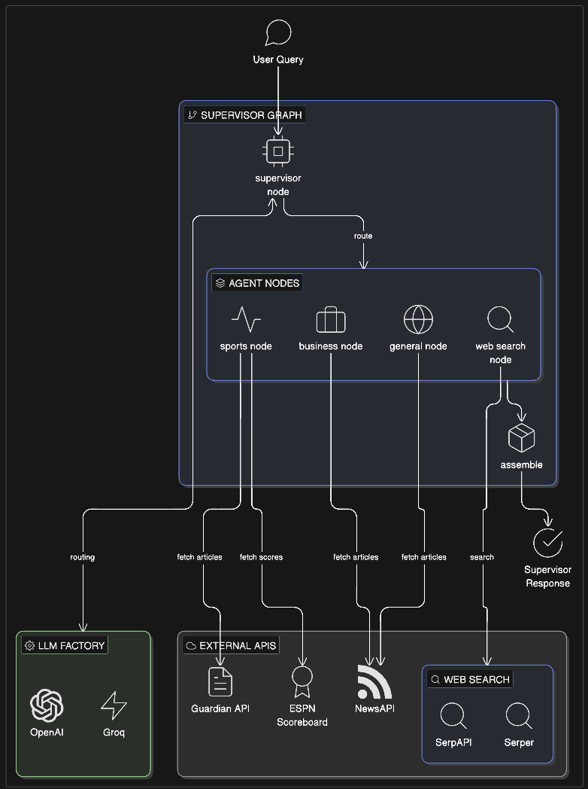
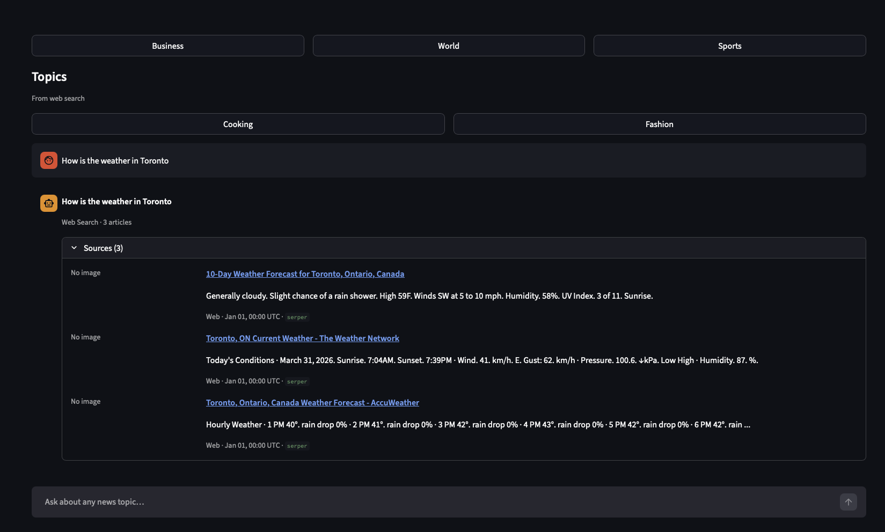

# NewsGenie Application

**Created by Tim Hayes**

## Problem

Modern news consumption is fragmented and often overwhelming. Users face three compounding challenges: staying updated with relevant, accurate information across multiple domains (business, sports, world news); filtering out unreliable or misleading content by relying only on established editorial and wire sources; and accessing personalized, timely answers without switching between a news app, a search engine, and a chat interface.

Existing tools solve for one of these at a time. Aggregators surface headlines but cannot answer follow-up questions. Search engines return results but provide no curation or source trust signal. Chatbots answer questions but have no access to today's news. No single interface bridges all three.

NewsGenie addresses this by acting as a unified intelligent assistant: it interprets free-form conversational queries, classifies them into news domains or general web search, fetches from trusted editorial sources (NewsAPI, The Guardian, ESPN), and presents results as structured, readable article cards — all within a single Streamlit interface that maintains conversation context across turns.

---

## Solution Overview

NewsGenie is a multi-agent real-time news assistant powered by LangGraph. A supervisor LLM decomposes your query into up to three parallel news fetches across Business, Sports, and World domains — or routes to open-ended web search — then presents results as structured article cards.

The **only LLM call** is the supervisor routing step. All domain agents fetch from news APIs directly and normalize results to a common `NormalizedArticle` schema. No LLM-generated prose summaries in v1.0.

The supervisor also receives **bounded conversation history** (last 10 turns, trimmed FIFO) so follow-up queries can reference prior context without re-stating it.

---

## Architecture



The graph topology follows a supervisor → fan-out → assemble pattern:

1. **Supervisor node** — the single LLM call. Receives the user query plus bounded conversation history, classifies intent into one or more of `[BUSINESS, SPORTS, GENERAL, WEB_SEARCH]`, and emits a structured plan (`Intent | Query` pairs).
2. **Conditional fan-out** — LangGraph routes each intent in the plan to its corresponding agent node. Up to three branches run concurrently; total fan-out time is `max(branch)`, not the sum.
3. **Agent nodes** — stateless fetch-and-normalize workers. Each agent calls its API client, applies the `NormalizedArticle` schema, and returns a typed result. No LLM involvement.
   - `BusinessAgent` → NewsAPI (business category)
   - `SportsAgent` → Guardian (editorial) + ESPN Scoreboard (scores) in parallel
   - `GeneralNewsAgent` → NewsAPI (general/world category)
   - `WebSearchNode` → SerpAPI or Serper (configurable)
4. **Assemble node** — deterministic, no I/O. Collects all agent results, groups articles by intent, and builds the `SupervisorResponse`.

For more details, see [Overall Architecture](docs/ARCHITECTURE.md).

---

## Setup

### Prerequisites

- Python 3.13+
- [Poetry](https://python-poetry.org/docs/#installation)

### Install

```bash
git clone <repo-url>
cd newsgenie
poetry install
cp .env.example .env
# Edit .env and fill in your API keys (see Keys section below)
```

### API keys

All keys have empty-string defaults — a missing key disables that agent gracefully rather than crashing at startup. You only need the keys for the providers you intend to use.

| Key | Required for | Where to get |
|-----|-------------|--------------|
| `OPENAI_API_KEY` | LLM routing (when `LLM_PROVIDER=openai`) | platform.openai.com |
| `GROQ_API_KEY` | LLM routing (when `LLM_PROVIDER=groq`) | console.groq.com |
| `NEWSAPI_API_KEY` | Business News + General/World News | newsapi.org |
| `GUARDIAN_API_KEY` | Sports News (editorial; ESPN scores work without it) | open-platform.theguardian.com |
| `SERPAPI_API_KEY` | Web Search (when `WEB_SEARCH_PROVIDER=serpapi`) | serpapi.com |
| `SERPERDEV_API_KEY` | Web Search (when `WEB_SEARCH_PROVIDER=serper`) | serper.dev |

Minimum viable setup (one LLM + one or more news sources):

```bash
LLM_PROVIDER=openai
OPENAI_API_KEY=sk-...
NEWSAPI_API_KEY=...        # enables Business + General News
GUARDIAN_API_KEY=...       # enables Sports News
WEB_SEARCH_PROVIDER=serpapi
SERPAPI_API_KEY=...        # enables Web Search
```

---

## Usage

### CLI

```bash
# Basic query
poetry run python -m src.cli.cli "What's happening in the markets today?"

# With an explicit session ID (useful for tracking multi-turn context)
poetry run python -m src.cli.cli "NBA playoff results" --session-id my-session

# Short form
poetry run python -m src.cli.cli "Bitcoin price" -s my-session
```

The CLI prints article cards grouped by intent. A spinner is shown while the graph runs.

### Streamlit UI

```bash
poetry run streamlit run src/ui/app.py
```

Open the browser URL shown in the terminal (default `http://localhost:8501`).

- Use the **Headlines** chip row (Business, World, Sports) to fetch from wire news feeds
- Use the **Topics** chip row (Cooking, Fashion) to search the open web
- After selecting a chip, click **Get News** to submit without typing a query, or combine the chip with a typed phrase for context-aware routing
- Type any query directly in the chat input for free-form routing
- The **Advanced** expander in the sidebar shows the active LLM provider and model (set via `.env`)
- Conversation history is maintained across turns — follow-up queries like "tell me more about the second story" work without re-stating context

**Session management:** conversation state (history, active session ID) is held in Streamlit's `st.session_state`, which persists for the lifetime of the browser tab. Each new tab or page refresh starts a clean session. Session IDs can also be passed explicitly via the CLI `--session-id` flag to track multi-turn context across invocations.

---

## Configuration

All settings are loaded from `.env` (or environment variables). Edit `.env.example` → `.env` to configure.

| Variable | Default | Description |
|----------|---------|-------------|
| `LLM_PROVIDER` | `openai` | LLM backend for routing: `openai` or `groq` |
| `SUPERVISOR_MODEL` | `gpt-4o-mini` | Model used by the supervisor node |
| `WEB_SEARCH_PROVIDER` | `serpapi` | Web search backend: `serpapi` or `serper` |
| `MAX_ARTICLES_PER_AGENT` | `5` | Maximum articles returned per agent per query |
| `MAX_HISTORY_TURNS` | `10` | Conversation turns retained in context (1 turn = user + assistant message) |
| `LOG_LEVEL` | `INFO` | Python logging level |

**Provider swap:** switch between OpenAI and Groq by changing `LLM_PROVIDER` and the matching API key. No code changes required. Routing quality is validated at ≥90% on gpt-4o-mini and gpt-3.5-turbo; re-validate after switching models (see `experiments/intent_tester/`).

---

## Error Handling and Fallback Mechanisms

NewsGenie is designed to always return a response, even when individual components fail.

### Missing API key

If a news API key is absent, that agent returns an empty result set (`success=False`) and the response is assembled without its articles. Other agents are unaffected. The `fallback_used` flag on `SupervisorResponse` is set to `True` when any section has no articles.

**What you see:** a warning indicator and sections from the agents that did succeed. You will not see an error about the missing key unless all agents fail.

### Sports agent — Guardian error with ESPN fallback

The Sports agent fetches Guardian (editorial) and ESPN Scoreboard (today's scores) **in parallel**. If Guardian returns an HTTP error, that error is logged as a warning and ESPN results are still returned. The agent always returns `success=True` — a Guardian outage never silences today's scores. ESPN requires no API key.

### Routing fallback (LLM output unparseable)

The supervisor extracts intents by matching `INTENT: X | QUERY: Y` lines with regex. If the LLM returns output that produces zero regex matches (e.g. a refusal or garbled response), the system falls back to a **single Web Search step** on the full original query. You always get at least one result section.

### Category filter → web search

If you restrict to specific categories (e.g. Sports only) and the supervisor routes entirely outside those categories, the system replaces the plan with a single Web Search step rather than returning nothing.

### API errors and rate limits

Transient errors (rate limits, timeouts, connection failures) are retried with exponential backoff via `tenacity`. Logic errors (validation failures, invalid API keys) are not retried — they surface as `success=False` on the affected agent result immediately.

### All agents fail

If every agent returns empty results, `SupervisorResponse` has sections with no articles and `fallback_used=True`. The user sees a "no results" message rather than a crash.

---

## Performance and Optimization

Response time is bounded, not instant. The end-to-end path is:

```
T_round_trip ≈ T_supervisor + T_parallel_fan_out + T_assemble
```

Agent branches run **in parallel**, so fan-out time is `max(branch)`, not the sum.

| Stage | Design target (p95) | Notes |
|-------|---------------------|-------|
| `supervisor_node` (LLM call) | ≤ 8 s | Dominates end-to-end; faster with Groq or smaller models |
| Parallel agent nodes | ≤ 4 s | NewsAPI and Guardian are typically sub-second; ESPN scoreboard adds 69–205 ms within this budget; slowest branch wins |
| `assemble` | negligible | Deterministic, no I/O |
| **Round trip** | ≤ 15 s p95 | Cold start, retries, or rate limits can exceed this |

These are design targets for acceptance testing, not contractual SLAs. The CLI and UI both show a progress indicator while the graph runs.

**Parallel fan-out:** all agent nodes run concurrently via LangGraph's conditional fan-out. A three-intent query takes as long as the slowest single agent, not the sum of all three.

**Single LLM call:** the supervisor is the only LLM call in the entire system. Domain agents (Business, Sports, General, Web Search) fetch from APIs directly — no LLM involved in article retrieval or assembly.

**Article budget:** `MAX_ARTICLES_PER_AGENT` (default 5) bounds how many articles each agent fetches per query. Increase for broader results; decrease to reduce latency and token count if you later add LLM synthesis.

**Bounded history:** conversation context is capped at `MAX_HISTORY_TURNS` (default 10 turns = 20 messages). Older turns are dropped FIFO to prevent context window growth across long sessions. Worst-case history overhead is ~2,650 tokens — well within the 128k Groq context window and negligible for OpenAI models.

**Model selection:** `gpt-4o-mini` (OpenAI) and `llama-3.1-70b-versatile` (Groq) both achieve ≥90% routing accuracy on a 200-query validation set (`data/Intent_Validation_Mini.jsonl`). Groq `llama-3.1-8b-instant` is fastest but scored 80% — use only if latency is critical and you accept lower routing precision. See `experiments/intent_tester/findings/` for full benchmark results.

**Web search provider:** SerpAPI and Serper are both supported. Serper does not raise exceptions on API errors — it returns HTTP 200 with an error body, which the web search node handles explicitly.

---

## Development

### Run tests

```bash
# Full suite with coverage
poetry run pytest

# Phase-scoped
poetry run pytest tests/utils/ tests/graph/ -v
poetry run pytest tests/cli/ -v
```

### Lint

```bash
poetry run ruff check src/
```

### Coverage targets

| Path | Target |
|------|--------|
| Overall | ≥ 80% |
| `utils/normalizer.py` | ≥ 95% |
| `graph/supervisor_node.py` | ≥ 90% |
| `graph/assemble_node.py` | ≥ 90% |
| `graph/edges.py` | ≥ 90% |

### Project structure

```
src/
├── agents/          # Domain agents: fetch() + normalize per news source
├── api/             # HTTP clients: NewsAPI, Guardian, ESPN Scoreboard
├── cli/             # Click CLI entry point
├── data/            # Pydantic models and enums
├── graph/           # LangGraph nodes, edges, builder
├── ui/              # Streamlit app
└── utils/           # Config, LLM factory, normalizer, history
```

### Screen Shots

**Base UI**


**Latest Sports**


**Weather**



### Experiments and Lessons Learned

Research harnesses used during development live under `experiments/`:

- `experiments/intent_tester/` — supervisor routing accuracy across models
- `experiments/news_api_tester/` — API latency benchmarks (led to dropping MarketAux, choosing NewsAPI + Guardian)
- `experiments/espn_scorecard_tester/` — ESPN `site.api.espn.com` scoreboard JSONL harness (US league scores; no API key;

For more detail, see [Experiments — Lessons Learned](docs/Experiments_Lessons_Learned.md).

---

## Deliverables Summary

### 1. Interactive AI-powered assistant

NewsGenie delivers a conversational assistant that handles both general queries and real-time news requests within a single interface. The supervisor LLM classifies each query into one or more intents (`BUSINESS`, `SPORTS`, `GENERAL`, `WEB_SEARCH`) and routes accordingly. Free-form follow-up questions (e.g. "tell me more about the second story") are handled via bounded conversation history maintained across turns. See [Usage](#usage).

### 2. Integrated system: news API + web search + LangGraph workflow

The system integrates three real-time data sources (NewsAPI, The Guardian, ESPN Scoreboard) with two web search providers (SerpAPI, Serper) under a LangGraph-based workflow. The graph's conditional fan-out runs up to three agent branches concurrently; the assemble node collects and normalizes results to a common `NormalizedArticle` schema. Provider switching (OpenAI ↔ Groq, SerpAPI ↔ Serper) requires only `.env` changes. See [Architecture](#architecture) and [Configuration](#configuration).

### 3. Streamlit UI with session management and responsive design

The Streamlit frontend provides category chip selectors (Business, World, Sports, Cooking, Fashion), a free-form chat input, a progress indicator during graph execution, and an Advanced sidebar showing the active LLM provider. Session state persists for the lifetime of the browser tab; CLI sessions are addressable by explicit `--session-id`. See [Usage — Streamlit UI](#streamlit-ui).

### 4. Fallback mechanisms and performance optimization

Five distinct failure modes are handled gracefully: missing API keys, Guardian outage (ESPN fallback), unparseable LLM output (web search fallback), category filter mismatch (web search substitution), and total agent failure (no-crash empty state). End-to-end p95 target is ≤15 s, with the single LLM call as the dominant cost and all agent branches running in parallel. See [Error Handling](#error-handling-and-fallback-mechanisms) and [Performance](#performance-and-optimization).
